```mermaid
graph TD
    A["Baseband Signal Issues"] --> B["🚫 Large Antenna Size<br/>λ = c/f, for f = 1kHz, λ = 300km"]
    A --> C["🚫 Signal Mixing<br/>Multiple signals → indistinguishable"]
    A --> D["🚫 Limited Bandwidth<br/>Many users cannot share channel"]
    A --> E["🚫 Frequency Domain<br/>All signals concentrated at DC→few kHz"]
```

# AC Module 1

>[!SUMMARY]+ Table of Contents
>- [[AC_Module_1#Module 1: Analog Communication - Complete Study Guide|Module 1: Analog Communication - Complete Study Guide]]
>    - [[AC_Module_1#Exam Checklist|Exam Checklist]]
>    - [[AC_Module_1#1. Block Diagram of a Communication System|1. Block Diagram of a Communication System]]
>        - [[AC_Module_1#Overview|Overview]]
>        - [[AC_Module_1#System Components|System Components]]
>    - [[AC_Module_1#2. Need for Analog Modulation|2. Need for Analog Modulation]]
>        - [[AC_Module_1#Why Modulation is Essential|Why Modulation is Essential]]
>            - [[AC_Module_1#Problems Without Modulation|Problems Without Modulation]]
>        - [[AC_Module_1#Advantages of Modulation|Advantages of Modulation]]
>        - [[AC_Module_1#Mathematical Foundation|Mathematical Foundation]]
>    - [[AC_Module_1#3. Amplitude Modulation (AM)|3. Amplitude Modulation (AM)]]
>        - [[AC_Module_1#Definition & Concept|Definition & Concept]]
>        - [[AC_Module_1#AM Signal Equation|AM Signal Equation]]
>        - [[AC_Module_1#Modulation Index|Modulation Index]]
>        - [[AC_Module_1#Visual Representation|Visual Representation]]
>    - [[AC_Module_1#4. Equation and Spectrum of AM Signal|4. Equation and Spectrum of AM Signal]]
>        - [[AC_Module_1#Time Domain Equation|Time Domain Equation]]
>        - [[AC_Module_1#Frequency Domain (Spectrum)|Frequency Domain (Spectrum)]]
>        - [[AC_Module_1#Spectrum Diagram|Spectrum Diagram]]
>        - [[AC_Module_1#AM Bandwidth|AM Bandwidth]]
>        - [[AC_Module_1#Power Distribution in AM|Power Distribution in AM]]
>    - [[AC_Module_1#5. Summary Table - Quick Reference|5. Summary Table - Quick Reference]]
>    - [[AC_Module_1#Study Tips for Exam 🎯|Study Tips for Exam 🎯]]
>        - [[AC_Module_1#Common Questions|Common Questions]]
>        - [[AC_Module_1#Derivation Practice|Derivation Practice]]
>    - [[AC_Module_1#Next Topics to Study|Next Topics to Study]]
# Module 1: Analog Communication - Complete Study Guide

> **Exam Focus:** This module covers the fundamentals of analog communication systems, modulation techniques, and signal analysis. Master the block diagrams, mathematical equations, and spectral characteristics.

## Exam Checklist

- [ ] Block diagram of communication system components and signal flow
- [ ] Difference between baseband and passband signals
- [ ] Why analog modulation is necessary (frequency shifting, noise immunity)
- [ ] AM signal equation: $s(t) = A_c[1 + m_a m(t)]\cos(\omega_c t)$
- [ ] AM modulation index and overmodulation effects
- [ ] AM spectrum and bandwidth calculations
- [ ] DSB-SC (Double Sideband Suppressed Carrier) advantages
- [ ] SSB (Single Sideband) implementation and benefits
- [ ] Power calculations in AM signals
- [ ] Numerical problems on AM modulation

---

## 1. Block Diagram of a Communication System

### Overview

```mermaid
graph LR
    A["📊 Message Signal<br/>m(t)<br/>Baseband"] --> B["🔧 Modulator<br/>Carrier: cos(ωc t)<br/>Parameters: Frequency,<br/>Amplitude, Phase"]
    B --> C["📈 Modulated Signal<br/>s(t)<br/>Passband"]
    C --> D["📡 Transmission<br/>Through Channel<br/>AWGN/Fading"]
    D --> E["🎛️ Receiver<br/>Demodulator<br/>Detector"]
    E --> F["📊 Recovered Signal<br/>m̂(t)<br/>Output"]
    
    style A fill:#e1f5ff
    style C fill:#fff3e0
    style F fill:#f3e5f5
    style B fill:#e8f5e9
    style E fill:#e8f5e9
```



![[Screenshot 2025-11-05 at 11.22.53 PM.png]]


### System Components

| Component | Function | Characteristics |
|-----------|----------|-----------------|
| **Message Source** | Generates information signal | Baseband signal, typically 0-5 kHz (audio) |
| **Modulator** | Combines message with carrier | Uses modulation index, carrier frequency |
| **Transmitter** | Amplifies modulated signal | Increases power for long-distance transmission |
| **Channel** | Medium of transmission | Subject to noise, fading, attenuation |
| **Receiver** | Detects modulated signal | LNA, mixer, filters for signal extraction |
| **Demodulator** | Extracts original message | Removes carrier, recovers baseband signal |
| **Output** | Recovered information | Quality depends on SNR and system parameters |

> **Key Point:** The entire purpose of communication system is to transmit information over distance while maintaining signal integrity despite channel impairments.

---

## 2. Need for Analog Modulation

>[!abstract]+ Overview
>Modulation is the process of modifying a carrier signal's properties (amplitude, frequency, or phase) to encode information from a message signal. Without modulation, direct transmission of baseband signals leads to practical limitations in communication systems. This section explores why modulation is essential for efficient, reliable wireless communication.

### Why Modulation is Essential

> **Core Concept:** Baseband signals (like audio from 0-5 kHz) cannot be transmitted efficiently over long distances without modulation. Modulation shifts the signal to higher frequencies, enabling practical antennas, multiplexing, and noise immunity.

#### Problems Without Modulation



```mermaid
graph TD
    A["Baseband Transmission Issues"] --> B["🚫 Antenna Size Problem<br/>λ = c/f, for f = 1kHz → λ = 300km<br/>Impractical antennas!"]
    A --> C["🚫 Signal Interference<br/>Multiple signals overlap<br/>Cannot distinguish channels"]
    A --> D["🚫 Limited Range<br/>Low frequencies attenuate quickly<br/>Poor propagation"]
    A --> E["🚫 Spectrum Waste<br/>All signals concentrated at DC<br/>No frequency reuse"]
```

- **Antenna Size:** For low-frequency signals, antennas must be λ/4 long. A 1 kHz signal requires a 75 km antenna – impossible!
- **Interference:** Multiple baseband signals mix together, causing crosstalk and unintelligible reception.
- **Propagation Issues:** Low frequencies don't propagate well through air or space; they get absorbed or reflected.
- **Bandwidth Inefficiency:** All information is crammed near DC, preventing multiple users from sharing the medium.

### Advantages of Modulation

| Advantage | Explanation | Practical Impact |
|-----------|-------------|------------------|
| **Frequency Translation** | Shifts baseband to passband (higher frequencies) | Reduces antenna size by 10³-10⁶ times |
| **Multiplexing Capability** | Different signals on different carrier frequencies | FDM allows hundreds of channels (e.g., radio stations) |
| **Noise Reduction** | Higher frequencies are less affected by thermal noise | Improved signal-to-noise ratio (SNR) |
| **Efficient Transmission** | Matches signal to channel characteristics | Better power utilization and longer range |
| **Selective Reception** | Tunable receivers can select specific carriers | Eliminates interference from unwanted signals |

### Mathematical Foundation

**Baseband Signal (unmodulated):**
$$m(t) = \text{Message signal, } f_m \leq 5 \text{ kHz}$$

**Carrier Signal:**
$$c(t) = A_c \cos(\omega_c t)$$

**Modulated Signal:**
$$s(t) = \text{Modified carrier carrying } m(t)$$

**Antenna Length Calculation:**
$$L = \frac{\lambda}{4} = \frac{c}{4f}$$
- Baseband (1 kHz): L ≈ 75 km ❌
- Modulated (1 MHz): L ≈ 75 m ✓
- Modulated (100 MHz): L ≈ 0.75 m ✓

> **Key Insight:** Modulation enables practical communication by solving the fundamental mismatch between low-frequency information and high-frequency propagation requirements.

---

## 2.1 Types of Modulation


- **AM:** Changes carrier amplitude – simple but noise-sensitive
- **FM:** Changes carrier frequency – robust against noise but uses more bandwidth
- **PM:** Changes carrier phase – related to FM, used in advanced systems

> **Note:** Analog modulation (AM/FM) is covered in this module; digital modulation builds on these principles.

---

## 2.2 Modulation in Communication Systems

**Block Diagram Context:**

```mermaid
graph LR
    A["Message<br/>m(t)"] --> B["Modulator<br/>+ Carrier"]
    B --> C["Channel<br/>Transmission"]
    C --> D["Demodulator<br/>- Carrier"]
    D --> E["Recovered<br/>m̂(t)"]
    
    style B fill:#e1f5fe
    style D fill:#e1f5fe
```


**Why Essential for [[AC_Module_1#1. Block Diagram of a Communication System|Communication Systems]]:**
- Enables the transmitter to prepare signals for efficient propagation
- Allows receivers to extract original information despite channel impairments
- Forms the foundation for all modern wireless communication (radio, TV, mobile networks)

> **Pro Tip:** Think of modulation as "packaging" low-frequency information for high-frequency "shipping" through the air.
### Why Modulation is Essential

> **Definition:** Modulation is the process of encoding information into a carrier signal by varying one or more of its parameters (amplitude, frequency, or phase).

#### Problems Without Modulation



### Advantages of Modulation

| Advantage | Explanation | Practical Benefit |
|-----------|-------------|--------------------|
| **Frequency Shifting** | Shifts signal to higher frequencies | Antenna size reduced by factor of 10³-10⁶ |
| **Multiplexing** | Multiple signals on one channel | Efficient spectrum utilization (FDM) |
| **Noise Immunity** | Higher frequency signals less affected by noise | Improved SNR at receiver |
| **Bandwidth Accommodation** | Uses available frequency bands efficiently | Different signals in different bands |
| **Long Distance Transmission** | Higher frequencies propagate better | Enables wireless communication |
| **Channel Adaptation** | Matches signal to channel characteristics | Optimizes link performance |

### Mathematical Foundation

**Baseband Signal (before modulation):**
$$m(t) = \text{Information signal, typically } f_m < 5 \text{ kHz}$$

**Carrier Signal:**
$$c(t) = A_c \cos(\omega_c t + \phi_c)$$

**Why Higher Frequency:**
- Antenna length: $L = \frac{\lambda}{4} = \frac{c}{4f_c}$
- For $f_m = 1$ kHz: antenna needed = 75 km ❌
- For $f_c = 100$ MHz: antenna needed = 0.75 m ✓

> **Example:** AM radio broadcasts at 530-1700 kHz (MW band) because low frequency signals cannot be efficiently transmitted using practical antenna sizes.


## 2.1 Types Of Modulation 


---

## 3. Amplitude Modulation (AM)

>[!info]+ Amplitude Modulation (AM)
>Amplitude Modulation (AM) is a modulation technique where the amplitude of a high frequency carrier signal is varied in proportion to the instantaneous amplitude of the message/modulating signal, while keeping frequency and phase constant.
>
>**Key Equation:**
>$s(t) = A_c[1 + m_a m(t)]\cos(\omega_c t)$
>
>Where:
>- $A_c$ = Carrier amplitude 
>- $m_a$ = Modulation index (0 ≤ $m_a$ ≤ 1)
>- $m(t)$ = Message signal
>- $\omega_c$ = Carrier frequency
>
>**Characteristics:**
>- Bandwidth = 2fm (fm = max message frequency)
>- Power efficiency = 33.3% max
>- Simple envelope detection possible
>- Susceptible to noise
>- Used in AM radio broadcasting

### Definition & Concept

>[!hint]+
> **Amplitude Modulation (AM):** A modulation technique where the amplitude of the carrier signal is varied in accordance with the message signal, while frequency and phase remain constant.

```mermaid
graph LR
    M["m(t)<br/>Message"] -->|"Multiply"| MOD["×"]
    C["Ac cos(ωc t)<br/>Carrier"] --> MOD
    MOD --> S["s(t)<br/>AM Signal"]
    
    style M fill:#bbdefb
    style C fill:#fff9c4
    style MOD fill:#ffe0b2
    style S fill:#c8e6c9
```


![[Screenshot 2025-11-05 at 11.25.06 PM.png]]
### AM Signal Equation

**Standard Form:**
$$s(t) = A_c[1 + m_a m(t)]\cos(\omega_c t)$$

**Where:**
- $A_c$ = Carrier amplitude
- $m_a$ = Modulation index (0 ≤ $m_a$ ≤ 1)
- $m(t)$ = Normalized message signal (-1 ≤ $m(t)$ ≤ 1)
- $\omega_c = 2\pi f_c$ = Carrier angular frequency

**Alternative Form (using modulating signal directly):**
$$s(t) = A_c \cos(\omega_c t) + \frac{A_c m_a}{2}m(t)\cos(\omega_c t)$$

### Modulation Index

**Definition:**
$$m_a = \frac{A_m}{A_c}$$

Where $A_m$ is the peak amplitude of message signal.

**Effect of Modulation Index:**

| $m_a$ Value | Condition | Characteristics | Quality |
|-----------|-----------|-----------------|---------|
| 0 | Undermodulation | Weak envelope, unused power | Poor |
| 0 to 1 | Proper modulation | Full information transfer | Optimal ✓ |
| = 1 | 100% modulation | Maximum envelope variation | Best |
| > 1 | **Overmodulation** | **Distortion, spectral splatter** | **Poor ❌** |

### Visual Representation

```
Message Signal: m(t)
    ▲
  1 |    ╱╲    ╱╲
    |   ╱  ╲  ╱  ╲
  0 |──────╱──────── time
    |          
 -1 |
    
Carrier: cos(ωc t)
    ▲
  1 |▔▔▔▔▔▔▔
    |
  0 |─────────── time
    |
 -1 |▄▄▄▄▄▄▄

AM Signal: [1 + ma·m(t)]cos(ωc t) with ma = 0.5
    ▲
    |  ╱╲
    | ╱  ╲  
    |╱    ╲  (Envelope follows m(t))
  0 |─────────── time
    |╲    ╱
    | ╲  ╱
    |  ╲╱
```

> **Important:** When $m_a > 1$ (overmodulation), the envelope tries to go negative, causing phase reversal and spectral distortion. This is unacceptable in AM systems!

---

## 4. Equation and Spectrum of AM Signal

### Time Domain Equation

**Standard AM Signal:**
$$s(t) = A_c[1 + m_a m(t)]\cos(\omega_c t)$$

**Expanded using product-to-sum identity:**
$$s(t) = A_c\cos(\omega_c t) + \frac{A_c m_a}{2}m(t)\cos(\omega_c t)$$

### Frequency Domain (Spectrum)

**For simple message signal:** $m(t) = \cos(\omega_m t)$ where $\omega_m = 2\pi f_m$

**Expanding the product:**
$$s(t) = A_c\cos(\omega_c t) + \frac{A_c m_a}{2}\cos(\omega_m t)\cos(\omega_c t)$$

**Using:** $\cos A \cos B = \frac{1}{2}[\cos(A+B) + \cos(A-B)]$

$$s(t) = A_c\cos(\omega_c t) + \frac{A_c m_a}{4}\cos[(\omega_c + \omega_m)t] + \frac{A_c m_a}{4}\cos[(\omega_c - \omega_m)t]$$

**Frequency Domain Components:**

| Component | Frequency | Amplitude | Name |
|-----------|-----------|-----------|------|
| Carrier | $f_c$ | $A_c$ | Unmodulated Carrier |
| Upper Sideband (USB) | $f_c + f_m$ | $\frac{A_c m_a}{2}$ | **Contains Information** |
| Lower Sideband (LSB) | $f_c - f_m$ | $\frac{A_c m_a}{2}$ | **Contains Information** |

### Spectrum Diagram

```mermaid
graph TD
    A["AM Spectrum for m(t) = cos(ωm t)"] 
    A --> B["Amplitude vs Frequency Plot"]
    
    B --> C["
    Amplitude
        │
        │     ││    ││
    Ac  │    ││    ││
        │    ││    ││
   Ac*ma/2│  │╱╲  ╱╲│
        │  │  ││  ││  │
        │  ║  ╱╲  ╱╲  ║
        │  ║ ╱  ╲╱  ╲ ║
      0 │──║─────────║──► Frequency
        │  fc-fm fc fc+fm
        │  LSB   C  USB
        │
    Bandwidth = 2fm
    "]
```



### AM Bandwidth

$$B_{AM} = 2f_m$$

Where $f_m$ is the maximum frequency component in the message signal.

**Example:**
- Voice signal: $f_m = 5$ kHz → $B_{AM} = 10$ kHz
- Audio signal: $f_m = 15$ kHz → $B_{AM} = 30$ kHz

> **Key Observation:** Both sidebands carry identical information (mirror images). This is redundancy! Later we'll see SSB eliminates one sideband.

	### Power Distribution in AM

**Total Power:**
$$P_{total} = P_c + P_{USB} + P_{LSB}$$

**Component Powers:**

$$P_c = \frac{A_c^2}{2}$$

$$P_{USB} = P_{LSB} = \frac{1}{2}\left(\frac{A_c m_a}{2}\right)^2 = \frac{A_c^2 m_a^2}{8}$$

$$P_{total} = \frac{A_c^2}{2}\left(1 + \frac{m_a^2}{2}\right)$$

**Power Efficiency:**
$$\eta = \frac{P_{sidebands}}{P_{total}} = \frac{m_a^2}{2 + m_a^2} \times 100\%$$

**Maximum Efficiency (at $m_a = 1$):**
$$\eta_{max} = \frac{1}{3} \approx 33.3\%$$

| Efficiency Level | $m_a$ | Power in Sidebands |
|-----------------|-------|-------------------|
| 33% (Maximum) | 1 | 1/3 of total |
| 20% | 0.6 | 1/5 of total |
| 10% | 0.4 | 1/10 of total |

> **Problem:** In standard AM, **67% of power is wasted in the carrier**, which carries no information! This is a major disadvantage.

---

## 5. Summary Table - Quick Reference

| Aspect | Details |
|--------|---------|
| **Definition** | Amplitude of carrier varied by message signal |
| **Equation** | $s(t) = A_c[1 + m_a m(t)]\cos(\omega_c t)$ |
| **Modulation Index** | $0 \leq m_a \leq 1$ (or 0-100%) |
| **Bandwidth** | $B_{AM} = 2f_m$ |
| **Spectrum** | Carrier + USB + LSB (symmetric) |
| **Power Efficiency** | 33.3% maximum (at $m_a = 1$) |
| **Main Disadvantage** | Redundant sidebands, wasted carrier power |
| **Applications** | AM radio, legacy broadcasting |

---

## Study Tips for Exam 🎯

### Common Questions

> **Q1:** Why is the modulation index limited to 1?
> **A:** At $m_a > 1$, overmodulation occurs causing the envelope to attempt negative values, resulting in phase reversal and spectral splatter (distortion).

> **Q2:** Why do we need TWO sidebands if they carry identical information?
> **A:** Standard AM inherently creates symmetric sidebands. This is wasteful; hence DSB-SC and SSB systems suppress/eliminate redundancy.

> **Q3:** Why is AM power efficiency only 33%?
> **A:** The carrier ($A_c^2/2$) carries NO information. Only sidebands carry info. Even at 100% modulation, 67% goes to carrier.

### Derivation Practice

1. **Expand:** $s(t) = A_c[1 + 0.5\cos(10^4 \pi t)]\cos(10^8 \pi t)$
2. **Find:** All frequency components and their amplitudes
3. **Calculate:** Bandwidth and power in each component

---

---

# 6. DSB-SC (Double Sideband Suppressed Carrier) Systems

## Definition & Concept

> **DSB-SC:** A modulation scheme where the carrier is suppressed and only the two sidebands are transmitted. This eliminates the wasted carrier power while maintaining information in both sidebands.

### Comparison: AM vs DSB-SC

| Parameter | **AM** | **DSB-SC** |
|-----------|--------|-----------|
| **Equation** | $s(t) = A_c[1 + m_a m(t)]\cos(\omega_c t)$ | $s(t) = A_c m(t)\cos(\omega_c t)$ |
| **Carrier Present?** | Yes ✓ | **No (Suppressed)** ✗ |
| **Bandwidth** | $2f_m$ | $2f_m$ (Same) |
| **Components** | Carrier + USB + LSB | **USB + LSB only** |
| **Power Efficiency** | 33.3% max | **100%** in sidebands ✓ |
| **Total Power Saved** | — | **50% reduction** |
| **Demodulation** | Simple diode detector | **Complex, needs phase lock** |
| **Receiver Complexity** | Low | **High** |
| **Applications** | AM Radio | Voice channels (Telephony), Stereo FM |

### DSB-SC Signal Equation

**Mathematical Form:**
$$s(t) = A_c m(t) \cos(\omega_c t)$$

**For sinusoidal message:** $m(t) = \cos(\omega_m t)$

$$s(t) = A_c \cos(\omega_m t) \cos(\omega_c t)$$

**Expanding using product formula:**
$$s(t) = \frac{A_c}{2}\cos[(\omega_c + \omega_m)t] + \frac{A_c}{2}\cos[(\omega_c - \omega_m)t]$$

**Frequency Domain:**
- USB at: $f_c + f_m$ with amplitude $\frac{A_c}{2}$
- LSB at: $f_c - f_m$ with amplitude $\frac{A_c}{2}$
- **NO carrier at $f_c$** ✗

### DSB-SC Spectrum Diagram

```
                     DSB-SC Spectrum
                     (No Carrier Peak!)
                     
    Amplitude
        │
    Ac/2│  ╱╲      ╱╲
        │ ╱  ╲    ╱  ╲
        │╱    ╲  ╱    ╲
      0 │──────────────► Frequency
        │     
        │ fc-fm  fc  fc+fm
        │ LSB    No  USB
        │        Carrier
        
    Bandwidth = 2fm (Same as AM)
    Power Efficiency = 100% (Only sidebands)
```

### Power Analysis

**Power in Each Sideband:**
$$P_{USB} = P_{LSB} = \frac{A_c^2}{8}$$

**Total Transmitted Power:**
$$P_{total} = P_{USB} + P_{LSB} = \frac{A_c^2}{4}$$

**Comparison with AM (same message, same modulation index):**

| Metric | AM | DSB-SC | Advantage |
|--------|-----|---------|-----------|
| Carrier Power | $\frac{A_c^2}{2}$ | 0 | DSB-SC saves 50% |
| Sideband Power | $\frac{A_c^2 m_a^2}{4}$ | $\frac{A_c^2}{4}$ | DSB-SC more efficient |
| **Total Power** | $\frac{A_c^2}{2}(1 + \frac{m_a^2}{2})$ | $\frac{A_c^2}{4}$ | DSB-SC **2× more efficient** |

### Advantages of DSB-SC

✓ **Power Efficiency:** All transmitted power goes to sidebands (information)  
✓ **Spectrum Conservation:** Same bandwidth as AM  
✓ **Noise Immunity:** Higher effective signal strength  
✓ **Better SNR:** No wasted power on carrier  

### Disadvantages of DSB-SC

✗ **Coherent Detection Required:** Receiver must generate phase-locked carrier (difficult & expensive)  
✗ **Phase Synchronization Needed:** Must match transmitter carrier phase  
✗ **Complex Receiver:** Needs PLL (Phase Locked Loop) circuit  
✗ **Carrier Recovery:** Extra cost for recovering lost carrier  

---

# 7. SSB (Single Sideband) Systems

## Definition & Concept

> **SSB (Single Sideband):** Only ONE sideband (USB or LSB) is transmitted. The other sideband and carrier are completely suppressed. Maximum bandwidth efficiency.

### Why SSB?

**Problem with DSB-SC:** Still transmits two redundant sidebands (mirror images). We can eliminate one!

```mermaid
graph TD
    A["Standard AM"] -->|"Suppress Carrier"| B["DSB-SC"]
    B -->|"Suppress One Sideband"| C["SSB"]
    
    A -->|"Power Efficiency"| D["33.3% max"]
    B -->|"Power Efficiency"| E["100% in 2 SB"]
    C -->|"Power Efficiency"| F["100% in 1 SB<br/>Only half bandwidth!"]
    
    A -->|"Bandwidth"| G["2fm"]
    B -->|"Bandwidth"| H["2fm"]
    C -->|"Bandwidth"| I["fm ← MINIMUM!"]
    
    style C fill:#c8e6c9
    style F fill:#a5d6a7
    style I fill:#81c784
```



### SSB Signal Equation

**General Form:**
$$s(t) = A_c m(t) \cos(\omega_c t) \mp A_c \hat{m}(t) \sin(\omega_c t)$$

Where:
- $\hat{m}(t)$ = Hilbert transform of $m(t)$ (90° phase shift)
- **Upper sideband (USB):** Use minus sign (−)
- **Lower sideband (LSB):** Use plus sign (+)

**For sinusoidal message:** $m(t) = \cos(\omega_m t)$

**USB-SSB:**
$$s_{USB}(t) = \frac{A_c}{2}\cos[(\omega_c + \omega_m)t]$$

**LSB-SSB:**
$$s_{LSB}(t) = \frac{A_c}{2}\cos[(\omega_c - \omega_m)t]$$

### SSB Spectrum Comparison

```
Standard AM Spectrum (for reference)
    ▲
    │    │        │        │
 Ac │    │        │        │
    │    │        │        │
Ac/2│  ╱╲      ╱╲        ╱╲  
    │ ╱  ╲    ╱  ╲      ╱  ╲
    └─────────────────────────► f
      LSB   Carrier   USB
    (info) (wasted)  (info)
    Bandwidth = 2fm

    
DSB-SC Spectrum
    ▲
    │
 Ac/2│  ╱╲        ╱╲  
    │ ╱  ╲      ╱  ╲
    │╱    ╲    ╱    ╲
    └─────────────────► f
      LSB (info)  USB (info)
      Bandwidth = 2fm

      
SSB-USB Spectrum (OPTIMAL)
    ▲
    │
 Ac/2│      ╱╲  
    │     ╱  ╲
    │    ╱    ╲
    └───────────────► f
        USB only
        (info)
        Bandwidth = fm ← 50% REDUCTION!


SSB-LSB Spectrum (Alternative)
    ▲
    │
 Ac/2│  ╱╲  
    │ ╱  ╲
    │╱    ╲
    └───────────────► f
        LSB only
        (info)
        Bandwidth = fm ← 50% REDUCTION!
```

### Comparison: AM vs DSB-SC vs SSB

| Feature | **AM** | **DSB-SC** | **SSB** |
|---------|--------|-----------|---------|
| Carrier | Present | Suppressed | Suppressed |
| Sidebands | USB + LSB | USB + LSB | USB **or** LSB |
| Bandwidth | $2f_m$ | $2f_m$ | $f_m$ ✓ |
| Power Efficiency | 33.3% | 100% in 2 SB | 100% in 1 SB ✓ |
| Information Loss | None | None | None |
| Receiver Type | Envelope detector | Coherent | Coherent |
| Receiver Cost | Low | Medium | **High** |
| Applications | AM Radio | Stereo FM | **Telephone**, Aviation, Military |
| Bandwidth Efficiency | **Worst** | Medium | **BEST** ✓ |

### Advantages of SSB

✓ **Minimum Bandwidth:** Only $f_m$ (50% reduction vs AM/DSB-SC)  
✓ **Maximum Spectrum Efficiency:** More channels in same band  
✓ **Power Efficiency:** All power in one sideband  
✓ **Better SNR:** Smaller bandwidth = less noise  
✓ **Long-distance Communication:** Ideal for channels with bandwidth limitations  

### Disadvantages of SSB

✗ **Complex Modulation:** Requires Hilbert transform or filter method  
✗ **Complex Demodulation:** Needs coherent detection with precise phase  
✗ **Frequency Stability Required:** ±0.1% accuracy needed (vs ±1% for AM)  
✗ **Cost:** More expensive equipment  
✗ **Vestigial Sideband Effects:** Phase distortion if frequency drift occurs  

---

# 8. SSB Transmitter Block Diagram

## Method 1: Phase Shift Method (Weaver/Hilbert)

```mermaid
graph LR
    M["m(t)<br/>Message"] --> A["×"]
    C1["cos(ωc t)"] --> A
    A --> B["LPF<br/>Filter"]
    
    M --> C["Hilbert<br/>Transform<br/>H(ωm)"]
    C --> D["×"]
    C2["sin(ωc t)"] --> D
    D --> E["LPF<br/>Filter"]
    
    B --> SUM["+/-"]
    E --> SUM
    SUM --> OUT["SSB Signal<br/>USB or LSB<br/>s(t)"]
    
    style M fill:#bbdefb
    style OUT fill:#c8e6c9
    style C fill:#ffe0b2
```



**Steps:**
1. Multiply message $m(t)$ by $\cos(\omega_c t)$ → produces both product terms
2. Apply Hilbert transform to $m(t)$ (90° phase shift)
3. Multiply result by $\sin(\omega_c t)$
4. Add or subtract the two products (+ for LSB, − for USB)
5. Filter to remove unwanted components

## Method 2: Filter Method (Most Common)

```mermaid
graph LR
    M["m(t)<br/>Message<br/>Signal"] --> MOD["Modulator<br/>m(t)cos(ωc t)<br/>Produces DSB-SC"]
    MOD --> BPF["Bandpass<br/>Filter<br/>Sharp Cutoff<br/>Suppresses One SB"]
    BPF --> AMP["Power<br/>Amplifier"]
    AMP --> TX["Transmitter"]
    
    C["cos(ωc t)<br/>Carrier<br/>Generator"] --> MOD
    
    style BPF fill:#fff9c4
    style TX fill:#c8e6c9
```



**Key Components:**
- **Modulator:** Generates DSB-SC signal (both sidebands)
- **Bandpass Filter:** Has sharp rolloff to suppress unwanted sideband
- **Filter Selectivity:** Must block one sideband while passing the other

---

# 9. SSB Receiver Block Diagram


**Key Components:**
- **Antenna & LNA:** Capture weak SSB signal
- **BPF (Channel Selection):** Selects desired frequency band
- **Mixer:** Heterodyne conversion (multiply by local oscillator)
- **PLL (Phase Locked Loop):** **Critical!** Must recover carrier with proper phase
- **LPF (Baseband Filter):** Removes high-frequency components
- **Audio Amplifier:** Final amplification for output

> **Critical for SSB:** The PLL must maintain phase lock within ±45° for acceptable quality. Even small phase errors cause distortion (time compression/expansion effect).

---


| Scheme | Bandwidth | System Complexity                          |
| ------ | --------- | ------------------------------------------ |
| AM     | $2 f_m$   | Low – simple generation, envelope detector |
| DSB-SC | $2 f_m$   | Medium – needs coherent detection          |
| SSB-SC | $f_m$     | High – requires sideband filtering/phasing |

# 10. Frequency Modulation (FM)

## Definition & Concept

> **Frequency Modulation (FM):** The frequency of the carrier signal is varied in accordance with the message signal, while amplitude and phase remain constant.

### FM vs AM: Key Differences


### FM Signal Equation

**Standard FM Signal:**
$$s(t) = A_c \cos[\omega_c t + 2\pi f_\Delta \int_0^t m(\tau) d\tau]$$

**Or equivalently:**
$$s(t) = A_c \cos[\omega_c t + \phi(t)]$$

Where:
- $A_c$ = Carrier amplitude (constant!)
- $\omega_c = 2\pi f_c$ = Carrier angular frequency
- $\phi(t) = 2\pi f_\Delta \int_0^t m(\tau) d\tau$ = Phase deviation
- $f_\Delta$ = Frequency deviation sensitivity (Hz/V)

**For sinusoidal message:** $m(t) = m_0 \cos(\omega_m t)$

$$s(t) = A_c \cos[\omega_c t + \beta \sin(\omega_m t)]$$

### Key FM Parameters

| Parameter | Symbol | Definition | Range |
|-----------|--------|-----------|-------|
| **Frequency Deviation** | $\Delta f$ | Max frequency shift from $f_c$ | Controlled by $m_a$ |
| **Modulation Index** | $\beta$ | Ratio of deviation to message freq | $\Delta f / f_m$ |
| **Message Frequency** | $f_m$ | Highest freq in message | Typically 0-5 kHz |
| **Instantaneous Frequency** | $f_i(t)$ | Actual signal frequency at time $t$ | $f_c + f_\Delta m(t)$ |

### Modulation Index ($\beta$ or $m_f$)

$$\beta = \frac{\Delta f}{f_m}$$

Where:
- $\Delta f$ = Frequency deviation (peak frequency shift)
- $f_m$ = Message signal frequency

**Effect of $\beta$:**

| $\beta$ Value | Type | Characteristics |
|-----------|------|-----------------|
| $\beta < 1$ | **Narrow Band FM** | Few sidebands, compact spectrum |
| $\beta = 1$ | Transition | Single dominant sidebands |
| $\beta > 1$ | **Wideband FM** | Many sidebands, wide spectrum |
| $\beta >> 1$ | Deep modulation | Very wide spectrum, excellent SNR |

---

# 11. Narrow Band FM (NBFM)

## Characteristics

> **Narrow Band FM:** When $\beta < 1$, the modulation index is small, resulting in a spectrum similar to AM but with better noise immunity.

### NBFM Signal Equation

For small $\beta$:
$$\sin(\beta \sin(\omega_m t)) \approx \beta \sin(\omega_m t) \quad \text{(small angle approximation)}$$

$$s(t) \approx A_c \cos(\omega_c t) - \frac{A_c \beta}{2}\sin[(\omega_c - \omega_m)t] + \frac{A_c \beta}{2}\sin[(\omega_c + \omega_m)t]$$

### NBFM Spectrum

```
Narrow Band FM Spectrum (β < 1, typically β = 0.1 - 0.5)

    Amplitude
        │
    Ac  │      ││
        │      ││  Carrier (almost unchanged)
 Ac·β/2 │    ╱╲││╱╲
        │   ╱  ││  ╲
      0 │──────┼─────────► Frequency
        │      │
        │ fc-fm fc fc+fm
        │  USB    Carrier   LSB
        
    Only 3 Frequency Components!
    Similar to AM spectrum
    Bandwidth ≈ 2fm (Like AM!)
```

### NBFM Characteristics

| Property | Value |
|----------|-------|
| **Modulation Index** | $\beta < 1$ |
| **Bandwidth** | $B_{NBFM} \approx 2f_m$ (Carson's Rule) |
| **Number of Sidebands** | 1 significant pair (±1) |
| **Power Distribution** | Mostly in carrier |
| **Noise Immunity** | Better than AM (frequency-based) |
| **Receiver Complexity** | Medium (frequency discriminator) |
| **Applications** | Mobile radio, Police/Fire, Walkie-talkie |

### Advantages of NBFM

✓ Bandwidth efficiency (same as AM)  
✓ Better SNR than AM  
✓ Simpler than Wideband FM  
✓ Spectrum regulated (fixed bandwidth)  

### Disadvantages of NBFM

✗ Not as immune to noise as WBFM  
✗ Less SNR improvement than WBFM  
✗ Frequency stability required  

---

# 12. Wideband FM (WBFM)

## Characteristics

> **Wideband FM:** When $\beta > 1$, many significant sidebands are generated, resulting in a wide spectrum but excellent noise immunity and SNR.

### WBFM Signal Decomposition (Using Bessel Functions)

$$s(t) = A_c \sum_{n=-\infty}^{\infty} J_n(\beta) \cos[(\omega_c + n\omega_m)t]$$

Where $J_n(\beta)$ are Bessel functions of the first kind.

### WBFM Spectrum

```
Wideband FM Spectrum (β > 1, typically β = 5 - 15)

    Amplitude
        │
        │  │││      │││
        │  │││      │││  Many
 Ac·Jn  │ ╱│││╲    ╱│││╲  Sidebands!
        │╱ │││ ╲  ╱ │││ ╲
      0 │──┼───┼──┼──┼───┼──► Frequency
        │  
        │ fc-5fm ... fc ... fc+5fm
        │         Carrier Freq
        
    Bandwidth ≈ 2(Δf + fm) = 2(βfm + fm) = 2fm(β + 1)
    Multiple sidebands on both sides of carrier
    Spectrum spreads with β
```

### Carson's Rule for FM Bandwidth

$$B_{FM} = 2(\Delta f + f_m) = 2f_m(\beta + 1)$$

**Derivation:**
- Frequency deviation: $\Delta f = \beta f_m$
- Maximum frequency: $f_c + \Delta f + f_m$
- Minimum frequency: $f_c - \Delta f - f_m$
- Bandwidth: $B = 2(\Delta f + f_m)$

### Bandwidth Comparison: AM vs NBFM vs WBFM

| System | Formula | For $f_m = 5$ kHz, $\beta = 5$ |
|--------|---------|------|
| **AM** | $2f_m$ | **10 kHz** |
| **NBFM** | $2f_m$ | **10 kHz** |
| **WBFM** | $2(\beta + 1)f_m$ | **60 kHz** ✓ Better SNR |

> **Key Trade-off:** WBFM uses 6× more bandwidth than AM but provides dramatically better noise immunity!

### WBFM Characteristics

| Property | Value |
|----------|-------|
| **Modulation Index** | $\beta > 1$ (typically 5-15) |
| **Bandwidth** | $B = 2f_m(\beta + 1)$ |
| **Number of Sidebands** | Many (typically $\approx 2(\beta + 1)$) |
| **Power Distribution** | Spread across many sidebands |
| **Noise Immunity** | **Excellent** (up to 30 dB improvement) |
| **SNR Improvement** | $3(\beta + 1)$ times better than AM |
| **Receiver Complexity** | High (FM discriminator) |
| **Applications** | FM Radio, TV audio, Satellite comms |

### SNR Improvement in FM

$$\text{SNR}_{\text{FM}} = \frac{3\beta^2}{2} \times \text{SNR}_{\text{AM}}$$

For $\beta = 5$:
$$\text{SNR}_{\text{FM}} = \frac{3 \times 25}{2} \times \text{SNR}_{\text{AM}} = 37.5 \times \text{SNR}_{\text{AM}}$$

**Gain = 37.5× or 15.7 dB improvement!** ✓

---

# 13. FM Transmitter Block Diagram

## Direct FM Modulation


**Components:**

| Component | Function | Details |
|-----------|----------|---------|
| **VCO** | Frequency modulation | Output frequency varies with input voltage: $f_o = f_c + K_f m(t)$ |
| **Buffer** | Impedance matching | Prevents VCO loading by amplifier |
| **Power Amplifier** | Signal amplification | Increases power for transmission |
| **BPF** | Spectral cleanup | Removes harmonics and sidebands outside channel |
| **Pre-emphasis Filter** | *Optional* | Boosts high frequencies before modulation |

### VCO Characteristics

$$f_o(t) = f_c + K_f m(t)$$

Where:
- $K_f$ = VCO sensitivity (Hz/V)
- $m(t)$ = Message signal (voltage)
- Frequency deviation: $\Delta f = K_f \times m_{\text{max}}$

---

## Indirect FM Modulation (Armstrong Method)

```mermaid
graph LR
    M["Message Signal<br/>m(t)"]
    C["Stable Oscillator<br/>f₁"]
    
    M --> INT["Integrator<br/>∫m(t)dt"]
    INT --> FC["Frequency<br/>Multiplier<br/>×N"]
    
    FC --> MIX["Mixer"]
    C --> MIX
    
    MIX --> BPF["Bandpass<br/>Filter"]
    BPF --> MULT["Frequency<br/>Multiplier"]
    MULT --> PA["Power<br/>Amplifier"]
    PA --> TX["TX to Antenna"]
    
    style C fill:#fff9c4
    style INT fill:#e1bee7
    style MULT fill:#ffccbc
```



**Advantages:**
- Uses stable crystal oscillator (better frequency stability)
- Phase-lock-loop frequency multiplication
- More precise frequency control

---

# 14. FM Receiver Block Diagram


**Key Components:**

| Component | Function | Purpose |
|-----------|----------|---------|
| **LNA** | Low Noise Amplifier | Minimizes noise figure at receiver input |
| **Mixer/Heterodyne** | Frequency conversion | Down-converts RF to IF (multiple stages) |
| **IF Filter** | Bandpass filtering | Selects channel, rejects adjacent channels |
| **Limiter** | Amplitude limiting | Removes AM variations, keeps only FM envelope |
| **Discriminator** | FM → AM conversion | Converts frequency variations to amplitude |
| **De-emphasis** | Filter (inverse of pre-emphasis) | Restores original spectrum at TX |
| **Audio Amplifier** | Final amplification | Drives speaker |

### FM Discriminator Operation

**Purpose:** Convert frequency variations (FM) into amplitude variations (AM) for easy demodulation.

**Common Discriminators:**

| Type | Operation |
|------|-----------|
| **Slope Detector** | Uses LC tank circuit phase shift |
| **Foster-Seeley** | Two secondary coils create differential output |
| **Ratio Detector** | Balanced discriminator, removes AM noise |
| **PLL Discriminator** | Phase Locked Loop tracking the VCO |

**Characteristic:**
```
Discriminator Output Voltage vs Input Frequency

     Output
     Voltage
        │       │╱
        │       ╱│
        │      ╱ │
        │     ╱  │
      0 │────┼───┼──► Input Frequency
        │    │fc  
        │    
    Null at  Positive slope
    carrier  = FM demod
```

---

# 15. Spectral Characteristics of FM

### Narrowband FM Spectrum

```
NBFM (β = 0.3)

        │   ││   
   Ac   │   ││   
        │  ╱││╲
        │ ╱ ││ ╲
        │╱  ││  ╲
      0 ┤───┼─────────── f
        │  fc-fm fc fc+fm
        
    Components: Carrier + 2 sidebands
    Bandwidth ≈ 2fm
    Looks like AM!
```

### Wideband FM Spectrum

```
WBFM (β = 5)

        │  │││      │││
        │ ╱│││╲    ╱│││╲
        │╱ │││ ╲  ╱ │││ ╲
        │  │││  ││  │││  
      0 ┤──┼───┼──┼──┼───┼─── f
        │fc-Δf      fc     fc+Δf
        
    Components: Carrier + Many sidebands
    Bandwidth = 2(Δf + fm) = 2fm(β+1)
    Much wider spectrum
```

### Bessel Function Sideband Amplitudes

For FM signal: $s(t) = A_c \cos[\omega_c t + \beta\sin(\omega_m t)]$

Amplitude of sideband at $(f_c + nf_m)$:
$$A_n = A_c J_n(\beta)$$

**Bessel Function Values (Common):**

| $\beta$ \ $n$ | $J_0$ | $J_1$ | $J_2$ | $J_3$ | $J_4$ | $J_5$ |
|------|--------|--------|--------|--------|--------|--------|
| 0.5 | 0.938 | 0.242 | 0.030 | — | — | — |
| 1.0 | 0.765 | 0.440 | 0.115 | 0.020 | — | — |
| 2.0 | 0.224 | 0.577 | 0.353 | 0.129 | 0.034 | 0.007 |
| 5.0 | -0.178 | -0.328 | 0.047 | 0.365 | 0.391 | 0.261 |
| 10.0 | -0.246 | 0.043 | 0.255 | 0.058 | -0.220 | -0.234 |

**Interpretation:**
- $J_0(\beta)$ = Carrier amplitude
- $J_1(\beta)$ = First sideband amplitude
- Negative values indicate 180° phase shift

**Number of Significant Sidebands:**
$$N \approx \beta + 1 \quad \text{(roughly)}$$

---

# 16. Comparison: NBFM vs WBFM

| Feature | **NBFM** | **WBFM** |
|---------|----------|----------|
| **Modulation Index** | $\beta < 1$ (typically 0.3-0.5) | $\beta > 1$ (typically 5-15) |
| **Bandwidth** | $\approx 2f_m$ | $2f_m(\beta+1)$ |
| **Sidebands** | Few (1-2 pairs) | Many (5-15 pairs) |
| **Spectrum Efficiency** | **High** ✓ | Low (uses more spectrum) |
| **SNR Improvement** | $3\beta^2/2$ (modest) | $3(\beta+1)^2/2$ (excellent) |
| **Receiver Complexity** | Low-Medium | High |
| **Power Efficiency** | Good | Excellent |
| **Applications** | Mobile radio, Walkie-talkie | FM radio (88-108 MHz), TV audio, Satellite |
| **Frequency Stability** | ±0.1% acceptable | ±0.01% required |
| **Antenna Size** | Smaller | Standard |

---

# 17. FM Transmitter and Receiver - Complete System

## FM Radio System Example (88-108 MHz)

### Transmitter Architecture


### Receiver Architecture


### Key Parameters for FM Radio

| Parameter | Value |
|-----------|-------|
| **Frequency Range** | 88-108 MHz (VHF) |
| **Channel Spacing** | 200 kHz |
| **Maximum Deviation** | ±75 kHz |
| **Audio Bandwidth** | 0-15 kHz |
| **Modulation Index** | $\beta = 75/15 = 5$ (Wideband) |
| **Transmission Bandwidth** | $2(75+15) = 180$ kHz ≈ 200 kHz |
| **Pre-emphasis** | +3 dB/octave above 2.1 kHz |
| **De-emphasis** | -3 dB/octave (inverse) |
| **IF Frequency** | 10.7 MHz (standard) |

---

# 18. Complete Comparison Table: All Modulation Methods

| Property | **AM** | **DSB-SC** | **SSB** | **NBFM** | **WBFM** |
|----------|--------|-----------|---------|----------|----------|
| **Varying Parameter** | Amplitude | Amplitude | Amplitude | Frequency | Frequency |
| **Carrier** | Present | Suppressed | Suppressed | Constant | Constant |
| **Bandwidth** | $2f_m$ | $2f_m$ | $f_m$ ✓ | $2f_m$ | $2f_m(\beta+1)$ |
| **Sidebands** | 2 pairs | 2 pairs | 1 pair ✓ | 1-2 pairs | Many pairs |
| **SNR Improvement** | 1× (baseline) | 1× | 1× | 3$\beta^2$/2 | 3($\beta+1)^2/2 ✓ |
| **Receiver** | Envelope Det. | Coherent | Coherent | Discriminator | Discriminator |
| **Cost** | **Low** ✓ | Medium | High | Medium | Medium-High |
| **Spectrum Efficiency** | Good | Medium | **Best** ✓ | Good | Poor |
| **Complexity** | **Simple** ✓ | Medium | High | Medium | High |
| **Applications** | AM Radio | Telephony | Telephony, Aviation | Mobile, Walkie-talkie | **FM Radio, TV** ✓ |

---

# 19. Exam Checklist - Complete

## Part 1: DSB-SC & SSB
- [ ] Understand carrier suppression in DSB-SC
- [ ] Compare power efficiency: AM (33%) vs DSB-SC (100%) vs SSB (100%)
- [ ] Derive DSB-SC equation: $s(t) = A_c m(t)\cos(\omega_c t)$
- [ ] Explain Hilbert transform for SSB generation
- [ ] Compare bandwidth: AM (2$f_m$) vs DSB-SC (2$f_m$) vs SSB ($f_m$)
- [ ] Block diagram of SSB transmitter (phase shift method)
- [ ] Block diagram of SSB receiver (coherent detection)
- [ ] Understand phase lock loop (PLL) requirement for SSB/DSB-SC
- [ ] Calculate sideband frequencies
- [ ] Numerical: Power calculations for DSB-SC and SSB

## Part 2: Frequency Modulation Basics
- [ ] Define FM and difference from AM
- [ ] FM equation: $s(t) = A_c \cos[\omega_c t + \beta\sin(\omega_m t)]$
- [ ] Understand instantaneous frequency
- [ ] Frequency deviation ($\Delta f$) definition
- [ ] Modulation index ($\beta = \Delta f / f_m$)
- [ ] Recognize when NBFM ($\beta < 1$) vs WBFM ($\beta > 1$)

## Part 3: Narrowband FM
- [ ] NBFM characteristics: $\beta < 1$
- [ ] Bandwidth: $B_{NBFM} \approx 2f_m$ (similar to AM)
- [ ] Spectrum has 1-2 significant sidebands
- [ ] SNR improvement: $3\beta^2/2$
- [ ] Application: Mobile radio, Police/Fire
- [ ] Compare with AM (better noise immunity, larger $\beta$)

## Part 4: Wideband FM
- [ ] WBFM characteristics: $\beta > 1$
- [ ] **Carson's Rule:** $B_{WBFM} = 2(\Delta f + f_m) = 2f_m(\beta+1)$
- [ ] Many sidebands generated (use Bessel functions)
- [ ] SNR improvement: $3(\beta+1)^2/2$ ✓ Excellent
- [ ] Example: FM radio (88-108 MHz) with $\beta = 5$
- [ ] Bandwidth vs noise trade-off
- [ ] Bessel function values for amplitude calculation

## Part 5: FM Transmitter
- [ ] Direct modulation using VCO
- [ ] Indirect (Armstrong) method using phase modulation
- [ ] Pre-emphasis filter (boost high frequencies)
- [ ] Power amplifier and spectral filtering
- [ ] VCO frequency sensitivity ($K_f$ in Hz/V)
- [ ] Frequency multiplier stages
- [ ] Frequency stability requirements

## Part 6: FM Receiver
- [ ] Antenna and LNA (low noise amplifier)
- [ ] Heterodyne receiver (mixing and IF stages)
- [ ] IF filter bandwidth and selectivity
- [ ] **Limiter stage** (removes AM noise)
- [ ] **FM Discriminator** (converts FM to AM)
- [ ] De-emphasis filter (inverse of TX pre-emphasis)
- [ ] Audio amplifier and output stages
- [ ] Types: Slope, Foster-Seeley, Ratio, PLL discriminators

## Part 7: Spectrum Analysis
- [ ] Draw NBFM spectrum (few sidebands)
- [ ] Draw WBFM spectrum (many sidebands)
- [ ] Use Bessel functions for sideband amplitudes
- [ ] Understand Carson's rule derivation
- [ ] Bandwidth calculations for various $\beta$ values
- [ ] Number of significant sidebands ≈ $\beta + 1$

## Part 8: Numerical Problems
- [ ] Calculate FM bandwidth using Carson's rule
- [ ] Find modulation index from given deviation and message frequency
- [ ] Determine sideband frequencies
- [ ] Calculate number of sidebands using Bessel functions
- [ ] SNR improvement calculations
- [ ] Power distribution in FM signal
- [ ] Frequency stability requirements

---

# 20. Common Exam Questions & Answers

> **Q1: Why is FM immune to noise compared to AM?**
>
> **A:** AM transmits information in amplitude variations, which noise directly corrupts. FM transmits information in frequency variations. Receivers use limiters to remove amplitude variations (including noise) before FM discriminator, thus rejecting AM-like noise. Noise must be strong enough to cause frequency shift, making FM more robust.

> **Q2: What is the trade-off in FM modulation?**
>
> **A:** FM uses wider bandwidth than AM but provides better SNR and noise immunity. Specifically, WBFM uses 6× more bandwidth than AM for 37.5× SNR improvement - a worthwhile exchange for many applications like broadcasting.

> **Q3: Why is a limiter required in FM receiver?**
>
> **A:** The limiter removes amplitude variations (which carry noise in AM form) while preserving frequency variations (FM information). This allows the discriminator to extract pure FM information unaffected by amplitude noise.

> **Q4: What is de-emphasis in FM?**
>
> **A:** De-emphasis is a high-frequency-attenuating filter that reverses the pre-emphasis filter at the transmitter. FM naturally enhances high-frequency noise; pre-emphasis at TX boosts message highs, then de-emphasis at RX restores balance while reducing noise in the 2-15 kHz band.

> **Q5: Compare Carson's Rule with standard FM bandwidth formula.**
>
> **A:** Carson's Rule: $B = 2(\Delta f + f_m)$ accounts for ALL significant sidebands considering both frequency deviation AND modulation frequency. Traditional formula $B = 2\Delta f$ is incomplete. Carson's Rule is the standard used in practice.

> **Q6: Why is the carrier recovery critical for SSB?**
>
> **A:** SSB requires coherent detection with the correct carrier frequency and phase. Even ±45° phase error causes time compression/expansion (pitch shift). This is why SSB needs expensive PLL circuits for carrier recovery.

---

# 21. Summary: Key Equations Quick Reference

## Amplitude Modulation

$$s_{AM}(t) = A_c[1 + m_a m(t)]\cos(\omega_c t)$$

$$B_{AM} = 2f_m$$

$$\eta_{AM} = \frac{m_a^2}{2+m_a^2} \times 100\% \quad \text{(max 33.3%)}$$

## DSB-SC

$$s_{DSB-SC}(t) = A_c m(t)\cos(\omega_c t)$$

$$B_{DSB-SC} = 2f_m$$

$$\text{Power Efficiency} = 100\% \text{ in sidebands}$$

## SSB

$$s_{SSB}(t) = \frac{A_c}{2}m(t)\cos(\omega_c t) \mp \frac{A_c}{2}\hat{m}(t)\sin(\omega_c t)$$

$$B_{SSB} = f_m \quad \text{(50% reduction!)}$$

## Frequency Modulation

$$s_{FM}(t) = A_c\cos[\omega_c t + \beta\sin(\omega_m t)]$$

$$\beta = \frac{\Delta f}{f_m}$$

$$B_{Carson} = 2(\Delta f + f_m) = 2f_m(\beta + 1)$$

$$\text{SNR}_{FM} = \frac{3(\beta+1)^2}{2} \times \text{SNR}_{AM}$$

---

**Last Updated:** November 5, 2025
**Status:** Complete study guide ready for exam ✓✓✓