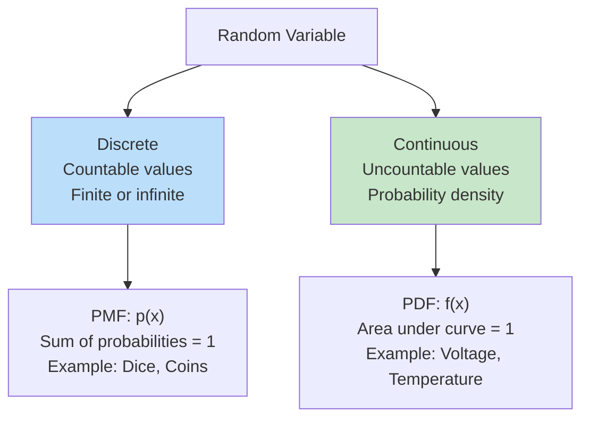
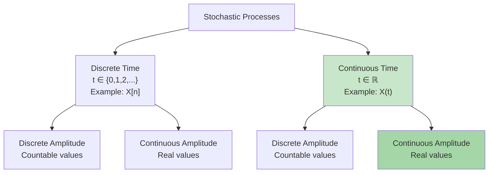

# Module 2: Review of Random Variables and Random Processes

> **Exam Focus:** This module covers fundamental concepts in probability theory, random variables, information theory, and stochastic processes essential for communication systems analysis. Master probability distributions, entropy concepts, and stationary processes.

## Exam Checklist

- [ ] Discrete vs continuous random variables and their properties
- [ ] CDF definition: $F_X(x) = P(X \leq x)$ and properties
- [ ] PDF definition: $f_X(x) = \frac{dF_X(x)}{dx}$ and properties
- [ ] Relationship between CDF and PDF
- [ ] Expected value (mean): $E[X] = \int x f_X(x) dx$
- [ ] Second moment and variance: $\sigma_X^2 = E[X^2] - (E[X])^2$
- [ ] Moments and their significance
- [ ] Entropy for discrete RV: $H(X) = -\sum p(x) \log_2 p(x)$ bits
- [ ] Differential entropy for continuous RV
- [ ] Entropy of Gaussian distribution: $H_{diff}(X) = \frac{1}{2}\log_2(2\pi e \sigma_X^2)$ bits
- [ ] Conditional entropy and conditional probability
- [ ] Mutual information: $I(X;Y) = H(X) - H(X|Y)$
- [ ] Stochastic processes definition and classification
- [ ] Stationarity: WSS (Wide Sense Stationary) conditions
- [ ] Strict Sense Stationarity (SSS) definition
- [ ] Autocorrelation function and its properties
- [ ] Power Spectral Density (PSD) and Wiener-Khinchin theorem
- [ ] LTI system response to WSS input
- [ ] Numerical problems on entropy and mutual information

---
# Prerequisites

- [[Probability]]

# 1. Random Variables: Discrete and Continuous

## Definition and Classification

> **Random Variable (RV):** A function that assigns numerical values to outcomes of a random experiment. Formally: $X: \Omega \rightarrow \mathbb{R}$ where $\Omega$ is the sample space.

**Practical Example:** Consider flipping a coin. The sample space $\Omega$ is {Heads, Tails}. Define RV $X$ as: $X(\text{Heads}) = 1$, $X(\text{Tails}) = 0$. Now, instead of words, we have numbers to analyze probabilities, means, etc.

**Simple Explanation:** Think of a random variable as a way to convert real-world random events into numbers. For example, when you roll a die, the outcome is a number from 1-6. That number IS the random variable!


### Discrete Random Variables

**Definition:** A RV that takes values from a **countable set** {$x_1, x_2, x_3, ...$}

**Simple Explanation:** Like counting: 1, 2, 3... You can list all possible values. No values "in between."

**Probability Mass Function (PMF):**
$$p(x_i) = P(X = x_i) \quad \text{where} \sum_{i} p(x_i) = 1$$

**Example: Dice Roll**
- Possible outcomes: {1, 2, 3, 4, 5, 6}
- $p(x_i) = 1/6$ for each $i$

**Quick Q&A:**
> **Q:** Why must all probabilities sum to 1?  
> **A:** Because the outcome MUST be one of the possible values. Total certainty = 1.

### Continuous Random Variables

**Definition:** A RV that takes values from an **uncountable set** (real interval)

**Simple Explanation:** Imagine a smooth line with infinitely many points. You CAN'T list all possible values. Examples: height, temperature, voltage - they're smooth and continuous.

**Probability Density Function (PDF):**
$$f_X(x) \geq 0 \quad \text{and} \quad \int_{-\infty}^{\infty} f_X(x) dx = 1$$

**Interpretation:** $f_X(x) dx = P(x < X \leq x + dx)$ (not a probability!)

**Simple Explanation:** PDF is like density (like mass per unit length). The area under the curve is the probability.

**Example: Temperature**
- Can take any value in a continuous range
- Probability of exact value = 0, only probability over intervals has meaning

**Quick Q&A:**
> **Q:** Why is the PDF not a probability?  
> **A:** Because for continuous variables, P(X = x) = 0 (single point has zero area). Only areas (integrals) give probabilities.

> **Q:** Can PDF be greater than 1?  
> **A:** Yes! If the range is small (like 0.1 to 0.2), the PDF can be > 1. But the total area must = 1.

### Key Difference



---

# 2. Cumulative Distribution Function (CDF)

## Definition

> **CDF:** The probability that a random variable $X$ is less than or equal to $x$; that is, $F_X(x)$ gives the total probability accumulated up to $x$.

$$F_X(x) = P(X \leq x)$$

**Simple Explanation:** Imagine cumulative = "accumulating" or "adding up". CDF is the running total of all probabilities up to value $x$. Think of it like a "probability up to this point."

**Visual Example:**
- At $x = 1$: How much probability is to the left of 1? → This is $F_X(1)$
- At $x = 2$: How much probability is to the left of 2? → This is $F_X(2)$ (always ≥ $F_X(1)$)

### CDF Properties

| Property | Mathematical Form | Significance |
|----------|-------------------|--------------|
| **Non-decreasing** | $F_X(x_1) \leq F_X(x_2)$ if $x_1 < x_2$ | Probability accumulates |
| **Boundaries** | $\lim_{x \to -\infty} F_X(x) = 0$ | No negative probability |
| **Upper bound** | $\lim_{x \to +\infty} F_X(x) = 1$ | Total probability = 1 |
| **Right continuous** | $\lim_{h \to 0^+} F_X(x+h) = F_X(x)$ | Continuous from right |
| **Probability interval** | $P(a < X \leq b) = F_X(b) - F_X(a)$ | Probability in interval |

### CDF for Discrete vs Continuous

**Discrete RV CDF:**
$$F_X(x) = \sum_{x_i \leq x} p(x_i)$$
- Step function (jumps at discrete points)
- Discontinuous

**Continuous RV CDF:**
$$F_X(x) = \int_{-\infty}^{x} f_X(\tau) d\tau$$
- Smooth, continuous curve
- Differentiable (almost everywhere)

### CDF Visualization

```
Discrete CDF (Example: 6-sided die)
    ▲ F(x)
    │
    1 │      ●───●───●───●───●───●
  5/6 │    ●─┘
  4/6 │  ●─┘
  3/6 │●─┘
  2/6 │●
  1/6 │
    0 │●────────────────────────────► x
      │ 0  1  2  3  4  5  6

Continuous CDF (Example: Gaussian)
    ▲ F(x)
    1 │         ╱───────
      │        ╱
  0.5 │──────╱────────── (mean)
      │    ╱
    0 │────────────────────► x
      │  μ-3σ  μ  μ+3σ
      (S-shaped curve)
```

---

# 3. Probability Density Function (PDF)

## Definition

> **PDF:** The derivative of the CDF. Represents the probability density (not probability).

$$f_X(x) = \frac{dF_X(x)}{dx}$$

**Simple Explanation:** If CDF is the "total accumulation," then PDF is the "rate of change" of that accumulation. It tells you where the probability is concentrated - high PDF = high concentration, low PDF = low concentration.

**Reverse relationship:**
$$F_X(x) = \int_{-\infty}^{x} f_X(\tau) d\tau$$

**Quick Q&A:**
> **Q:** If CDF is increasing (going up), what does that say about PDF?  
> **A:** PDF is positive. Derivative of an increasing function is positive.

> **Q:** What does PDF = 0 at a point mean?  
> **A:** Zero probability density at that point. No probability is concentrated there.

### PDF Properties

| Property | Mathematical Form | Significance |
|----------|-------------------|--------------|
| **Non-negative** | $f_X(x) \geq 0$ for all $x$ | Probability density is positive |
| **Normalized** | $\int_{-\infty}^{\infty} f_X(x) dx = 1$ | Total probability = 1 |
| **Probability** | $P(a < X \leq b) = \int_a^b f_X(x) dx$ | Area = probability |
| **Tail behavior** | $f_X(x) \to 0$ as $x \to \pm\infty$ | Probability density vanishes |

### Important Observation

$$P(X = x) = 0 \text{ for continuous RV}$$

Why? Because $P(X = x) = \lim_{dx \to 0} P(x < X \leq x + dx) = \lim_{dx \to 0} f_X(x) \cdot dx = 0$

> This is the **fundamental difference** between discrete and continuous RVs!

### Common PDFs in Communication

| Distribution | PDF | Applications |
|-------------|-----|--------------|
| **Gaussian** | $f_X(x) = \frac{1}{\sqrt{2\pi\sigma^2}} e^{-\frac{(x-\mu)^2}{2\sigma^2}}$ | AWGN noise, signal envelope |
| **Uniform** | $f_X(x) = \frac{1}{b-a}$ for $a < x < b$ | Random phase, quantization |
| **Exponential** | $f_X(x) = \lambda e^{-\lambda x}$ for $x \geq 0$ | Fading channels, lifetimes |
| **Rayleigh** | $f_X(x) = \frac{x}{\sigma^2} e^{-\frac{x^2}{2\sigma^2}}$ for $x \geq 0$ | Mobile fading |

---

# 4. Statistical Averages: Mean, Variance, and Moments

## Expected Value (Mean)

> **Expected Value:** The weighted average of all possible values of the RV.

**Simple Explanation:** Like the center of gravity. If you put tiny weights on all the values, weighted by their probabilities, the center is the mean. It's the "long-run average" if you repeat the experiment many times.

### For Discrete RV:
$$E[X] = \mu = \sum_{i} x_i p(x_i)$$

### For Continuous RV:
$$E[X] = \mu = \int_{-\infty}^{\infty} x f_X(x) dx$$

**Significance:** Center of probability mass (first moment)

**Example: Fair Dice**
$$E[X] = \frac{1}{6}(1+2+3+4+5+6) = 3.5$$

**Quick Q&A:**
> **Q:** Why is 3.5 the average if you can only roll 1-6?  
> **A:** It's the AVERAGE over many rolls, not a single outcome. If you roll 1000 times, the average will be ~3.5.

> **Q:** Can mean be outside the possible values?  
> **A:** Yes! Dice example shows this. Mean = 3.5 but you never roll 3.5.

## Variance

> **Variance:** A measure of the spread or dispersion of the RV around the mean.

**Simple Explanation:** How scattered the values are. Small variance = values clustered near mean. Large variance = values spread out. Think of it as "uncertainty" or "volatility."

### Mathematical Definition:
$$\text{Var}(X) = \sigma_X^2 = E[(X - \mu)^2]$$

### Alternative Formula (Easier to compute):
$$\sigma_X^2 = E[X^2] - (E[X])^2 = E[X^2] - \mu^2$$

Where: $E[X^2] = \int_{-\infty}^{\infty} x^2 f_X(x) dx$ (second moment)

**Significance:** Variance measures uncertainty or variability in the signal

**Standard Deviation:** $\sigma_X = \sqrt{\text{Var}(X)}$ (same units as $X$)

**Quick Q&A:**
> **Q:** Why square the deviations?  
> **A:** To make them positive and penalize large deviations more. Squaring ensures everything is positive.

> **Q:** Why take the square root to get standard deviation?  
> **A:** To get back to the same units as the original signal. Variance is in squared units.

### Example: Gaussian Distribution

For Gaussian RV with mean $\mu$ and variance $\sigma^2$:
- ~68% of values fall within $[\mu - \sigma, \mu + \sigma]$ (1σ)
- ~95% within $[\mu - 2\sigma, \mu + 2\sigma]$ (2σ)
- ~99.7% within $[\mu - 3\sigma, \mu + 3\sigma]$ (3σ)

## Moments

> **$n$-th Moment:** $E[X^n] = \int_{-\infty}^{\infty} x^n f_X(x) dx$

| Moment | Name | Formula | Significance |
|--------|------|---------|--------------|
| **1st** | Mean | $\mu = E[X]$ | Center of distribution |
| **2nd** | Power | $E[X^2]$ | Average power (for signals) |
| **2nd Central** | Variance | $\sigma^2 = E[(X-\mu)^2]$ | Spread/variability |
| **3rd Central** | Skewness | $\gamma = \frac{E[(X-\mu)^3]}{\sigma^3}$ | Asymmetry |
| **4th Central** | Kurtosis | $\kappa = \frac{E[(X-\mu)^4]}{\sigma^4}$ | Tailedness |

### Practical Significance in Communication

| Metric | Use in Communication |
|--------|----------------------|
| **Mean** | DC offset in signals |
| **Variance** | Noise power in AWGN channels |
| **Skewness** | Non-Gaussian noise characterization |
| **Kurtosis** | Impulsive noise detection |

---

# 5. Entropy: Information Measure

## Entropy for Discrete Random Variables

> **Entropy (Shannon):** A measure of the average information content or uncertainty in a random variable.

**Simple Explanation:** How surprised you are on average. Predictable events (boring!) have low entropy. Unpredictable events (shocking!) have high entropy. It measures "how much information" is needed to describe the outcome.

### Mathematical Definition:

$$H(X) = -\sum_{i=1}^{n} p(x_i) \log_2 p(x_i) \quad \text{[bits]}$$

Or using natural logarithm:
$$H(X) = -\sum_{i=1}^{n} p(x_i) \ln p(x_i) \quad \text{[nats]}$$

**Conversion:** 1 nat = $\log_2 e$ bits ≈ 0.693 bits

**Quick Q&A:**
> **Q:** Why use logarithm?  
> **A:** Because information is proportional to how surprising an event is, and surprise is logarithmic (doubling probability halves the surprise).

> **Q:** Why negative sign?  
> **A:** Because $\log(p)$ is negative for $0 < p < 1$. The negative makes entropy positive.

### Physical Interpretation

- **Entropy = 0:** Complete certainty (one outcome has $p=1$)
- **Entropy = Maximum:** Maximum uncertainty (all outcomes equally likely)
- **Units (bits):** Average number of bits needed to encode one symbol

### Example: Binary Symmetric Source

**Case 1: Unfair coin** ($p(0) = 0.9, p(1) = 0.1$)
$$H(X) = -[0.9 \log_2(0.9) + 0.1 \log_2(0.1)] = -[0.9(-0.152) + 0.1(-3.322)] = 0.469 \text{ bits}$$

Interpretation: On average, 0.469 bits needed to specify the outcome

**Case 2: Fair coin** ($p(0) = 0.5, p(1) = 0.5$)
$$H(X) = -[0.5 \log_2(0.5) + 0.5 \log_2(0.5)] = -[2 \times 0.5 \times (-1)] = 1 \text{ bit}$$

Interpretation: Exactly 1 bit needed to specify the outcome

### Maximum Entropy Property

For $n$ equally likely outcomes:
$$H_{max}(X) = \log_2 n$$

**Example:** 
- Binary source: $H_{max} = \log_2 2 = 1$ bit
- 8-level source: $H_{max} = \log_2 8 = 3$ bits

---

# 6. Differential Entropy: Continuous Case

## Definition

> **Differential Entropy:** The entropy for continuous random variables (also called continuous entropy).

$$H(X) = -\int_{-\infty}^{\infty} f_X(x) \log_2 f_X(x) dx \quad \text{[bits]}$$

Or using natural logarithm:
$$H(X) = -\int_{-\infty}^{\infty} f_X(x) \ln f_X(x) dx \quad \text{[nats]}$$

### Key Differences from Discrete Entropy

| Property | Discrete | Continuous |
|----------|----------|------------|
| **Range** | $0 \leq H \leq \log_2 n$ | Can be negative! |
| **Independence** | $H(X,Y) = H(X) + H(Y)$ | Same relationship |
| **Interpretation** | Average bits per symbol | Differential information |
| **Max condition** | All outcomes equally likely | Specific distribution |

> **Important:** Differential entropy can be **negative** because $f_X(x)$ can be > 1 for continuous RVs!

### Differential Entropy for Common Distributions

| Distribution | Differential Entropy |
|-------------|----------------------|
| **Uniform** $[a,b]$ | $H = \log_2(b-a)$ |
| **Gaussian** $N(\mu, \sigma^2)$ | $H = \frac{1}{2}\log_2(2\pi e \sigma^2)$ ← **Most important!** |
| **Exponential** (rate $\lambda$) | $H = \log_2(e/\lambda)$ |

---

# 7. Differential Entropy of Gaussian Random Variable

## Importance in Communication

> **Key Result:** Among all distributions with given variance, the **Gaussian distribution has MAXIMUM differential entropy**.

**Simple Explanation:** Gaussian/normal distribution is the "most random" or "most unpredictable" for a given amount of spread. This is why AWGN (Additive White Gaussian Noise) is worst-case in communication - it carries maximum uncertainty!

### Mathematical Derivation

For Gaussian RV $X \sim N(\mu, \sigma^2)$:

$$f_X(x) = \frac{1}{\sqrt{2\pi\sigma^2}} \exp\left(-\frac{(x-\mu)^2}{2\sigma^2}\right)$$

**Differential Entropy:**

$$H(X) = -\int_{-\infty}^{\infty} f_X(x) \log_2 f_X(x) dx$$

**After integration (detailed derivation omitted):**

$$\boxed{H(X) = \frac{1}{2}\log_2(2\pi e \sigma_X^2) \text{ [bits]}}$$

Or:
$$H(X) = \frac{1}{2}\ln(2\pi e \sigma_X^2) \text{ [nats]}$$

### Properties

1. **Depends ONLY on variance** ($\sigma_X^2$), not on mean $\mu$
2. **Maximizes entropy** for given variance (uniqueness of Gaussian)
3. **Increases logarithmically** with variance

**Quick Q&A:**
> **Q:** Why doesn't mean affect entropy?  
> **A:** Mean just shifts the distribution left/right. The "spread" (uncertainty) is the same. Entropy depends only on spread, not location.

> **Q:** If I increase variance, does entropy increase?  
> **A:** Yes, logarithmically. More spread = more uncertainty = higher entropy.

### Numerical Example

For $\sigma^2 = 1$:
$$H(X) = \frac{1}{2}\log_2(2\pi e \times 1) = \frac{1}{2}\log_2(17.08) = \frac{1}{2} \times 4.095 = 2.047 \text{ bits}$$

### Channel Capacity Application

**Shannon's Noisy Channel Capacity:**
$$C = B \log_2\left(1 + \frac{P_s}{P_n}\right)$$

where:
- $B$ = Bandwidth (Hz)
- $P_s$ = Signal power
- $P_n$ = Noise power (from Gaussian noise entropy!)

> This demonstrates why Gaussian noise is the "worst case" and hence critical in communication theory.

---

# 8. Conditional Entropy and Mutual Information

## Conditional Entropy

> **Conditional Entropy:** The uncertainty in $X$ given that we know $Y$.

**Simple Explanation:** If you already know $Y$, how much uncertainty remains about $X$? Like having partial information. If $Y$ is very informative about $X$, conditional entropy is low.

### Definition (Discrete Case):

$$H(X|Y) = -\sum_y p(y) \sum_x p(x|y) \log_2 p(x|y)$$

**Or more compactly:**
$$H(X|Y) = -\sum_{x,y} p(x,y) \log_2 \frac{p(x,y)}{p(y)}$$

**Quick Q&A:**
> **Q:** When is $H(X|Y) = 0$?  
> **A:** When Y completely determines X (no remaining uncertainty). If you know Y, you know X exactly.

> **Q:** When is $H(X|Y) = H(X)$?  
> **A:** When X and Y are independent. Knowing Y tells you nothing about X.

### Interpretation

- $H(X|Y) \leq H(X)$ → Knowing $Y$ reduces or maintains uncertainty in $X$
- $H(X|Y) = H(X)$ → $X$ and $Y$ are **independent**
- $H(X|Y) = 0$ → $X$ is completely determined by $Y$

### Chain Rule of Entropy

$$H(X,Y) = H(X) + H(Y|X) = H(Y) + H(X|Y)$$

---

## Mutual Information

> **Mutual Information:** The amount of information about $X$ that $Y$ contains (or vice versa).

**Simple Explanation:** How much knowing Y helps you understand X. High mutual information = Y tells you a lot about X. Zero mutual information = Y and X are completely unrelated.

### Mathematical Definition:

$$I(X;Y) = H(X) - H(X|Y)$$

**Alternative expressions:**
$$I(X;Y) = H(Y) - H(Y|X)$$
$$I(X;Y) = H(X) + H(Y) - H(X,Y)$$
$$I(X;Y) = \sum_{x,y} p(x,y) \log_2 \frac{p(x,y)}{p(x)p(y)}$$

**Quick Q&A:**
> **Q:** Why is $I(X;Y) \geq 0$ always?  
> **A:** Information is always non-negative. Knowing Y can't increase uncertainty in X (it either helps or doesn't).

> **Q:** What does $I(X;Y) = H(X)$ mean?  
> **A:** Knowing Y completely reveals X. Perfect information transmission. Y and X have a deterministic relationship.

### Interpretation

- $I(X;Y) \geq 0$ → Non-negative (always!)
- $I(X;Y) = 0$ → $X$ and $Y$ are independent
- $I(X;Y) = H(X)$ → Complete knowledge (deterministic relationship)
- $I(X;Y) = \min(H(X), H(Y))$ → Maximum possible

### Channel Capacity using Mutual Information

The capacity of a channel is:
$$C = \max_{p(x)} I(X;Y)$$

where the maximum is over all input distributions $p(x)$.

### Visualization: Information Theory Diagram

```
                H(X)
            ┌─────────┐
            │  H(X|Y) │  H(X∩Y) = I(X;Y)
            │────────┌┼──────┐
            │        │      │
        ────┼────────┼──────┼────────  ← (Complete information)
            │        │      │
            │        └──────┘
            │        H(Y|X)
            └─────────┘
                H(Y)

    Area of overlap (I(X;Y)) = Mutual Information
    Non-overlapping part of X = H(X|Y)
    Non-overlapping part of Y = H(Y|X)
```

---

# 9. Stochastic Processes

## Definition and Classification

> **Stochastic Process:** A collection of random variables indexed by time (or space): {$X(t), t \in T$}

where $t$ is the index parameter (usually time) and $T$ is the index set.

**Simple Explanation:** Instead of ONE random variable, you have MANY random variables, one at each point in time. Like a sequence of dice rolls: X[1], X[2], X[3], ... Each is a random variable. Together they form a stochastic process.

### Types of Stochastic Processes



### Examples in Communication

| Type | Example |
|------|---------|
| **Discrete-time, Discrete** | Binary bit sequence {0,1} |
| **Discrete-time, Continuous** | Sample sequence of analog signal |
| **Continuous-time, Discrete** | Poisson point process (arrivals) |
| **Continuous-time, Continuous** | AWGN noise $n(t)$ (most important!) |

### Characterization Methods

**Method 1: Joint PDF of samples**
$$f_{X(t_1), X(t_2), ..., X(t_n)}(x_1, x_2, ..., x_n)$$

**Method 2: First and second-order statistics (simpler!)**
- Mean: $m_X(t) = E[X(t)]$
- Autocorrelation: $R_X(t_1, t_2) = E[X(t_1)X(t_2)]$

---

# 10. Stationarity: WSS and SSS

## Strict Sense Stationarity (SSS)

> **SSS:** A process is SSS if its statistical properties are unchanged by time shifting.

**Simple Explanation:** The "behavior" of the signal looks the same whether you look at it starting now or starting tomorrow. Statistical properties don't change with time. Like a well-mixed river - water at any point looks the same.

### Mathematical Definition:

For any $n$, times $t_1, t_2, ..., t_n$, and time shift $\tau$:

$$f_{X(t_1+\tau), X(t_2+\tau), ..., X(t_n+\tau)}(x_1, ..., x_n) = f_{X(t_1), ..., X(t_n)}(x_1, ..., x_n)$$

**Simple interpretation:** The process "looks the same" at any time point.

### Implications of SSS

1. **First-order:** $f_X(x,t) = f_X(x)$ (independent of $t$)
   - Mean is constant: $m_X(t) = \mu$ (constant)

2. **Second-order:** $f_{X(t_1), X(t_2)}(x_1, x_2) = f_{X(t_1+\tau), X(t_2+\tau)}(x_1, x_2)$
   - Autocorrelation depends only on difference: $R_X(t_1, t_2) = R_X(\tau)$ where $\tau = t_2 - t_1$

**Quick Q&A:**
> **Q:** Does SSS mean the signal is constant?  
> **A:** No! It varies, but its STATISTICS (mean, variance, etc.) don't change. The overall character stays the same.

> **Q:** What process is NOT stationary?  
> **A:** A signal that grows over time (like exponential growth). Its mean/variance change, so it's not stationary.

### Examples

| Process | SSS? | Reason |
|---------|------|--------|
| AWGN noise | Yes ✓ | Gaussian with constant mean/variance |
| $X(t) = A\cos(\omega_0 t + \phi)$ | No ✗ | Periodic, changes with $t$ |
| $X(t) = A\cos(\omega_0 t + \Phi)$, random phase $\Phi$ | Yes ✓ | Time average = uniform distribution |

---

## Wide Sense Stationary (WSS)

> **WSS (Weak Stationarity):** A weaker condition requiring only first and second-order moments to be independent of time.

**Simple Explanation:** Like a "practical" version of SSS. We don't require ALL statistics to be constant, just the important ones: mean and autocorrelation. Easier to check and most communication signals satisfy this.

### WSS Conditions (Two Requirements)

**Condition 1:** Mean is constant
$$E[X(t)] = \mu \quad \text{(independent of } t \text{)}$$

**Condition 2:** Autocorrelation depends only on time difference
$$E[X(t_1)X(t_2)] = R_X(t_2 - t_1) = R_X(\tau)$$

where $\tau = t_2 - t_1$

**Quick Q&A:**
> **Q:** Why is WSS easier to verify than SSS?  
> **A:** Only 2 conditions (mean & autocorr). SSS requires ALL statistics to match, which is hard to prove.

> **Q:** When are WSS and SSS the same?  
> **A:** For Gaussian processes! That's why Gaussian noise is so important - WSS = SSS for Gaussians.

### Relationship Between SSS and WSS

```
    SSS (Strictly Stationary)
           ↓
         (implies)
           ↓
    WSS (Wide Sense Stationary)
    
    Note: WSS does NOT imply SSS
```

**Key insight:** For Gaussian processes: **WSS ⟺ SSS** (equivalence!)

### Practical Significance

- **WSS:** Easy to verify in practice (just check mean and autocorrelation)
- **SSS:** Difficult to verify (need all higher moments)
- **Assumption:** Most communication signals assumed WSS for analysis

---

# 11. Autocorrelation Function

## Definition

> **Autocorrelation Function:** Measures the correlation of a process with itself at different times.

**Simple Explanation:** How similar is the signal to itself at different times? If you shift the signal by $\tau$, how well does it match the original? High autocorr = similar, Low autocorr = different.

### For WSS Process:

$$R_X(\tau) = E[X(t)X(t+\tau)]$$

where $\tau$ is the time lag.

**Quick Q&A:**
> **Q:** Why is autocorrelation maximum at $\tau = 0$?  
> **A:** At zero shift, the signal matches itself perfectly. As you shift more ($|\tau|$ increases), similarity decreases.

> **Q:** What does it mean if autocorr falls to zero?  
> **A:** The signal at time $t$ is completely uncorrelated with the signal at time $t+\tau$. Very different values.

### Properties of Autocorrelation

| Property | Mathematical Form | Significance |
|----------|-------------------|--------------|
| **Maximum at origin** | $\|R_X(\tau)\| \leq R_X(0)$ | Maximum correlation at zero lag |
| **Even function** | $R_X(\tau) = R_X(-\tau)$ | Symmetric about $\tau = 0$ |
| **At zero lag** | $R_X(0) = E[X^2(t)]$ | Average power of signal |
| **At zero lag** | $R_X(0) = \sigma_X^2 + \mu_X^2$ | Variance + mean square |
| **Asymptotic behavior** | $R_X(\tau) \to \mu_X^2$ as $\tau \to \infty$ | Independent samples |
| **Non-negative** | PSD $\geq 0$ (from Fourier pair) | Energy conservation |

### Autocorrelation Plots

**Highly correlated signal (slow variation):**
```
R_X(τ)
    │   ╲
    │    ╲
    │     ╲────── → μ² (slowly)
    │
    0 ├─────────────────► τ
      │ 0  T  2T  3T
```

**Low correlation signal (fast variation):**
```
R_X(τ)
    │ ╱╲╱╲╱╲
    │╱ ╲ ╲ ╲  → μ² (quickly)
    │    ╲╱ ╲╱
    0 ├─────────────────► τ
      │ 0  T  2T  3T
```

### Examples

**White Noise (AWGN):**
$$R_X(\tau) = \frac{N_0}{2}\delta(\tau) + \mu_X^2$$

where $\delta(\tau)$ is Dirac delta (autocorr only at $\tau=0$)

**Sinusoid with Random Phase:**
$$X(t) = A\cos(\omega_0 t + \phi), \quad \phi \sim \text{Uniform}[0, 2\pi]$$
$$R_X(\tau) = \frac{A^2}{2}\cos(\omega_0 \tau)$$

---

# 12. Power Spectral Density (PSD)

## Definition

> **Power Spectral Density:** The frequency domain representation of the average power in a signal.

**Simple Explanation:** Shows WHERE the power is distributed across different frequencies. High PSD at frequency $f$ = lots of power at that frequency. Like a bar chart showing power at each frequency.

### Mathematical Definition:

$$S_X(f) = \mathcal{F}\{R_X(\tau)\}$$

where $\mathcal{F}$ denotes the Fourier transform.

**Inverse relation (Wiener-Khinchin Theorem):**
$$R_X(\tau) = \mathcal{F}^{-1}\{S_X(f)\} = \int_{-\infty}^{\infty} S_X(f) e^{j2\pi f\tau} df$$

### Wiener-Khinchin Theorem

> **Theorem:** The autocorrelation function and power spectral density form a Fourier transform pair.

$$R_X(\tau) \stackrel{\mathcal{F}}{\longleftrightarrow} S_X(f)$$

**Simple Explanation:** Time-domain autocorrelation and frequency-domain PSD are two ways to see the same information. Like looking at a song in time (waveform) vs frequency (bass, treble, etc.). Same song, two views!

**Quick Q&A:**
> **Q:** Why is this theorem important?  
> **A:** You can calculate PSD from autocorrelation (or vice versa). Whichever is easier to compute!

> **Q:** Can you go back and forth?  
> **A:** Yes! Fourier transform is reversible. Autocorr ↔ PSD

### PSD Properties

| Property | Mathematical Form | Significance |
|----------|-------------------|--------------|
| **Non-negative** | $S_X(f) \geq 0$ | Power is always positive |
| **Total power** | $P_{total} = R_X(0) = \int_{-\infty}^{\infty} S_X(f) df$ | Area = total power |
| **Even function** | $S_X(f) = S_X(-f)$ for real signals | Symmetry about $f=0$ |
| **Real-valued** | $S_X(f) \in \mathbb{R}$ | For real processes |
| **Units** | $S_X(f)$ in Watts/Hz | Power per Hz bandwidth |

### PSD Interpretation

$S_X(f) df$ = power in frequency band $[f, f+df]$

### Examples of PSD

**White Noise:**
$$S_X(f) = \frac{N_0}{2} \quad \text{for all } f$$

- Constant across all frequencies
- Autocorrelation: $R_X(\tau) = \frac{N_0}{2}\delta(\tau)$

**Bandlimited Signal:**
```
    S_X(f)
       │     ┌─────────┐
    P/B│     │         │
       │     │         │
       0 ├─────┴─────────┴─────► f
         │ f₀-B/2  f₀  f₀+B/2
         
    Total Power: P = S_X(f) × B (for each band)
```

---

# 13. LTI Systems with WSS Input

## System Response

> **LTI (Linear Time-Invariant) System:** Output = Convolution of input with impulse response.

$$y(t) = \int_{-\infty}^{\infty} h(\tau) x(t-\tau) d\tau = h(t) * x(t)$$

where $h(t)$ is the impulse response.

**Simple Explanation:** An LTI system is like a filter that processes signals in a consistent way. Same input always produces same output, no matter when it's applied.

### When Input is WSS

**Key Result:** If input $X(t)$ is WSS, then output $Y(t)$ is also WSS!

**Simple Explanation:** Filtering a stationary signal keeps it stationary. The signal's "character" is preserved even if the specific content changes.

**Quick Q&A:**
> **Q:** What happens to the PSD when you filter?  
> **A:** It gets multiplied by $|H(f)|^2$. Strong attenuation ($|H|$ small) reduces power, no attenuation ($|H|$ = 1) preserves it.

> **Q:** If I filter white noise, what do I get?  
> **A:** Colored noise. The PSD is no longer flat - it's "colored" by the filter's frequency response.

### Input-Output Relations

#### Autocorrelation:
$$R_Y(\tau) = \int_{-\infty}^{\infty} \int_{-\infty}^{\infty} h(s) h(u) R_X(\tau + u - s) ds \, du$$

**Simplified using convolution:**
$$R_Y(\tau) = R_X(\tau) * h(\tau) * h(-\tau)$$

#### Power Spectral Density:
$$S_Y(f) = |H(f)|^2 S_X(f)$$

where $H(f) = \mathcal{F}\{h(t)\}$ is the frequency response.

#### Output Power:
$$P_Y = R_Y(0) = \int_{-\infty}^{\infty} |H(f)|^2 S_X(f) df$$

### Cross-Correlation

**Between input and output:**
$$R_{XY}(\tau) = E[X(t)Y(t+\tau)] = R_X(\tau) * h(\tau)$$

**Cross-PSD:**
$$S_{XY}(f) = H(f) S_X(f)$$

---

## Important Application: Filtering

### Lowpass Filter Example

**Frequency response:**
$$H(f) = \begin{cases} 1 & |f| \leq B \\ 0 & |f| > B \end{cases}$$

**Output PSD:**
$$S_Y(f) = S_X(f) \quad \text{for } |f| \leq B, \quad 0 \text{ otherwise}$$

**Output power:**
$$P_Y = \int_{-B}^{B} S_X(f) df$$

---

# 14. Complete Comparison Table

| Concept | Discrete | Continuous |
|---------|----------|------------|
| **RV Definition** | Countable values | Uncountable values |
| **Probability** | PMF: $p(x) = P(X=x)$ | PDF: $f_X(x)$ (density) |
| **Normalization** | $\sum p(x) = 1$ | $\int f_X(x) dx = 1$ |
| **Expected Value** | $E[X] = \sum x p(x)$ | $E[X] = \int x f_X(x) dx$ |
| **Variance** | $\sigma^2 = E[X^2] - \mu^2$ | Same formula |
| **Entropy** | $H = -\sum p \log_2 p$ [bits] | $H = -\int f \log_2 f$ [bits] |
| **Example** | Dice, Coin | Noise, Temperature |

---

# 15. Exam Checklist - Complete

## Part 1: Random Variables Basics
- [ ] Distinguish between discrete and continuous RVs
- [ ] Understand PMF for discrete RVs
- [ ] Understand PDF for continuous RVs
- [ ] Relationship between CDF and PDF: $f(x) = \frac{dF(x)}{dx}$
- [ ] Properties of CDF (non-decreasing, boundaries, continuity)
- [ ] Properties of PDF (non-negative, normalization, probability intervals)
- [ ] Calculate probabilities using PDF: $P(a < X \leq b) = \int_a^b f(x) dx$

## Part 2: Statistical Averages
- [ ] Mean (Expected Value): $E[X] = \int x f(x) dx$
- [ ] Variance: $\sigma^2 = E[X^2] - (E[X])^2$
- [ ] Understand significance: mean = center, variance = spread
- [ ] Moments: 1st=mean, 2nd=power, 3rd=skewness, 4th=kurtosis
- [ ] Practical applications: DC offset, noise power, signal characteristics
- [ ] Numerical: Calculate means and variances for given distributions

## Part 3: Entropy - Discrete Case
- [ ] Discrete entropy formula: $H = -\sum p \log_2 p$
- [ ] Entropy units: bits (base-2), nats (natural log)
- [ ] Entropy = 0 when outcome certain
- [ ] Maximum entropy = $\log_2 n$ for $n$ equal outcomes
- [ ] Practical interpretation: average bits to encode symbol
- [ ] Calculate entropy for given probability distributions

## Part 4: Differential Entropy - Continuous Case
- [ ] Differential entropy formula: $H = -\int f \log_2 f$
- [ ] Can be negative (unlike discrete entropy!)
- [ ] Reason: PDF can be > 1
- [ ] Examples: uniform, Gaussian, exponential distributions

## Part 5: Gaussian Entropy (Most Important!)
- [ ] **Gaussian entropy:** $H = \frac{1}{2}\log_2(2\pi e \sigma^2)$ bits
- [ ] Depends ONLY on variance, not mean
- [ ] Maximizes entropy for given variance
- [ ] Application to channel capacity: Shannon formula
- [ ] Numerical example: Calculate entropy for given $\sigma^2$

## Part 6: Conditional Entropy & Mutual Information
- [ ] Conditional entropy: $H(X|Y) = H(X) - I(X;Y)$
- [ ] $H(X|Y) = 0$ means complete dependence
- [ ] $H(X|Y) = H(X)$ means independence
- [ ] Mutual information: $I(X;Y) = H(X) - H(X|Y)$
- [ ] $I(X;Y) \geq 0$ (always non-negative)
- [ ] Channel capacity: $C = \max I(X;Y)$
- [ ] Chain rule: $H(X,Y) = H(X) + H(Y|X)$

## Part 7: Stochastic Processes
- [ ] Definition: Collection of RVs indexed by time
- [ ] Types: Discrete/continuous time, discrete/continuous amplitude
- [ ] Examples: AWGN, bit sequence, Poisson process
- [ ] Characterization: Joint PDF or statistics approach

## Part 8: Stationarity - SSS
- [ ] Strict Sense Stationarity definition
- [ ] All statistics invariant to time shift
- [ ] Implies: constant mean, autocorr depends on $\tau$ only
- [ ] Examples: AWGN ✓, random phase sinusoid ✓, deterministic sinusoid ✗

## Part 9: Stationarity - WSS
- [ ] Condition 1: $E[X(t)] = \mu$ (constant)
- [ ] Condition 2: $R_X(t_1, t_2) = R_X(t_2 - t_1) = R_X(\tau)$
- [ ] **Weaker than SSS** (easier to verify)
- [ ] For Gaussian: WSS ⟺ SSS
- [ ] Why important: Mathematical tractability

## Part 10: Autocorrelation Function
- [ ] Definition: $R_X(\tau) = E[X(t)X(t+\tau)]$
- [ ] Maximum at $\tau = 0$: $|R(\tau)| \leq R(0)$
- [ ] Even function: $R(\tau) = R(-\tau)$
- [ ] $R(0) = E[X^2]$ = average power
- [ ] Properties: Even, maximum at origin, decay to $\mu^2$
- [ ] Visual interpretation: Correlation decay rate

## Part 11: Power Spectral Density (PSD)
- [ ] Definition: Fourier transform of autocorrelation
- [ ] **Wiener-Khinchin:** $R(\tau) \stackrel{\mathcal{F}}{\longleftrightarrow} S(f)$
- [ ] PSD Properties: Non-negative, even function, units Watts/Hz
- [ ] Total power: $P = R(0) = \int S(f) df$
- [ ] Examples: White noise, bandlimited signals
- [ ] Interpretation: $S(f) df$ = power in band $[f, f+df]$

## Part 12: LTI Systems with WSS Input
- [ ] Output also WSS ✓
- [ ] Output power: $P_Y = \int |H(f)|^2 S_X(f) df$
- [ ] Output PSD: $S_Y(f) = |H(f)|^2 S_X(f)$
- [ ] Output autocorrelation: $R_Y(\tau) = R_X(\tau) * h(\tau) * h(-\tau)$
- [ ] Cross-PSD: $S_{XY}(f) = H(f) S_X(f)$
- [ ] Application: Filtering preserves stationarity

## Part 13: Numerical & Conceptual Problems
- [ ] Calculate CDF/PDF for given distributions
- [ ] Compute entropy and mutual information
- [ ] Find autocorrelation from PSD and vice versa
- [ ] Determine if process is WSS or SSS
- [ ] Filter analysis with LTI systems

---

# 16. Common Exam Questions & Answers

> **Q1: Why is Gaussian distribution important in communication?**
>
> **A:** (1) Maximizes entropy for given variance → worst-case scenario, (2) AWGN is Gaussian, (3) By Central Limit Theorem, sums of independent RVs approach Gaussian, (4) Analytic tractability.

> **Q2: What's the difference between WSS and SSS?**
>
> **A:** WSS requires only mean and autocorrelation to be time-invariant (tractable). SSS requires ALL statistics to be time-invariant (very restrictive). For Gaussian processes, WSS ⟺ SSS (equivalent).

> **Q3: Why can differential entropy be negative?**
>
> **A:** Because PDF can be > 1 for continuous RVs (e.g., narrow Gaussian), causing $\log_2(f) < 0$. Discrete entropy is always ≥ 0 because $p(x) \leq 1$.

> **Q4: How does filtering affect a WSS process?**
>
> **A:** WSS input produces WSS output. PSD is modified by $|H(f)|^2$, so output power = $\int |H(f)|^2 S_X(f) df$. Autocorrelation becomes the convolution of input autocorr with impulse response convolution.

> **Q5: What's the relationship between autocorrelation and PSD?**
>
> **A:** Wiener-Khinchin Theorem: $R(\tau) \stackrel{\mathcal{F}}{\longleftrightarrow} S(f)$. Time-domain correlation ↔ frequency-domain power distribution. Total power = $R(0) = \int S(f) df$.

> **Q6: How is mutual information used in channel capacity?**
>
> **A:** Channel capacity = maximum mutual information achievable: $C = \max_{p(x)} I(X;Y)$. For AWGN channel: $C = B \log_2(1 + SNR)$ where $SNR = P_s/P_n$.

---

# 17. Summary: Key Equations Quick Reference

## Random Variables

$$F_X(x) = P(X \leq x), \quad f_X(x) = \frac{dF_X(x)}{dx}$$

$$E[X] = \int x f_X(x) dx, \quad \sigma^2 = E[X^2] - (E[X])^2$$

## Entropy

$$H(X) = -\sum p(x) \log_2 p(x) \text{ [discrete]}$$

$$H(X) = -\int f(x) \log_2 f(x) dx \text{ [continuous]}$$

$$H_{Gaussian} = \frac{1}{2}\log_2(2\pi e \sigma^2) \text{ [bits]}$$

## Mutual Information

$$I(X;Y) = H(X) - H(X|Y) = \sum_{x,y} p(x,y) \log_2 \frac{p(x,y)}{p(x)p(y)}$$

## Stochastic Processes

$$R_X(\tau) = E[X(t)X(t+\tau)], \quad S_X(f) = \mathcal{F}\{R_X(\tau)\}$$

$$R_X(\tau) \stackrel{\mathcal{F}}{\longleftrightarrow} S_X(f) \text{ (Wiener-Khinchin)}$$

## LTI System Response

$$S_Y(f) = |H(f)|^2 S_X(f), \quad P_Y = \int |H(f)|^2 S_X(f) df$$

---

# 18. Quick Reference: Common Mistakes & Memory Tips

## Common Mistakes to Avoid ❌

| Mistake | Why It's Wrong | Correct Understanding ✓ |
|---------|-----------------|------------------------|
| PDF is a probability | PDF can be > 1, probabilities can't | PDF is probability DENSITY, not probability. Area = probability |
| Variance can be negative | By definition, it's squared deviations | Variance is always $\geq 0$ |
| Entropy only for discrete | Works for both! | Discrete entropy ≥ 0, differential entropy can be negative |
| WSS ⟹ SSS | Not always true | Only true for Gaussian processes |
| High entropy = bad signal | Actually, it means unpredictable | Low entropy = predictable/boring, High = unpredictable |
| Autocorr at $\tau \neq 0$ > Autocorr at $\tau = 0$ | Maximum must be at zero | $\|R(\tau)\| \leq R(0)$ always |
| Independent ⟹ uncorrelated | True, but reverse is NOT | Uncorrelated doesn't imply independent (except for Gaussian) |
| Filter doesn't preserve WSS | False! | WSS input → WSS output (important!) |

---

## Memory Tips & Mnemonics 🧠

### For CDF and PDF
- **C**DF = **C**umulative (running total, S-shaped curve)
- **P**DF = **P**eak (shows where the peak/concentration is)
- Remember: **CDF is derivative of PDF** → One smooth line, one is its slope

### For Entropy
- **Entropy = Confusion/Uncertainty** (High entropy = very confused, low = certain)
- Formula has **negative sign** because $\log(p) < 0$ for probabilities
- **Maximum entropy = $\log_2 n$** → Only when all outcomes equally likely

### For Variance
- **Variance = Spread** (how scattered the values are)
- Always **square** deviations (makes negatives positive)
- **Standard deviation = $\sqrt{\text{Var}}$** (back to original units)

### For Stationarity
- **Stationary = Unchanging statistics** (mean, var stay same over time)
- **WSS = Practical** (easy to check: 2 conditions)
- **SSS = Theoretical** (check all statistics - difficult!)
- **For Gaussian: WSS ⟺ SSS** (Both equivalent)

### For PSD and Autocorrelation
- **Wiener-Khinchin:** Autocorr ↔ PSD via Fourier (like time and frequency domains)
- **Total power = Area under PSD** = $R(0)$ = Average power
- **PSD always $\geq 0$** (power can't be negative!)

### For LTI Systems
- **WSS input → WSS output** (Always!)
- **Output PSD = Input PSD × $|H(f)|^2$** (Filter shapes the spectrum)

---

## Quick Answer Checklist ✓

**When You See... Think:**

| Term | Think... |
|------|----------|
| **Discrete RV** | Can list all values, PMF, sum = 1 |
| **Continuous RV** | Can't list all, PDF, integral = 1 |
| **CDF** | Running total, goes 0→1, S-shaped |
| **PDF** | Slope of CDF, area = probability |
| **Expected Value** | Average (center of mass) |
| **Variance** | Spread/scatter (dispersion) |
| **Entropy** | Uncertainty/information content |
| **Mutual Information** | How much Y tells you about X |
| **WSS** | Constant mean, autocorr = $R(\tau)$ only |
| **SSS** | All statistics unchanged by time shift |
| **Autocorrelation** | Self-similarity at different times |
| **PSD** | Power distribution vs frequency |
| **Wiener-Khinchin** | Autocorr ↔ PSD (Fourier pair) |

---

## 5-Minute Summary for Exam

### If You Have ONLY 5 Minutes:

1. **Random Variables:** Discrete (countable, PMF) vs Continuous (uncountable, PDF)
2. **CDF & PDF:** $F(x) = P(X \leq x)$, $f(x) = dF/dx$
3. **Mean & Variance:** $E[X]$ = average, $\sigma^2 = E[X^2] - (E[X])^2$
4. **Entropy:** $H = -\sum p \log p$ (discrete), $H = -\int f \log f$ (continuous)
5. **Gaussian Entropy:** $H = \frac{1}{2}\log(2\pi e \sigma^2)$ (MAXIMUM for given variance!)
6. **Mutual Info:** $I(X;Y) = H(X) - H(X|Y)$ (shared information)
7. **Stochastic Process:** Collection of RVs at different times {$X(t)$}
8. **WSS:** Mean constant + Autocorr = $R(\tau)$ only
9. **Autocorrelation:** $R(\tau) = E[X(t)X(t+\tau)]$, maximum at $\tau=0$
10. **Wiener-Khinchin:** $R(\tau) \stackrel{\mathcal{F}}{\longleftrightarrow} S(f)$ ← THE KEY RELATIONSHIP

---

## Formula Flashcards 📇

| Concept | Formula | When to Use |
|---------|---------|------------|
| **Discrete PMF** | $\sum p(x_i) = 1$ | Discrete random variables |
| **Continuous PDF** | $\int f(x)dx = 1$ | Continuous random variables |
| **Probability** | $P(a < X \leq b) = \int_a^b f(x)dx$ | Find probability over range |
| **Expected Value** | $E[X] = \int x f(x) dx$ | Find average/mean |
| **Variance** | $\sigma^2 = E[X^2] - (E[X])^2$ | Find spread/dispersion |
| **Discrete Entropy** | $H = -\sum p \log_2 p$ [bits] | Information in discrete signal |
| **Differential Entropy** | $H = -\int f \log_2 f$ [bits] | Information in continuous signal |
| **Gaussian Entropy** | $H = \frac{1}{2}\log_2(2\pi e \sigma^2)$ | Worst-case noise |
| **Mutual Info** | $I(X;Y) = H(X) - H(X\|Y)$ | Shared information |
| **Autocorrelation** | $R(\tau) = E[X(t)X(t+\tau)]$ | Self-similarity |
| **Wiener-Khinchin** | $S(f) = \mathcal{F}\{R(\tau)\}$ | Time ↔ Frequency |
| **LTI Output PSD** | $S_Y(f) = \|H(f)\|^2 S_X(f)$ | Filtered signal spectrum |
| **Output Power** | $P_Y = \int \|H(f)\|^2 S_X(f) df$ | Power after filtering |

---

**Last Updated:** November 5, 2025
**Status:** Complete Module 2 study guide with simple explanations ✓✓✓

