### Module 3: Source Coding

- Source coding theorems I and II (Statements only).
- Waveform coding.
- Sampling and Quantization.
- Pulse code modulation, Transmitter and receiver.
- Companding.
- Practical 15 level A and mu-law companders.
- DPCM transmitter and receiver.
- Design of linear predictor.
- Wiener-Hopf equation.
- Delta modulation.
- Slope overload


## Quantization
>Quantization is simply the act of replacing ==infinite-precision== amplitude with an ==index==. Every digital communication system starts here, so it’s a core definition question.

> **step size $\Delta$**.
![[Pasted image 20251118000321.png]]


==Quantization==, is the step in **digital communication** where each sampled analog value is forced to the **nearest discrete amplitude level**. It’s the bridge between the continuous world and a PCM bitstream.

Think of it as dividing the full amplitude range into $L = 2^n$ levels (for an $n$-bit encoder). Each sample is rounded to one of these levels. This rounding introduces **quantization error**, which behaves like noise in most analyses.

A tidy way to express it:
For a sample $x$, the quantized value is  
$$
x_q = Q(x)
$$

where $Q(\cdot)$ maps to the nearest level spaced by $\Delta$.

The error:  
$$
e_q = x - x_q
$$

```
+1      ─────────── level
        Δ
0       ─────────── level
        Δ
-1      ─────────── level

```

What it _should_ mean:
- If the range is from –1 to +1  
- And you have, say, 8 quantization levels  
- Then ∆ should be:
$$
\begin{align}
\Delta = \frac{{+M_{max}- -M_{min}}}{L}
\end{align}
$$


$$\Delta = \frac{2}{8} = 0.25$$

So the levels are:

$$-1,\,-0.75,\,-0.5,\,-0.25,\,0,\,0.25,\,0.5,\,0.75$$

Every jump is ∆ = 0.25.  
**But only one jump** is ∆ — not the whole +1 to 0 region.

### Where it is used? 
In communication courses, quantization matters because:
1. **PCM** relies on uniform quantization to turn samples into bits.
2. **Companding (A-law, μ-law)** reduces quantization noise for speech signals by allocating more levels to low amplitudes.
3. **SNR of a PCM system** depends directly on quantizer resolution  
    (e.g., $\text{SNR} \approx 1.76 + 6.02n$ dB).
    

## Companding

The idea is elegantly sneaky: before ==quantizing==, you ==_compress_== the dynamic range of the signal so that small amplitudes get more resolution and large amplitudes get less. After transmission, you _expand_ it back


## PCM

```mermaid
flowchart TD
    A[Analog Input Signal] --> B["Anti-Alias Filter<br/>(Low-pass filter)"]
    B --> C["Sampler<br/>(Uniform sampling)"]
    C --> D["Compander (A/μ-law)<br/>(optional)"]
    D --> E["Quantizer<br/>(Mid-rise / Mid-tread)"]
    E --> F["Binary Encoder<br/>(n-bit code word)"]
    F --> G["PCM Bitstream<br/>(Digital Output)"]

    classDef blk fill:#fafafa,stroke:#333,stroke-width:1px,rx:6,ry:6;
    class A,B,C,D,E,F,G blk;

```



- The analog signal first passes through an **anti-aliasing filter**, which is a l==ow-pass filter== that limits the signal’s bandwidth so that the sampling theorem is satisfied.This prevents higher-frequency components from ==folding== into the baseband during sampling
- The filtered signal then enters the **sampler**, which takes uniform time-spaced samples at a rate greater than twice the highest signal frequency.
- These samples are still analog in amplitude, so the next step is the **quantizer**, which assigns each sample to the nearest level from a finite set of discrete amplitudes. This introduces quantization error but makes the signal representable digitally
- The quantized levels are then converted into binary words by the **encoder**, producing the PCM bitstream ready for digital transmission.

### How does it differ from  delta modulation?

>One captures the _absolute value_ of each sample; the other captures only the _change_ between samples.

 It ==samples== the analog signal, ==quantizes== each sample to the nearest amplitude level, and assigns a binary word to that level.

You end up describing the **absolute amplitude** at every sampling instant.

This means:

* The bit-rate is relatively high (e.g., 8 bits per sample × 8 kHz = 64 kbps for voice).
* You need multi-bit quantizers and encoders.
* Quality is high if enough bits are used.
* Regenerative repeaters can perfectly restore the digital signal.
    

## Delta Modulation (DM)

It doesn’t store full samples. Instead, it notes whether the signal went **up or down** compared to the previous value. Each step is just +Δ or −Δ.

That means:
* Only **1 bit per sample** is needed.
* The step size Δ determines how fast the algorithm can follow the signal.
* If the signal changes faster than Δ can track, you get **slope overload distortion**.
* If Δ is too large, you get **granular noise** when the signal is slowly changing.
![[Pasted image 20251118001110.png]]
DM is conceptually simple, lightweight, and easy for hardware.

* * *

##### The fundamental difference

PCM encodes **full amplitude information** with multiple bits.  
Delta modulation encodes **only the difference** with a single bit.

This changes everything.

PCM sacrifices bandwidth for accuracy.  
DM sacrifices accuracy for simplicity and lower bit-rate.

* * *

| Feature / Aspect     | Pulse Code Modulation (PCM)                       | Delta Modulation (DM)                               |
| -------------------- | ------------------------------------------------- | --------------------------------------------------- |
| Principle            | Encodes the **absolute amplitude** of each sample | Encodes the **change** in amplitude (up or down)    |
| Bits per sample      | Multi-bit (8–12 bits typical for speech)          | **1 bit** per sample                                |
| Quantization         | Multi-level uniform or non-uniform quantizer      | Two-level quantizer (+Δ or –Δ)                      |
| Encoder complexity   | Higher (sampler + quantizer + encoder)            | Very simple (comparator + integrator)               |
| Bitrate              | High (e.g., 64 kbps for telephone PCM)            | Lower bitrate                                       |
| Distortion/Noise     | Only quantization noise                           | Granular noise + slope overload                     |
| Tracking ability     | Tracks any signal well                            | Limited by step size Δ; struggles with fast signals |
| Signal quality       | High, depends on number of bits                   | Lower, depends on Δ and sampling rate               |
| Hardware requirement | More memory and processing                        | Minimal hardware                                    |
    
### Draw the block diagram of a PCM transmitter and receiver and explain the system.
#### **1. PCM Transmitter Operation**


1. **Anti-Alias Filter**  
    The analog input is passed through a ==low-pass filte==r to limit its bandwidth. This ensures the sampling theorem is satisfied and prevents aliasing.
    
2. **Sampler**  
    The filtered signal is sampled at regular intervals. The sampling rate must be at least twice the highest signal frequency (Nyquist rate).
    
3. **Quantizer**  
    Each sample is rounded to the nearest quantization level. This introduces quantization error but makes the amplitude suitable for digital representation.
    
4. **Binary Encoder**  
    Each quantized level is converted into an n-bit binary word. This produces the PCM bitstream.


#### **2. PCM Receiver Operation**

```mermaid
flowchart TB

    %% Row 1
    subgraph row1[ ]
        direction LR
        A[Received PCM Bitstream] --> B[Decoder<br/>Binary → Levels]
    end

    %% Row 2
    subgraph row2[ ]
        direction LR
        C[Dequantizer<br/>Reconstruct Amplitude] --> D[Reconstruction Filter<br/>Low-pass]
    end

    %% Row 3
    subgraph row3[ ]
        direction LR
        E[Recovered Analog Signal]
    end

    %% Vertical links between rows
    B --> C
    D --> E
    classDef blk fill:#ffffff,stroke:#333,stroke-width:1px,rx:6,ry:6;
    class A,B,C,D,E blk;
```



1. **Decoder**  
    The incoming PCM bitstream is divided into codewords and each codeword is mapped back to its corresponding quantized level.
    
2. **Dequantizer**  
    The numerical values are converted back to amplitude levels approximating the original samples.
    
3. **Reconstruction Filter**  
    A low-pass filter smooths the staircase-like samples into a continuous-time analog waveform.
---


### Q2
Q. State and explain ==sampling theorem==. A PCM system uses a ==uniform quantizer== followed by an ==8-bit encoder==. If the bit rate of the system is $10^8$ bps, then what is the maximum bandwidth of the low-pass message signal for which the system operates satisfactorily?


### 1. Sampling theorem (Nyquist–Shannon) — Statement

If a continuous-time signal $(x(t))$ is bandlimited to $(B) Hz$ (i.e., its Fourier transform $(X(f)=0)$ for $(|f|>B))$, then $(x(t))$ can be perfectly reconstructed from its samples taken uniformly at rate ($f_s$) samples/second provided

$$  
f_s \ge 2B  
$$

The minimum sampling frequency $(2B)$ is called the **Nyquist rate**.

---

#### 2. Explanation (intuitive + what it prevents)

• **Why we need it:** *sampling converts a continuous-time signal into a sequence of impulses in time*. Without limiting the signal bandwidth first, spectral replicas produced by sampling overlap (aliasing), which makes it impossible to separate original spectral content from the copies.
• **Anti-aliasing filter:** in practice, an anti-aliasing low-pass filter is used before sampling to ensure the signal is effectively ==bandlimited== to $(B) Hz$.

• **Perfect reconstruction:** if $(f_s\ge2B)$ and an ideal reconstruction (low-pass) filter is used at the receiver, the original continuous-time signal can be recovered exactly from the samples.

• **If $(f_s<2B)$:** spectral replicas overlap → aliasing → irreversible distortion.

---

#### 3. Mathematical form (sampling and reconstruction)

Sampling: $(x_s(t)=\sum_{n=-\infty}^{\infty} x(nT_s),\delta(t-nT_s))$ where $(T_s=1/f_s)$.

Reconstruction (ideal): pass $(x_s(t))$ through ideal low-pass filter of cutoff $(B)$ to recover $(x(t))$.

---

#### 4. Example (given PCM system)

**Problem:** A PCM system uses a uniform quantizer followed by an 8-bit encoder. If the bit-rate of the system is **$10^8$ bps**, find the maximum bandwidth (B_{max}) of the low-pass message signal for which the system will operate satisfactorily.

**Solution steps:**

1. In PCM, bit-rate $(R = n\times f_s)$, where
	- $(R)$ is the PCM bit-rate (bits per second),
	- $(n)$ is number of bits per sample (here $(n=8)$),
	- $(f_s)$ is sampling frequency (samples per second).
		
2. So the sampling frequency is

$$  
f_s = \dfrac{R}{n} = \dfrac{10^8}{8} = 12.5\ \text{MHz}.  
$$

3. By the sampling theorem, the maximum message bandwidth that can be sampled without aliasing is
    

$$  
B_{max} = \dfrac{f_s}{2} = \dfrac{12.5}{2} = 6.25\ \text{MHz}.  
$$

**Answer:** $(B_{max} = 6.25\ \text{MHz}.)$

---

## DPCM

### Transmitter

>==DPCM==, or Differential Pulse Code Modulation, is a digital coding technique where an analog signal is sampled, and instead of encoding the actual sample value, the system encodes the ==difference between the current sample and a predicted value== obtained from previous samples. Because the difference is usually much smaller than the full sample value, DPCM reduces the number of bits needed for transmission while still allowing accurate reconstruction at the receiver.


![[Pasted image 20251118114045.png]]

- When a voice or video signal is sampled at a rate slightly higher than the Nyquist rate, as usually done in PCM, the resulting sampled signal is found to exhibit a high degree of correlation between adjacent samples. The meaning of this high correlation is that, the signal ==does not change rapidly from one sample to the next==.
- When these highly correlated samples are encoded, the resulting encoded signal contains redundant information. Redundancy means that symbols that are not absolutely essential to the transmission of information
-  By removing this redundancy before encoding, we obtain a more efficient encoded signal, compared to PCM.
- If we know a sufficient part of a redundant signal, we may make the most probable estimate. In particular, if we know the past behavior of a signal up to a certain point in time, it is possible to make some inference about its future values; such a process is commonly called ==prediction==.
- Suppose then a message signal $m(t)$ is sampled at the rate $fs=1/Ts$ giving the sampled signal $m(nTs)$. A prediction of it is denote by $\hat m(nTs)$. which is modeled as a linear combination of p past sample values of the quantized version of $m(nTs)$ where $p$ is the prediction order.

$$
e(nTs)= m(nTs) - \hat m(nTs)
$$
- The difference signal $e(nT_{s})$ is called the prediction error, since it is the amount by which the prediction filter fails to predict the incoming message signal exactly.
![[Screenshot 2025-11-18 at 1.39.12 PM.png]]


1. **The quantizer output for the _prediction error_ is written as:**

$$e_q(nT_s) = e(nT_s) + q(nT_s)$$

Where:

* $e(nT_s)$ = **prediction error**
* $q(nT_s)$ = **quantization error**
    

So the quantizer produces:

**quantized error = actual error + quantization noise**

* * *

2. **This quantized error is added back to the predictor output**

The input to the prediction-filter (or reconstruction filter) is:

$$m_q(nT_s) = \hat{m}(nT_s) + e_q(nT_s)$$

Meaning:

**reconstructed sample = predicted sample + quantized error**

* * *

3. **Substitute the quantizer output into the equation**

Substitute:

$$e_q(nT_s) = e(nT_s) + q(nT_s)$$

into:

$$m_q(nT_s) = \hat{m}(nT_s) + e_q(nT_s)$$

you get:

$$m_q(nT_s) = \hat{m}(nT_s) + e(nT_s) + q(nT_s)$$

* * *

4. **The key observation**

Look at the term:

$$\hat{m}(nT_s) + e(nT_s)$$

But by definition:

$$e(nT_s) = m(nT_s) - \hat{m}(nT_s)$$

Therefore:

$$\hat{m}(nT_s) + e(nT_s) = m(nT_s)$$

So the entire equation becomes:

$$m_q(nT_s) = m(nT_s) + q(nT_s)$$

This is a core insight:

**After prediction + error addition + quantization, we effectively get a quantized version of the original sample.**

* * *

5.  **The important conclusion**

The text says:

* If the predictor is good,  
    then the prediction error $e(nT_s)$ becomes **very small**.
    
* A **smaller amplitude signal** requires fewer quantizer levels.
    
* For a fixed number of quantizer bits,  
    the **quantization noise becomes smaller** than PCM.
    

This gives the main advantage:

##### DPCM achieves lower quantization noise because it quantizes a small error signal rather than the full sample.

PCM quantizes:

$$m(nT_s)$$

DPCM quantizes:

$$e(nT_s) = m(nT_s) - \hat{m}(nT_s)$$

When the signal is predictable (like speech),  
$\hat{m}(nT_s)$ ≈ $m(nT_s)$ → error is small → better efficiency.

* * *

 Put simply

1. Predictor estimates the sample.
2. You transmit the difference.
3. Quantizer only handles this small difference.
4. Receiver reconstructs full sample: prediction + quantized error.
5. Final sample = true sample + quantization noise.

Because the difference is much smaller,  
**DPCM has less quantization noise than PCM for the same number of bits.**

* * *

Accordingly, if the prediction is good, the average power of the prediction error $e(nTs)$ will be smaller than the average power of $m(nTs)$ so that a quantizer with a given number of levels can be adjusted to produce a quantization error with a smaller average power than would be possible if m(nTs) were quantized directly using PCM.
> [!abstract]- Block Wise
> ### 🌱 **EXPLANATION OF EACH BLOCK**
> 
> #### **1. Input Signal x(n)**
> 
> This is your sampled analog signal—speech is the classic example.  
> DPCM doesn’t transmit x(n) directly. Instead, it transmits _changes_ in x(n).
> 
> #### **2. Predictor / Linear Predictor**
> ![[Screenshot 2025-11-18 at 1.29.41 PM.png]]
> 
> >**Linear Prediction Error Filter**
> 
> A **linear prediction error filter** is a filter that predicts the current sample of a signal using a linear combination of its past samples and then produces the **prediction error**, which is the difference between the actual value and the predicted value.
> 
> Prediction:
> 
> $$\hat{x}(n) = a_1 x(n-1) + a_2 x(n-2) + \ldots + a_p x(n-p)$$
> 
> Prediction error:
> 
> $$e(n) = x(n) - \hat{x}(n)$$
> 
> The filter coefficients $a_1, a_2, \ldots, a_p$ are chosen to **minimize the mean squared error (MSE)**.  
> This is why the filter is widely used in DPCM and speech coding.
> 
> This is the brain of DPCM.  
> It predicts the present sample from previous samples:
> 
> $$\hat{x}(n) = a_1 x(n-1) + a_2 x(n-2) + \dots + a_p x(n-p)$$
> 
> The predictor reduces redundancy because speech and many natural signals vary slowly.
> 
> #### **3. Subtractor / Summer**
> 
> It generates the **prediction error**:
> 
> $$e(n) = x(n) - \hat{x}(n)$$
> 
> This error is usually much smaller than x(n), meaning fewer bits are needed.
> 
> #### **4. Quantizer**
> 
> The error is quantized to a limited number of levels. Because e(n) is small, the quantizer noise is also small—this is why DPCM works well.
> 
> ##### **5. Encoder**
> 
> The quantized error is converted to binary digits and transmitted.
> 


### Receiver
- [ ] Draw This 
![[Screenshot 2025-11-18 at 1.54.48 PM.png]]
-  ~~In the absence of channel noise, we find that the encoded signal at the receiver input is identical to the encoded signal at the transmitter output~~
-   The ==decoder== reconstructs the quantized error signal $e_{q}(nTs)$ .
-   The input to ==prediction filter== is $m_{q}(nTs)$ and the output is $\hat{m}(nT_s)$.
-  Finally, an estimate of the original message signal $m(t)$ is obtained by passing the sequence $m_{q}(nTs)$ through a ==low-pass reconstruction filter==.


## Dela Modulation

- Another digital pulse modulation technique, a simpler one compared to PCM
-  Unlike PCM, the difference between the input signal and its approximation is quantized into only two levels—namely $\pm \Delta$, corresponding to positive and negative differences. Hence, ==DM transmits only 1 bit per sample==.
-  Thus, if the approximation falls below the input signal at any sampling epoch, it is increased by ∆, on the other hand, the approximation lies above the signal, it is diminished by ∆.
- Provided the input signal does not change too rapidly from sample to sample, the staircase approximation remains within of the input signal.
-   We denote the input signal by $m(t)$ and its staircase approximation by $mq(t)$.
![[Screenshot 2025-11-18 at 2.07.45 PM.png]]

### Equation 1
$$e(nT_s) = m(nT_s) - m_q(nT_s - T_s)$$

This is the **error**.  
Your real signal is $m(nT_s)$.  
Your DM encoder has a running guess of the signal: $m_q(nT_s - T_s)$.

Error = actual – previous approximation.

This tells the modulator:  
_Did the real signal go up or down since last time?_

* * *

### Equation 2

$$e_q(nT_s) = \Delta \, \text{sgn}\left( e(nT_s) \right)$$

This is the **quantizer**.  
DM quantizer is brutally simple: only **+Δ** or **–Δ**.

sgn(·) outputs +1 or –1.

So:

* If the input increased → output is +Δ
    
* If it decreased → output is –Δ
    

This is why DM sends only **1 bit**:  
1 → +Δ  
0 → –Δ

* * *

### Equation 3

$$m_q(nT_s) = m_q(nT_s - T_s) + e_q(nT_s)$$

This is the **accumulator** (sometimes called the integrator or staircase generator).

The new approximation =  
previous approximation + (step up or step down)

So the modulator literally builds a **staircase** approximation of the signal.

* * *

### Put it together

Each sample:

1. Compare input vs last staircase level.
2. Decide up or down (1 bit).
3. Move the staircase accordingly.
    
### DM Transmitter

![[Screenshot 2025-11-18 at 3.05.09 PM.png]]
### Quantization errors in DM
![[Pasted image 20251118001110.png]]

-   DM is subject to two types of quantization error: 
1. slope overload distortion and 
2. granular noise.
    
- If the ==rate of rise of input== signal m(t) is so high that the staircase signal can not approximate it, in other words the step size ∆ is too small for staircase signal to approximate m(t), then there is a large error between the staircase approximated signal and the original signal m(t).
-   This error or noise is known as ==slope overload distortion==.
- To reduce the slope overload distortion, the step size must be increased when slope of signal m(t) is high.
-  However, a linear delta modulator has a fixed step size.
-   If we fix a larger step size, it will create another problem called Granular noise.
-   In contrast to slope-overload distortion, ==granular noise== occurs when the ==step size is too large relative to the local slope characteristic of the original message signal.==
-   This second situation causes the staircase approximation to hunt around a relatively flat segment of $m(t)$.
-   Hence, there is a need to have a large step size to accommodate a wide dynamic range, whereas a small step size is required for the accurate representation of relatively low-level signals.
-   It is therefore clear that if we are to choose an optimum step size that minimizes the average power of the quantization error in a delta modulator, we need to make the DM system adaptive. This requirement, in turn, means that the step size has to vary in accordance with the incoming message signal.


## DPCM Vs DM

-   Differential pulse-code modulation includes delta modulation as a special case.
-  They are basically similar, except for two important differences:
1. The use of a one-bit (two-level) quantizer in the DM system.
2. Replacement of the prediction filter in the DPCM by a single delay element (i.e., zero prediction order).    
-  In other words, DM is the 1-bit version of DPCM. Note, however, that unlike a PCM system, the transmitters of both the DPCM and DM involve the use of feedback.
-  Insofar as noise is concerned, we may finally make the following two statements:
1. DPCM, like DM, is subject to slope-overload distortion whenever the input signal changes too rapidly for the prediction filter to track it.
2. Like PCM, DPCM suffers from quantization noise.