# Module 3: Source Coding - Complete Notes

> [!info] Module Overview
> This module covers techniques for converting analog signals to digital form, including sampling, quantization, and various coding schemes. Essential for understanding digital communication systems.

---

## 📋 Exam Checklist

- [ ] Source Coding Theorem I (Statement)
- [ ] Source Coding Theorem II (Statement)
- [ ] Waveform coding concepts
- [ ] Sampling theorem and Nyquist rate
- [ ] Quantization: Uniform and Non-uniform
- [ ] Quantization noise and SNR
- [ ] PCM transmitter block diagram
- [ ] PCM receiver block diagram
- [ ] Companding: A-law and μ-law
- [ ] 15-level compander characteristics
- [ ] DPCM transmitter and receiver
- [ ] Linear predictor design
- [ ] Wiener-Hopf equation
- [ ] Delta modulation (DM)
- [ ] Slope overload in DM
- [ ] Comparison: PCM vs DPCM vs DM

---

# 1. Source Coding Theorems

> [!abstract] Purpose
> Source coding theorems establish fundamental limits on data compression without loss of information.

## Source Coding Theorem I (Shannon's First Theorem)

> [!note] Statement
> For a discrete memoryless source with entropy $H(X)$, it is possible to encode the source output with an average code length $L$ arbitrarily close to $H(X)$ but not less than $H(X)$.
> 
> **Mathematically:** $L \geq H(X)$

**Key Points:**
- Entropy $H(X)$ is the **lower bound** for average code length
- Lossless compression cannot go below entropy
- Efficient codes approach entropy limit


## Source Coding Theorem II (Shannon's Second Theorem)

> [!note] Statement
> For a discrete memoryless source, codes exist that can achieve an average code length $L$ such that:
> $$H(X) \leq L < H(X) + \epsilon$$
> where $\epsilon$ can be made arbitrarily small by encoding blocks of symbols together.

**Key Points:**
- Block coding improves efficiency
- Longer blocks → closer to entropy limit
- Trade-off: complexity vs efficiency

### Practical Implications

| Aspect | Implication |
|--------|-------------|
| **Minimum bits** | Cannot compress below entropy |
| **Optimal coding** | Huffman, Arithmetic coding approach $H(X)$ |
| **Block coding** | Reduces overhead, improves efficiency |
| **Lossless limit** | $L \geq H(X)$ always |

---

# 2. Waveform Coding

> [!abstract] Definition
> Waveform coding converts analog signals into digital form by sampling, quantizing, and encoding the signal values.

## Basic Process


### Three Main Steps

1. **Sampling:** Convert continuous-time to discrete-time
2. **Quantization:** Convert continuous-amplitude to discrete-amplitude
3. **Encoding:** Map quantized values to binary codes

---

# 3. Sampling

> [!important] Sampling Theorem (Nyquist-Shannon)
> A bandlimited signal with maximum frequency $f_m$ can be perfectly reconstructed from its samples if sampled at rate $f_s \geq 2f_m$.

## Key Concepts

**Nyquist Rate:** $f_N = 2f_m$
**Nyquist Interval:** $T_s = \frac{1}{2f_m}$

### Sampling Conditions

| Condition | $f_s$ vs $f_N$ | Result |
|-----------|----------------|--------|
| **Oversampling** | $f_s > 2f_m$ | Perfect reconstruction ✓ |
| **Nyquist sampling** | $f_s = 2f_m$ | Minimum rate for reconstruction |
| **Undersampling** | $f_s < 2f_m$ | **Aliasing** (distortion) ✗ |

> [!warning] Aliasing
> When $f_s < 2f_m$, high-frequency components appear as low-frequency components (aliasing). Use anti-aliasing filters before sampling!

### Sampling Visualization

```
Original Signal (continuous)
    ▲
    │   ╱╲    ╱╲    ╱╲
    │  ╱  ╲  ╱  ╲  ╱  ╲
    │ ╱    ╲╱    ╲╱    ╲
    └─────────────────────► t

Sampled Signal (discrete)
    ▲
    │   ●      ●      ●
    │  ╱ ╲    ╱ ╲    ╱ ╲
    │ ●   ●  ●   ●  ●   ●
    └─────────────────────► t
      Ts   Ts   Ts
```

### Practical Example

> [!example] Voice Signal
> - Voice bandwidth: 300 Hz - 3.4 kHz
> - Maximum frequency: $f_m = 3.4$ kHz
> - Nyquist rate: $f_N = 2 \times 3.4 = 6.8$ kHz
> - Practical sampling: $f_s = 8$ kHz (standard in telephony)

---

# 4. Quantization

> [!abstract] Definition
> Quantization maps continuous amplitude values to a finite set of discrete levels.

## Types of Quantization


## Uniform Quantization

**Step size:** $\Delta = \frac{V_{max} - V_{min}}{L}$

where $L$ = number of quantization levels

### Quantization Parameters

| Parameter | Formula | Description |
|-----------|---------|-------------|
| **Levels** | $L = 2^n$ | $n$ = number of bits |
| **Step size** | $\Delta = \frac{V_{range}}{L}$ | Distance between levels |
| **Quantization error** | $-\frac{\Delta}{2} \leq e_q \leq \frac{\Delta}{2}$ | Error range |
| **Quantization noise power** | $\sigma_q^2 = \frac{\Delta^2}{12}$ | Assuming uniform distribution |

### Quantization Characteristic

```
Output
    │     ┌───
  3Δ│   ┌─┘
    │ ┌─┘
  2Δ│─┘
    │
   Δ│
    │
   0└─────────────► Input
    0  Δ  2Δ 3Δ
    
    Staircase function
```

## Signal-to-Quantization Noise Ratio (SQNR)

> [!important] SQNR Formula
> For uniform quantization with $n$ bits:
> $$SQNR = 1.76 + 6.02n \text{ dB}$$

**Key insight:** Each additional bit improves SQNR by ~6 dB

### SQNR Table

| Bits (n) | Levels (L) | SQNR (dB) |
|----------|------------|-----------|
| 4 | 16 | 25.84 |
| 8 | 256 | 49.92 |
| 12 | 4096 | 73.96 |
| 16 | 65536 | 98.08 |

> [!tip] Rule of Thumb
> **6 dB per bit:** Doubling bits improves SQNR by ~6 dB

---

# 5. Pulse Code Modulation (PCM)

> [!abstract] Definition
> PCM is a digital representation of an analog signal where the amplitude is sampled regularly and quantized to discrete levels, then encoded as binary digits.

## PCM Transmitter

```mermaid
graph LR
    A[Analog<br/>Input] --> B[LPF<br/>Anti-aliasing]
    B --> C[Sampler<br/>fs ≥ 2fm]
    C --> D[Quantizer<br/>L levels]
    D --> E[Encoder<br/>n bits]
    E --> F[PCM<br/>Output]
    
    style A fill:#ffccbc
    style B fill:#fff9c4
    style C fill:#c8e6c9
    style D fill:#bbdefb
    style E fill:#e1bee7
    style F fill:#b2dfdb
```



### PCM Transmitter Components

| Block | Function | Key Parameter |
|-------|----------|---------------|
| **LPF** | Remove frequencies > $f_m$ | Cutoff at $f_m$ |
| **Sampler** | Convert to discrete-time | $f_s \geq 2f_m$ |
| **Quantizer** | Convert to discrete-amplitude | $L = 2^n$ levels |
| **Encoder** | Convert to binary | $n$ bits per sample |

## PCM Receiver


### PCM Receiver Components

| Block | Function | Purpose |
|-------|----------|---------|
| **Regenerator** | Clean up noisy PCM signal | Remove channel noise |
| **Decoder** | Binary to quantized level | Reverse encoding |
| **LPF** | Smooth staircase signal | Reconstruct analog |

## PCM Specifications

> [!example] Standard PCM (Telephony)
> - Sampling rate: $f_s = 8$ kHz
> - Bits per sample: $n = 8$ bits
> - Quantization levels: $L = 256$
> - Bit rate: $R_b = 8000 \times 8 = 64$ kbps
> - SQNR: $\approx 50$ dB

### Bit Rate Calculation

$$R_b = n \times f_s \text{ bps}$$

where:
- $n$ = bits per sample
- $f_s$ = sampling frequency

---

# 6. Companding

> [!abstract] Definition
> **Companding** = **Comp**ression + Exp**anding**. Non-uniform quantization technique that compresses signal at transmitter and expands at receiver.

## Why Companding?

> [!question] Problem with Uniform Quantization
> - Weak signals: Poor SQNR (high relative error)
> - Strong signals: Good SQNR (low relative error)
> - **Solution:** Allocate more levels to weak signals!


## Companding Process


**Compressor:** Amplifies weak signals, attenuates strong signals
**Expander:** Reverse operation at receiver

---

# 7. A-law and μ-law Companding

## μ-law Companding (North America, Japan)

> [!note] μ-law Formula
> $$y = \frac{\ln(1 + \mu |x|)}{\ln(1 + \mu)} \cdot \text{sgn}(x)$$
> 
> where:
> - $x$ = normalized input $(-1 \leq x \leq 1)$
> - $y$ = compressed output
> - $\mu$ = compression parameter (typically $\mu = 255$)

## A-law Companding (Europe, International)

> [!note] A-law Formula
> $$y = \begin{cases}
> \frac{A|x|}{1 + \ln A} \cdot \text{sgn}(x) & \text{for } |x| \leq \frac{1}{A} \\
> \frac{1 + \ln(A|x|)}{1 + \ln A} \cdot \text{sgn}(x) & \text{for } \frac{1}{A} < |x| \leq 1
> \end{cases}$$
> 
> where $A = 87.6$ (standard value)

### Comparison Table

| Feature | μ-law | A-law |
|---------|-------|-------|
| **Region** | North America, Japan | Europe, International |
| **Parameter** | $\mu = 255$ | $A = 87.6$ |
| **Segments** | Logarithmic throughout | Linear + Logarithmic |
| **Small signal performance** | Slightly better | Good |
| **Implementation** | Simpler | More complex |
| **Standard** | T1 (1.544 Mbps) | E1 (2.048 Mbps) |

### Companding Characteristics

```
Output
  1 │        ╱
    │      ╱
    │    ╱
    │  ╱
  0 │╱─────────► Input
    │  ╱
    │╱
 -1 │

Compressed (curved)
vs
Linear (straight diagonal)
```

---

# 8. Practical 15-level Compander

> [!info] Simplified Implementation
> Instead of continuous compression, use **piecewise linear approximation** with 15 segments (8 positive + 7 negative + zero).

## 15-level Approximation

### Segment Structure

| Segment | Input Range | Step Size | Levels |
|---------|-------------|-----------|--------|
| 0 | $0 - \Delta$ | $\Delta$ | 1 |
| 1 | $\Delta - 2\Delta$ | $\Delta$ | 1 |
| 2 | $2\Delta - 4\Delta$ | $2\Delta$ | 1 |
| 3 | $4\Delta - 8\Delta$ | $4\Delta$ | 1 |
| ... | ... | ... | ... |

**Pattern:** Step size doubles in each segment (logarithmic approximation)

### Advantages

✓ Simpler hardware implementation
✓ Close approximation to true logarithmic curve
✓ Reduced complexity vs continuous companding
✓ Good SQNR improvement for weak signals

> [!tip] Practical Note
> Modern PCM systems use 8-bit encoding with 8 segments per polarity (16 total), approximating A-law or μ-law.

---

# 9. Differential Pulse Code Modulation (DPCM)

> [!abstract] Key Idea
> Instead of encoding the actual sample value, encode the **difference** between current sample and predicted value.

## Why DPCM?

> [!success] Advantages over PCM
> - **Reduced bit rate:** Differences are smaller than absolute values
> - **Better SQNR:** For same bit rate
> - **Exploits correlation:** Adjacent samples are similar

### Prediction Concept

```
Sample values:  100, 102, 105, 103, 104
PCM encodes:    100, 102, 105, 103, 104  (full values)
DPCM encodes:   100,  +2,  +3,  -2,  +1  (differences)
                ↑     ↑    ↑    ↑    ↑
              First  Smaller values → fewer bits!
```

## DPCM Transmitter

```mermaid
graph TB
    A[Input<br/>x(n)] --> B[Σ<br/>Subtractor]
    B --> C[Quantizer]
    C --> D[Encoder]
    D --> E[Output<br/>PCM]
    
    F[Predictor] --> B
    C --> G[+]
    F --> G
    G --> H[Delay]
    H --> F
    
    style A fill:#ffccbc
    style B fill:#fff9c4
    style C fill:#bbdefb
    style D fill:#e1bee7
    style E fill:#b2dfdb
    style F fill:#c8e6c9
```

### DPCM Transmitter Components

| Component | Function |
|-----------|----------|
| **Subtractor** | $e(n) = x(n) - \hat{x}(n)$ |
| **Quantizer** | Quantize prediction error $e(n)$ |
| **Predictor** | Estimate $\hat{x}(n)$ from past samples |
| **Local decoder** | Reconstruct to match receiver |

## DPCM Receiver

```mermaid
graph LR
    A[Input<br/>PCM] --> B[Decoder]
    B --> C[+<br/>Adder]
    D[Predictor] --> C
    C --> E[Output<br/>x̂(n)]
    C --> F[Delay]
    F --> D
    
    style A fill:#b2dfdb
    style B fill:#e1bee7
    style C fill:#fff9c4
    style D fill:#c8e6c9
    style E fill:#ffccbc
```

### DPCM Receiver Operation

1. **Decode:** Convert binary to quantized error
2. **Add:** $\hat{x}(n) = e_q(n) + \hat{x}(n)$ (prediction)
3. **Predict:** Use $\hat{x}(n)$ for next prediction
4. **Output:** Reconstructed signal

---

# 10. Linear Predictor Design

> [!abstract] Goal
> Design predictor that minimizes mean square prediction error.

## Linear Prediction

**Predictor output:**
$$\hat{x}(n) = \sum_{k=1}^{p} a_k x(n-k)$$

where:
- $p$ = predictor order
- $a_k$ = predictor coefficients
- $x(n-k)$ = past samples

### Prediction Error

$$e(n) = x(n) - \hat{x}(n) = x(n) - \sum_{k=1}^{p} a_k x(n-k)$$

**Objective:** Minimize $E[e^2(n)]$ (mean square error)

---

# 11. Wiener-Hopf Equation

> [!important] Optimal Predictor Coefficients
> The coefficients $a_k$ that minimize mean square prediction error satisfy the **Wiener-Hopf equation**:

$$\sum_{k=1}^{p} a_k R(i-k) = R(i), \quad i = 1, 2, ..., p$$

where $R(k) = E[x(n)x(n-k)]$ is the autocorrelation function.

## Matrix Form

$$\begin{bmatrix}
R(0) & R(1) & \cdots & R(p-1) \\
R(1) & R(0) & \cdots & R(p-2) \\
\vdots & \vdots & \ddots & \vdots \\
R(p-1) & R(p-2) & \cdots & R(0)
\end{bmatrix}
\begin{bmatrix}
a_1 \\ a_2 \\ \vdots \\ a_p
\end{bmatrix}
=
\begin{bmatrix}
R(1) \\ R(2) \\ \vdots \\ R(p)
\end{bmatrix}$$

**Compact form:** $\mathbf{R}\mathbf{a} = \mathbf{r}$

**Solution:** $\mathbf{a} = \mathbf{R}^{-1}\mathbf{r}$

### Key Properties

| Property | Description |
|----------|-------------|
| **Toeplitz matrix** | $\mathbf{R}$ has constant diagonals |
| **Symmetric** | $R(k) = R(-k)$ |
| **Positive definite** | Always invertible for valid signals |
| **Optimal** | Minimizes MSE globally |

> [!example] First-order Predictor (p=1)
> $$a_1 R(0) = R(1)$$
> $$a_1 = \frac{R(1)}{R(0)} = \rho(1)$$
> 
> where $\rho(1)$ is the correlation coefficient at lag 1.

---

# 12. Delta Modulation (DM)

> [!abstract] Definition
> Delta Modulation is the simplest form of DPCM with:
> - **1-bit quantizer** (binary output)
> - **First-order predictor** (previous sample)

## DM Principle

**Encoding rule:**
- If $x(n) > \hat{x}(n-1)$: Send **1** (step up)
- If $x(n) < \hat{x}(n-1)$: Send **0** (step down)

### DM Transmitter

```mermaid
graph LR
    A[Input<br/>x(n)] --> B[Comparator]
    B --> C[1-bit<br/>Output]
    C --> D[Integrator<br/>±Δ]
    D --> E[Delay]
    E --> B
    
    style A fill:#ffccbc
    style B fill:#fff9c4
    style C fill:#e1bee7
    style D fill:#c8e6c9
    style E fill:#bbdefb
```

### DM Receiver

```mermaid
graph LR
    A[1-bit<br/>Input] --> B[Integrator<br/>±Δ]
    B --> C[LPF]
    C --> D[Output<br/>x̂(n)]
    
    style A fill:#e1bee7
    style B fill:#c8e6c9
    style C fill:#fff9c4
    style D fill:#ffccbc
```

## DM Operation

```
Input signal:     ╱╲
                 ╱  ╲
                ╱    ╲

DM approximation: ┌┐┌┐
                 ┌┘└┘└┐
                ┌┘    └┐

Bits sent:       1 1 1 0 0 0
                 ↑ ↑ ↑ ↓ ↓ ↓
```

### DM Characteristics

| Feature | Value |
|---------|-------|
| **Bits per sample** | 1 bit |
| **Bit rate** | $R_b = f_s$ |
| **Step size** | $\Delta$ (constant) |
| **Complexity** | Very low |
| **Quality** | Moderate |

---

# 13. Slope Overload

> [!warning] Slope Overload Problem
> Occurs when input signal changes faster than DM can track (slope too steep).

## Slope Overload Condition

**Overload occurs when:**
$$\left|\frac{dx(t)}{dt}\right|_{max} > f_s \Delta$$

where:
- $f_s$ = sampling frequency
- $\Delta$ = step size

### Visualization

```
Slope Overload:
    
Input (fast change)
    │     ╱
    │   ╱
    │ ╱
    │╱

DM output (can't keep up)
    │   ┌┐┌┐
    │  ┌┘└┘
    │ ┌┘
    │┌┘
    
    Distortion!
```

## Solutions to Slope Overload

```mermaid
graph TD
    A[Slope Overload<br/>Solutions] --> B[Increase Δ<br/>Larger steps]
    A --> C[Increase fs<br/>More samples]
    A --> D[Adaptive DM<br/>Variable Δ]
    
    B --> B1[Trade-off:<br/>More granular noise]
    C --> C1[Trade-off:<br/>Higher bit rate]
    D --> D1[Best solution:<br/>Complexity increases]
    
    style A fill:#ffccbc
    style D fill:#c8e6c9
```



### Trade-offs

| Parameter | Effect on Slope Overload | Effect on Granular Noise |
|-----------|--------------------------|--------------------------|
| **Increase $\Delta$** | Reduces ✓ | Increases ✗ |
| **Decrease $\Delta$** | Increases ✗ | Reduces ✓ |
| **Increase $f_s$** | Reduces ✓ | Reduces ✓ (but higher bit rate) |

> [!tip] Optimal Design
> Choose $\Delta$ and $f_s$ to balance slope overload and granular noise for the expected signal characteristics.

---

# 14. Comparison: PCM vs DPCM vs DM

| Feature | PCM | DPCM | DM |
|---------|-----|------|-----|
| **Bits per sample** | 8-16 | 4-8 | 1 |
| **Bit rate** | High | Medium | Low |
| **Complexity** | Medium | High | Very Low |
| **SQNR** | Excellent | Good | Moderate |
| **Prediction** | None | Linear predictor | Previous sample |
| **Quantization** | Multi-level | Multi-level | 1-bit |
| **Applications** | High quality audio | Speech, video | Low bit rate speech |
| **Slope overload** | No | Possible | Common issue |
| **Granular noise** | Low | Low | Higher |

### Selection Guide


---

# 15. Summary Tables

## Key Formulas

| Concept | Formula |
|---------|---------|
| **Nyquist rate** | $f_N = 2f_m$ |
| **Quantization step** | $\Delta = \frac{V_{range}}{L}$ |
| **SQNR** | $SQNR = 1.76 + 6.02n$ dB |
| **PCM bit rate** | $R_b = n \times f_s$ |
| **Quantization noise** | $\sigma_q^2 = \frac{\Delta^2}{12}$ |
| **Linear predictor** | $\hat{x}(n) = \sum_{k=1}^{p} a_k x(n-k)$ |
| **Wiener-Hopf** | $\sum_{k=1}^{p} a_k R(i-k) = R(i)$ |
| **Slope overload** | $\left|\frac{dx}{dt}\right|_{max} > f_s \Delta$ |

## Quick Reference

> [!summary] Module 3 Key Points
> 1. **Sampling:** $f_s \geq 2f_m$ (Nyquist theorem)
> 2. **Quantization:** SQNR improves 6 dB per bit
> 3. **PCM:** Sample → Quantize → Encode
> 4. **Companding:** Non-uniform quantization for better weak signal performance
> 5. **DPCM:** Encode differences, uses predictor
> 6. **DM:** 1-bit DPCM, simple but prone to slope overload
> 7. **Wiener-Hopf:** Optimal predictor design equation

---

## 📝 Practice Problems

> [!question] Problem 1: Sampling
> A signal has frequency components up to 5 kHz. What is the minimum sampling rate? If sampled at 8 kHz, is aliasing present?

> [!question] Problem 2: Quantization
> An 8-bit uniform quantizer has input range -5V to +5V. Calculate:
> a) Number of levels
> b) Step size
> c) SQNR in dB

> [!question] Problem 3: PCM Bit Rate
> A PCM system samples at 10 kHz with 12 bits per sample. Calculate the bit rate.

> [!question] Problem 4: Slope Overload
> For DM with $f_s = 32$ kHz and $\Delta = 0.1$V, find the maximum signal slope that can be tracked without overload.

---

**Last Updated:** 2024
**Status:** Complete Module 3 Notes ✓
