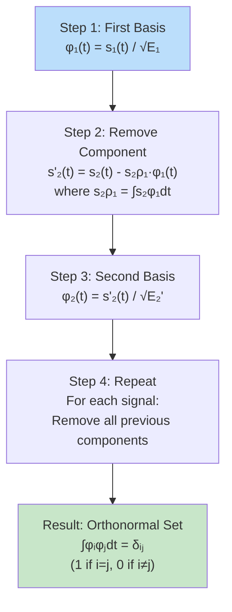
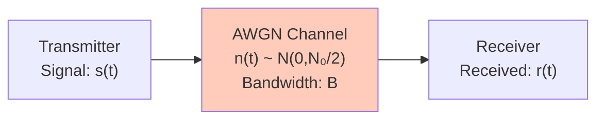
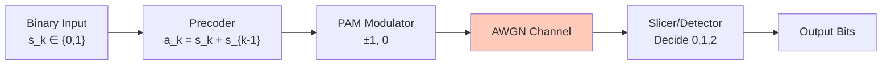
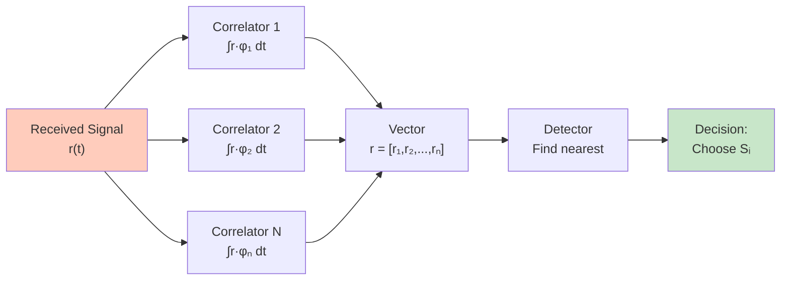

# Module 4: Signal Space, Channel Effects, and Receiver Design

> **Exam Focus:** This module covers signal representation in orthogonal spaces, digital transmission through channels, interference mitigation, and optimal receiver design. Master signal space concepts, channel impairments, and detection theory.

## Exam Checklist

- [ ] Gram-Schmidt (G-S) procedure steps and orthonormalization
- [ ] Signal space representation and basis functions
- [ ] Energy and distance metrics in signal space
- [ ] Baseband transmission through AWGN channel model
- [ ] Inter-Symbol Interference (ISI) mathematical model
- [ ] Nyquist criterion for zero ISI: $H(f) = 0$ for $|f| > B$
- [ ] Raised cosine spectrum and excess bandwidth concept
- [ ] Square-root raised cosine (SRRC) filters
- [ ] Partial response signaling and duobinary coding
- [ ] Equalization principle and error propagation
- [ ] Zero Forcing (ZF) equalizer design and implementation
- [ ] Vector model of AWGN channel
- [ ] Matched filter concept and correlation receiver design
- [ ] MAP (Maximum A Posteriori) receiver principle
- [ ] Maximum Likelihood (ML) receiver and decision rule
- [ ] Probability of error calculations: $P_e = Q(\sqrt{2E_b/N_0})$
- [ ] AWGN channel capacity: $C = B \log_2(1 + \text{SNR})$
- [ ] Significance: bandwidth-SNR tradeoff in system design

---

# 1. Gram-Schmidt (G-S) Orthonormalization Procedure

## Concept and Purpose

> **Gram-Schmidt Procedure:** A method to convert any set of arbitrary signals into a set of orthonormal basis signals.

**Simple Explanation:** Think of it as "cleaning up" overlapping signals to make them independent. Like finding perpendicular directions in a crowded room.

### Step-by-Step Procedure

**Given:** $N$ signals $s_1(t), s_2(t), ..., s_N(t)$ with finite energy

**Output:** $N$ orthonormal basis functions $\phi_1(t), \phi_2(t), ..., \phi_N(t)$



### Mathematical Formulation

**Step 1 - First basis:**
$$\phi_1(t) = \frac{s_1(t)}{\sqrt{E_1}}, \quad E_1 = \int_0^T s_1^2(t) dt$$

**Step 2 - For each subsequent signal:**
$$s_i'(t) = s_i(t) - \sum_{j=1}^{i-1} \langle s_i, \phi_j \rangle \phi_j(t)$$

where $\langle s_i, \phi_j \rangle = \int_0^T s_i(t) \phi_j(t) dt$ (inner product/projection)

**Step 3 - Normalize:**
$$\phi_i(t) = \frac{s_i'(t)}{\sqrt{E_i'}}, \quad E_i' = \int_0^T s_i'^2(t) dt$$

### Orthonormality Property

$$\langle \phi_i, \phi_j \rangle = \int_0^T \phi_i(t) \phi_j(t) dt = \delta_{ij} = \begin{cases} 1 & \text{if } i=j \\ 0 & \text{if } i \neq j \end{cases}$$

**Quick Q&A:**
> **Q:** What if $s_i'(t) = 0$?  
> **A:** The signal is linearly dependent on previous signals. Skip it and continue. Dimension reduces.

> **Q:** Why orthonormal and not just orthogonal?  
> **A:** Normalization (unit energy) simplifies calculations and provides standardized basis.

### Example: 3 PAM Signals

Given 3 signals with energy $E$:
- $s_1(t) = A, \quad 0 \leq t \leq T$
- $s_2(t) = -A, \quad 0 \leq t \leq T$
- $s_3(t) = 0$

**Result:** Only 1 basis function needed!
$$\phi_1(t) = \frac{1}{\sqrt{T}}, \quad 0 \leq t \leq T$$

All signals project onto this single dimension → 1-dimensional signal space

---

# 2. Signal Space Representation

## Concept

> **Signal Space:** An N-dimensional Euclidean space where signals are represented as points/vectors.

**Simple Explanation:** Instead of seeing signals as time waveforms, we represent them as points in a coordinate system. Each dimension is a basis function.

### Signal Vector Representation

**Any signal can be written as:**
$$s_i(t) = \sum_{j=1}^{M} s_{ij} \phi_j(t)$$

where:
- $s_{ij}$ = projection coefficient (component along basis $\phi_j$)
- $M$ = number of basis functions needed (dimension of space)

**Vector form:**
$$\mathbf{s}_i = [s_{i1}, s_{i2}, ..., s_{iM}]^T$$

### Energy and Distance

**Energy of signal $i$:**
$$E_i = \int_0^T s_i^2(t) dt = \sum_{j=1}^{M} s_{ij}^2 = \|\mathbf{s}_i\|^2$$

(Just sum of squared components!)

**Euclidean Distance between signals $i$ and $k$:**
$$d_{ik} = \sqrt{\int_0^T (s_i(t) - s_k(t))^2 dt} = \|\mathbf{s}_i - \mathbf{s}_k\|$$

### Constellation Diagram

**2-D Signal Space Example (QPSK):**
```
        φ₂(t)
          ↑
          │   S₂ (0,√E)
          │     •
          │
    ──────┼──────→ φ₁(t)
          │
    S₃ (-√E,0)•   S₁ (√E,0)
          │     •
          │     •
          │   S₄ (0,-√E)
```

**Quick Q&A:**
> **Q:** Why is signal space useful?  
> **A:** Simplifies detection - decide which point is closest to received signal.

> **Q:** What if signals have different energies?  
> **A:** They're at different distances from origin. Affects error probability.

---

# 3. Baseband Transmission Through AWGN Channel

## Channel Model



**Mathematical Model:**
$$r(t) = s(t) + n(t)$$

where:
- $s(t)$ = transmitted signal
- $n(t)$ = AWGN with PSD = $N_0/2$ (two-sided)
- Noise is Gaussian, white, independent

### Received Signal in Signal Space

**Received vector:**
$$\mathbf{r} = \mathbf{s} + \mathbf{n}$$

where:
$$r_j = s_j + n_j = s_j + \int_0^T n(t) \phi_j(t) dt$$

**Properties of noise components:**
- $n_j \sim \mathcal{N}(0, N_0/2)$ (each component is Gaussian)
- $E[n_i n_j] = 0$ for $i \neq j$ (uncorrelated)
- All components have same variance: $\sigma_n^2 = N_0/2$

### Channel Capacity (Shannon)

$$\boxed{C = B \log_2\left(1 + \frac{P}{N_0 B}\right) \text{ [bits/s]}}$$

where:
- $B$ = Bandwidth (Hz)
- $P$ = Signal power (Watts)
- $N_0$ = Noise PSD (Watts/Hz)
- SNR = $P/(N_0 B)$

**Significance:** 
- Fundamental limit on reliable transmission rate
- Tradeoff: Increase power OR increase bandwidth
- Must design systems approaching this limit

**Quick Q&A:**
> **Q:** What happens if SNR → 0?  
> **A:** Capacity → 0. No reliable transmission possible.

> **Q:** What if we double bandwidth?  
> **A:** Capacity increases logarithmically (diminishing returns).

---

# 4. Inter-Symbol Interference (ISI)

## Problem Definition

> **ISI:** When the channel response causes symbols to spread in time, causing interference between adjacent symbols.

**Simple Explanation:** Like an echo in a canyon - your voice doesn't come back as a clean pulse but as a tail. Similarly, transmitted symbols "smear" and interfere with each other.

### Mathematical Model

**Received signal (after passing through channel with impulse response $h(t)$):**
$$r(t) = \sum_{k=-\infty}^{\infty} a_k h(t - kT) + n(t)$$

where:
- $a_k$ = transmitted symbol at time $kT$
- $h(t)$ = channel impulse response
- $T$ = symbol period
- $n(t)$ = noise

### ISI at Sampling Time

**Sample at $t = nT$:**
$$r(nT) = \sum_{k=-\infty}^{\infty} a_k h(nT - kT) + n(nT)$$

**Rewrite:**
$$r(nT) = a_n h(0) + \sum_{k \neq n} a_k h((n-k)T) + n(nT)$$

**Three components:**
1. **Desired symbol:** $a_n h(0)$ (main term)
2. **ISI:** $\sum_{k \neq n} a_k h((n-k)T)$ (interference from other symbols)
3. **Noise:** $n(nT)$

### ISI Visualization

```
Transmitted pulses (symbols):
    |a₁|a₂|a₃|a₄|

After channel (spread):
    |  s₁  | s₂ |  s₃  |  s₄  |
         ↓ Sample at this time
         
    Interference from s₁, s₃, s₄!
```

**Quick Q&A:**
> **Q:** What causes ISI?  
> **A:** Limited channel bandwidth causes pulses to spread (pulse dispersion).

> **Q:** Can we eliminate ISI completely?  
> **A:** Yes! By satisfying Nyquist criterion (next section).

---

# 5. Nyquist Criterion for Zero ISI

## Nyquist's First Theorem

> **Zero ISI Condition:** Received signal should have zero crossings at all sampling times except the symbol time.

$$r(nT) = \begin{cases} a_n & \text{if } n = n_0 \\ 0 & \text{if } n \neq n_0 \end{cases}$$

### Mathematical Condition

**In frequency domain:**
$$\sum_{k=-\infty}^{\infty} H(f + \frac{k}{T}) = T$$

**Simple Version (sufficient condition):**
$$|H(f)| = 0 \quad \text{for } |f| > \frac{1}{2T}$$

**Meaning:** Bandwidth must be $\geq \frac{1}{2T}$ = half the symbol rate

### Minimum Bandwidth

$$B_{\min} = \frac{1}{2T} = \frac{R_s}{2}$$

where $R_s = 1/T$ = symbol rate (symbols/sec)

**Quick Q&A:**
> **Q:** What if bandwidth < $\frac{1}{2T}$?  
> **A:** ISI unavoidable. Some symbols will interfere.

> **Q:** Can we have bandwidth < Nyquist?  
> **A:** Only with special techniques (Partial Response, Duobinary).

---

# 6. Raised Cosine Spectrum

## Motivation

**Problem:** Nyquist criterion allows pulses up to $B = \frac{1}{2T}$, but:
- Practical filters can't have sharp cutoffs
- Need smooth transition for implementation
- Want excess bandwidth for tolerance

**Solution:** Raised Cosine spectrum

## Definition

**Frequency response:**
$$H(f) = \begin{cases}
T & |f| \leq \frac{1-\beta}{2T} \\
\frac{T}{2}\left[1 + \cos\left(\frac{\pi T}{\beta}\left(|f| - \frac{1-\beta}{2T}\right)\right)\right] & \frac{1-\beta}{2T} < |f| \leq \frac{1+\beta}{2T} \\
0 & |f| > \frac{1+\beta}{2T}
\end{cases}$$

where $\beta$ = roll-off factor ($0 \leq \beta \leq 1$)

### Parameters

| Parameter | Formula | Meaning |
|-----------|---------|---------|
| **Roll-off factor** | $\beta$ | Excess bandwidth ratio (0 to 1) |
| **Excess bandwidth** | $\frac{\beta}{2T}$ | Extra bandwidth beyond Nyquist |
| **Total bandwidth** | $B = \frac{1+\beta}{2T}$ | Actual bandwidth needed |
| **Bandwidth efficiency** | $\frac{2}{1+\beta}$ | Data rate / Total BW |

### Special Cases

| $\beta$ | Bandwidth | Name | Notes |
|--------|-----------|------|-------|
| 0 | $\frac{1}{2T}$ | Ideal Nyquist | Sharp cutoff, impractical |
| 0.5 | $\frac{3}{4T}$ | 50% excess | Good compromise |
| 1 | $\frac{1}{T}$ | Full roll-off | Maximum excess, simplest |

### Time Domain (for $\beta = 1$)

$$h(t) = \frac{\sin(\pi t/T)}{\pi t/T} \cdot \frac{\cos(\pi t/T)}{1 - (2t/T)^2}$$

**Properties:**
- Zero crossings at $t = \pm T, \pm 2T, ...$ ✓ (No ISI!)
- Smooth tail (faster decay than ideal filter)

### Visualization

```
Raised Cosine Spectrum (β = 0.5)

    H(f)
      │      ┌────────────┐
      │     ╱              ╲
      │    ╱                ╲
      0 ├──────────────────────────► f
        │      ↑            ↑
        │   Nyquist    β/(2T)
        │    1/(2T)   offset
        
    Smooth "raised cosine" shape
```

**Quick Q&A:**
> **Q:** What's the advantage over ideal Nyquist?  
> **A:** Slower tail decay → easier to implement, more robust to timing errors.

> **Q:** Why not use $\beta = 0$?  
> **A:** Ideal filter requires infinite length → impossible to implement.

---

# 7. Square-Root Raised Cosine (SRRC) Filter

## Concept

> **SRRC:** Square root of raised cosine filter, used in matched receiver design.

**Why?** To split the ISI-eliminating property between transmitter and receiver

### Filter Relationship

**Raised Cosine:** $H(f) = H_{TX}(f) \cdot H_{RX}(f)$

**Optimal split:** $H_{TX}(f) = H_{RX}(f) = \sqrt{H(f)}$

This gives **SRRC filter at each end**

### Benefits

✓ **Matched filtering:** Receiver matched to SRRC transmitter pulse  
✓ **Optimal SNR:** Matched filter maximizes signal-to-noise ratio  
✓ **Symmetric implementation:** Same filter in TX and RX  
✓ **Robustness:** Divided filtering reduces sensitivity to either component  

### Mathematical Form

$$H_{SRRC}(f) = \sqrt{H_{RC}(f)}$$

In time domain (complex form with impulse response):
$$h(t) = \frac{\sin[\pi t(1-\beta)/T] + 4\beta t\cos[\pi t(1+\beta)/T]/T}{\pi t(1 - 16\beta^2t^2/T^2)}$$

**Quick Q&A:**
> **Q:** Why not just use raised cosine on transmitter?  
> **A:** Receiver noise gets amplified. Matched filtering shares load, minimizes noise.

> **Q:** What does √ do?  
> **A:** In frequency domain: multiplying two SRRCs gives RC. In power domain: divides total filter effort.

---

# 8. Partial Response Signaling & Duobinary Coding

## Motivation

**Idea:** Allow controlled ISI to **reduce bandwidth** below Nyquist limit

"Intentionally add ISI" - sounds crazy, but it works!

## Duobinary Coding (Partial Response Class I)

### Definition

**Output:**
$$a_k = s_k + s_{k-1} \quad (\text{mod } M)$$

where $s_k$ = binary input, $a_k$ = duobinary output

### Example (Binary)

| $s_{k-1}$ | $s_k$ | $a_k = s_{k-1} + s_k$ |
|-----------|-------|----------------------|
| 0 | 0 | 0 |
| 0 | 1 | 1 |
| 1 | 0 | 1 |
| 1 | 1 | 2 |

**Ternary output:** {0, 1, 2}

### Spectral Properties

**Bandwidth:** $B = \frac{1}{2T}$ (Half of binary PAM!)

**Tradeoff:** 
- ✓ Reduced bandwidth
- ✗ More levels needed (3 instead of 2)
- ✗ More susceptible to noise

### System Model



**Quick Q&A:**
> **Q:** Why would we intentionally add ISI?  
> **A:** To reduce bandwidth! Duobinary trades noise margin for spectrum efficiency.

> **Q:** Can we decode duobinary perfectly?  
> **A:** Yes, with precoding. Precoding before transmission ensures unique reconstruction.

---

# 9. Equalization

## Problem

**After channel:**
- Received signal is distorted
- ISI present even with Nyquist channel
- Noise amplified

**Need:** Recover original signal

## Equalization Principle

**Goal:** Design filter $h_{eq}(t)$ so that:
$$h(t) * h_{eq}(t) * \delta(t) = \delta(t)$$

Cascade of channel and equalizer = impulse (perfect inversion)

**In frequency domain:**
$$H(f) \cdot H_{eq}(f) = 1$$

**Solution:**
$$H_{eq}(f) = \frac{1}{H(f)}$$

### Challenge: Noise Amplification

**Problem:** If $H(f)$ is small, $H_{eq}(f) = 1/H(f)$ is large

→ **Noise amplification!**

```
Clean Channel:
s(t) ─→ [H(f) ≈ 1] ─→ s(t)  ✓

Poor Channel (small H):
s(t) ─→ [H(f) ≈ 0.1] ─→ Equalize ─→ [H_eq ≈ 10] ─→ s(t) ✗
                                        Noise × 10!
```

---

# 10. Zero-Forcing (ZF) Equalizer

## Design

> **Zero-Forcing Equalizer:** Inverts channel response exactly, ignoring noise.

**Frequency response:**
$$H_{ZF}(f) = \frac{1}{H(f)}$$

**Time domain:** Tap weights are inverse of channel impulse response

### Advantages ✓

- Simple design
- Zero ISI (if channel invertible)
- Linear implementation
- Easy to update

### Disadvantages ✗

- **Noise amplification:** High at frequency notches
- **Not optimal:** Doesn't minimize error probability
- **Ill-conditioned:** Unstable for poor channels
- **Error propagation:** Errors accumulate

### Mathematical Formulation

**Tap weights** (N-tap ZF equalizer):
$$\mathbf{h}_{ZF} = (R_x)^{-1} \mathbf{p}$$

where:
- $R_x$ = input correlation matrix
- $\mathbf{p}$ = cross-correlation between input and desired output

**Decision rule:**
$$\hat{a}_n = \text{argmin}_{a_k} ||r_n - h_{ZF} * a_k||^2$$

### Example: 3-Tap ZF Equalizer

```
Received:    r₁ r₂ r₃ r₄ ...
             │  │  │
Output:  y_n = w₁r_n + w₂r_{n-1} + w₃r_{n-2}
             
Tap weights solve: Channel × Weights = [0 1 0]ᵀ (impulse)
```

**Quick Q&A:**
> **Q:** Why is ZF suboptimal?  
> **A:** Amplifies noise in frequency notches. Doesn't account for noise when inverting.

> **Q:** What's better than ZF?  
> **A:** MMSE (Minimum Mean Square Error) equalizer - balances ISI and noise.

---

# 11. Vector Model of AWGN Channel

## Representation

**M-ary constellation** (M signals in N-dimensional space):

**Transmitted:** $\mathbf{s}_i$ (vector of length N)  
**Received:** $\mathbf{r} = \mathbf{s}_i + \mathbf{n}$

where $\mathbf{n} \sim \mathcal{N}(\mathbf{0}, \sigma_n^2 \mathbf{I})$ (Gaussian noise vector)

### Likelihood Function

**Probability of receiving $\mathbf{r}$ given transmitted $\mathbf{s}_i$:**
$$p(\mathbf{r}|\mathbf{s}_i) = \frac{1}{(\pi N_0/2)^{N/2}} \exp\left(-\frac{\|\mathbf{r} - \mathbf{s}_i\|^2}{N_0/2}\right)$$

### Decision Region (Voronoi)

**Decide $\mathbf{s}_i$ if:**
$$\|\mathbf{r} - \mathbf{s}_i\| < \|\mathbf{r} - \mathbf{s}_j\|$$ for all $j \neq i$

**Meaning:** Choose closest constellation point

```
2D Voronoi Diagram:
        S₂
        •────────────────────
        │        │            │
        │   ───────────      │
        │  │   Region i   │  │
        │  │   (Choose Si)│  │
        │   ───────────      │
        ├─────────────────────► S₁
        │
    S₃ •
```

**Quick Q&A:**
> **Q:** Why choose nearest point?  
> **A:** Minimizes distance, maximizes likelihood (ML principle).

> **Q:** What if noise is very large?  
> **A:** Regions overlap → errors increase.

---

# 12. Matched Filter and Correlation Receiver

## Matched Filter Principle

> **Matched Filter:** Correlates received signal with known transmitted signal to maximize SNR.

$$h_{MF}(t) = s(T - t)$$ (time-reversed, delayed version of signal)

### Why "Matched"?

**Response to desired signal:** Maximum at $t = T$

**Response to noise:** Minimum variance

**SNR at output:** Maximum

### Implementation: Correlation Receiver

**Two equivalent implementations:**

**1. Matched Filter:**
```
r(t) ──→ [Matched Filter h(t)] ──→ Output y(t) ──Sample at t=T──→ Decision
```

**2. Correlator:**
```
r(t) ──→ [Multiply] ──→ [Integrate] ──→ Sample ──→ Decision
           ×               ∫₀ᵀ
           s(t)          for T
```

### Correlation Receiver Output

$$r_j = \int_0^T r(t) \phi_j(t) dt$$

For AWGN: $r_j = s_j + n_j$

where $n_j \sim \mathcal{N}(0, N_0/2)$

### SNR at Output

$$\text{SNR} = \frac{E_b}{N_0/2}$$

where $E_b$ = bit energy

**Improvement:** Matched filtering achieves best possible SNR!

### Block Diagram: M-ary Receiver



---

# 13. MAP and Maximum Likelihood Receivers

## Maximum Likelihood (ML) Receiver

> **ML Decision Rule:** Choose signal $s_i$ that maximizes likelihood.

$$\hat{i} = \arg\max_i p(\mathbf{r}|\mathbf{s}_i)$$

### Implementation

**Equivalent to minimum distance:**
$$\hat{i} = \arg\min_i \|\mathbf{r} - \mathbf{s}_i\|^2$$

**Expansion:**
$$\|\mathbf{r} - \mathbf{s}_i\|^2 = \|\mathbf{r}\|^2 - 2\mathbf{r}^T\mathbf{s}_i + \|\mathbf{s}_i\|^2$$

**For equal energy signals** ($\|\mathbf{s}_i\| = \sqrt{E}$ constant):
$$\hat{i} = \arg\max_i (\mathbf{r}^T\mathbf{s}_i)$$

**Meaning:** Maximize correlation with received signal

### ML Receiver Structure

```
r(t) ──→ [Correlator 1] ──→ [|·|²] ──→ Metrics → [Choose Max]
       ├─[Correlator 2] ──→ [|·|²] ──┘
       └─[Correlator M] ──→ [|·|²] ──→ Decision: Choose max metric
```

## MAP (Maximum A Posteriori) Receiver

> **MAP Decision Rule:** Choose signal with maximum posterior probability.

$$\hat{i} = \arg\max_i P(\mathbf{s}_i|\mathbf{r})$$

**Bayes Rule:**
$$P(\mathbf{s}_i|\mathbf{r}) = \frac{p(\mathbf{r}|\mathbf{s}_i) P(\mathbf{s}_i)}{p(\mathbf{r})}$$

**Decision rule:**
$$\hat{i} = \arg\max_i [p(\mathbf{r}|\mathbf{s}_i) P(\mathbf{s}_i)]$$

### Comparison: ML vs MAP

| Criterion | ML | MAP |
|-----------|----|----|
| **Uses likelihood** | ✓ | ✓ |
| **Uses prior** | ✗ | ✓ |
| **Assumption** | Equiprobable signals | Non-uniform prior |
| **Optimal for** | Uniform distribution | Any distribution |
| **Complexity** | Simpler | Requires prior knowledge |

**When equal probability:** MAP = ML

**Quick Q&A:**
> **Q:** Which receiver is optimal?  
> **A:** MAP is optimal in general. ML is special case when signals equally likely.

> **Q:** How much better is MAP?  
> **A:** Depends on prior knowledge. More skewed distribution → larger gain.

---

# 14. Probability of Error

## Error Probability for Binary Signals

### For AWGN Channel

**Bit error probability:**
$$P_e = Q\left(\sqrt{\frac{2E_b}{N_0}}\right)$$

where $Q(x) = \frac{1}{\sqrt{2\pi}} \int_x^{\infty} e^{-t^2/2} dt$ (Q-function)

**Alternative form:**
$$P_e = \frac{1}{2}\text{erfc}\left(\sqrt{\frac{E_b}{N_0}}\right)$$

where $\text{erfc}(x) = 2Q(x\sqrt{2})$

### For M-ary Signals

**Symbol error probability** (approximation):
$$P_s \approx 2Q\left(\sqrt{\frac{2E_s(M-1)}{(M^2-1)N_0}}\right)$$

where $E_s$ = symbol energy

**Bit error probability:**
$$P_b = \frac{P_s}{\log_2 M}$$ (approximately, for Gray coding)

### Energy Distance Relationship

**Error probability depends on:**
1. **Minimum distance:** $d_{min}$ between signals
2. **Noise variance:** $\sigma_n^2 = N_0/2$

$$P_e \approx Q\left(\frac{d_{min}}{2\sigma_n}\right) = Q\left(\sqrt{\frac{d_{min}^2}{2N_0}}\right)$$

### Example: BPSK (Binary PSK)

**Symbols:** $s_1(t) = \sqrt{E_b}\cos(\omega_c t)$, $s_2(t) = -\sqrt{E_b}\cos(\omega_c t)$

**Distance:** $d = 2\sqrt{E_b}$

**Error probability:**
$$P_e = Q\left(\sqrt{\frac{2E_b}{N_0}}\right)$$

### Numerical Examples

| $E_b/N_0$ | $P_e$ (BPSK) | Notes |
|-----------|--------------|-------|
| 3 dB | $10^{-3}$ | Poor quality |
| 6 dB | $10^{-6}$ | Reasonable |
| 7 dB | $10^{-7}$ | Good quality |
| 10 dB | $10^{-10}$ | Excellent |

**Quick Q&A:**
> **Q:** What SNR gives $P_e = 10^{-6}$?  
> **A:** For BPSK: about 6 dB. Look up in tables or compute Q-function.

> **Q:** How does M (number of levels) affect error?  
> **A:** More levels require larger separation → Higher SNR needed for same $P_e$.

---

# 15. AWGN Channel Capacity

## Shannon's Formula

$$\boxed{C = B \log_2\left(1 + \frac{P}{N_0 B}\right) \text{ [bits/s]}}$$

where:
- $B$ = Bandwidth (Hz)
- $P$ = Signal power (Watts)
- $N_0/2$ = Noise power spectral density (two-sided)
- $\text{SNR} = P/(N_0 B)$

### Key Insights

**As SNR → ∞:**
$$C \approx \frac{1.44 \cdot P}{N_0 \ln 2} = 1.44 \frac{P}{N_0}$$

(Doubling power barely helps - logarithmic increase)

**As B → ∞:**
$$C \to \frac{P}{N_0 \ln 2} \approx 1.44 \frac{P}{N_0}$$

(Shannon limit: infinite bandwidth, constant capacity!)

### Bandwidth-SNR Tradeoff

```
Capacity vs SNR:

C (capacity)
    │        ╱╱╱╱
    │       ╱
    │      ╱
    │     ╱   ← Logarithmic growth
    │    ╱
    │   ╱
    0 ├─────────────────► SNR (dB)
      │ 0   3   6   10
      
Small SNR: 1 dB improvement → huge capacity gain
Large SNR: 1 dB improvement → small capacity gain
```

### Design Implications

| Regime | Strategy | Example |
|--------|----------|---------|
| **High SNR** | Increase bandwidth (capacity limited by BW) | Satellite, no power |
| **Low SNR** | Increase power (capacity limited by SNR) | Deep space, fixed BW |
| **Balanced** | Tradeoff power and bandwidth | Typical systems |

### Spectral Efficiency

**Definition:**
$$\eta = \frac{R}{B} = \frac{C}{B} = \log_2(1 + \text{SNR})$$ [bits/s/Hz]

**Examples:**
- BPSK: 1 bit/s/Hz (requires SNR = 1, or 0 dB)
- QPSK: 2 bits/s/Hz (requires SNR = 3, or 4.77 dB)
- 16-QAM: 4 bits/s/Hz (requires SNR = 15, or 11.76 dB)

**Quick Q&A:**
> **Q:** Why is capacity limit important?  
> **A:** Design must approach this limit for efficiency. No system can exceed it.

> **Q:** Can we exceed Shannon capacity?  
> **A:** No! It's a hard limit. But we can approach it with complex coding.

---

# 16. Complete Comparison Table

| Concept | Formula | Used For |
|---------|---------|----------|
| **G-S Orthonormalization** | $\phi_i = s_i' / \sqrt{E_i'}$ | Signal space basis |
| **Signal Energy** | $E_i = \sum_j s_{ij}^2$ | Power calculation |
| **Euclidean Distance** | $d = \|\mathbf{s}_i - \mathbf{s}_j\|$ | Error probability |
| **AWGN Channel** | $r(t) = s(t) + n(t)$ | Received signal model |
| **ISI** | $\sum_{k \neq n} a_k h((n-k)T)$ | Interference term |
| **Nyquist Criterion** | $B = 1/(2T)$ | Min bandwidth for zero ISI |
| **Raised Cosine** | $B = (1+\beta)/(2T)$ | Practical pulse shaping |
| **SRRC Bandwidth** | $B = (1+\beta)/(2T)$ | TX/RX filter split |
| **Zero-Forcing Eq** | $H_{eq}(f) = 1/H(f)$ | Channel inversion |
| **ML Decision** | $\hat{i} = \arg\min \|\mathbf{r} - \mathbf{s}_i\|^2$ | Optimal detection |
| **Error Probability** | $P_e = Q(\sqrt{2E_b/N_0})$ | BPSK/Binary signals |
| **Channel Capacity** | $C = B\log_2(1 + \text{SNR})$ | Maximum reliable rate |

---

# 17. Exam Checklist - Complete

## Part 1: Signal Space & Gram-Schmidt
- [ ] G-S procedure: Project, orthogonalize, normalize each signal
- [ ] Orthonormality: $\int \phi_i \phi_j dt = \delta_{ij}$
- [ ] Signal vector representation in N-dimensional space
- [ ] Energy: Sum of squared components
- [ ] Euclidean distance between signals
- [ ] Constellation diagram for M-ary signals
- [ ] Dimension reduction when signals linearly dependent

## Part 2: AWGN Channel & ISI
- [ ] Channel model: $r(t) = s(t) + n(t)$
- [ ] Noise properties: Gaussian, white, uncorrelated components
- [ ] ISI components: desired, interference, noise
- [ ] ISI causes: Limited channel bandwidth (pulse dispersion)
- [ ] Received sample: $r(nT) = a_n h(0) + \text{ISI} + n(nT)$
- [ ] Nyquist criterion: Zero ISI when $B \geq 1/(2T)$
- [ ] Minimum bandwidth: $B_{min} = R_s/2$

## Part 3: Pulse Shaping Filters
- [ ] Raised Cosine spectrum shape and parameters
- [ ] Roll-off factor: $\beta \in [0,1]$
- [ ] Total bandwidth: $B = (1+\beta)/(2T)$
- [ ] Raised Cosine time domain: Zero crossings at $\pm T, \pm 2T, ...$
- [ ] SRRC: Square root of raised cosine
- [ ] SRRC split between TX and RX for matched filtering
- [ ] Partial response/Duobinary: Intentional ISI for bandwidth reduction
- [ ] Duobinary output: Ternary levels {0,1,2}

## Part 4: Equalization
- [ ] Equalization goal: Invert channel response
- [ ] Zero-Forcing equalizer: $H_{eq}(f) = 1/H(f)$
- [ ] ZF noise amplification: High where $H(f)$ small
- [ ] ZF decision: Minimum distance criterion
- [ ] Error propagation: Mistakes accumulate
- [ ] MMSE vs ZF tradeoff
- [ ] Tap weights calculation
- [ ] Convergence and convergence speed

## Part 5: Vector AWGN Channel & Detection
- [ ] Vector representation: $\mathbf{r} = \mathbf{s}_i + \mathbf{n}$
- [ ] Likelihood function for Gaussian noise
- [ ] Voronoi decision regions
- [ ] Matched filter: Time-reversed signal $h(t) = s(T-t)$
- [ ] Correlation receiver implementation
- [ ] SNR at output: Maximized by matched filtering
- [ ] M-ary correlator bank

## Part 6: Optimal Detection
- [ ] ML receiver: $\arg\max p(\mathbf{r}|\mathbf{s}_i)$
- [ ] ML equivalent to minimum distance for equal energy
- [ ] ML to maximum correlation for equal energy
- [ ] MAP receiver: $\arg\max p(\mathbf{r}|\mathbf{s}_i) P(\mathbf{s}_i)$
- [ ] When MAP = ML (uniform prior)
- [ ] Complexity of ML vs MAP

## Part 7: Error Analysis
- [ ] Bit error probability: $P_e = Q(\sqrt{2E_b/N_0})$ for BPSK
- [ ] Q-function properties and approximations
- [ ] Symbol error vs bit error relationship
- [ ] M-ary error probability (Gray coding)
- [ ] Minimum distance relationship to error
- [ ] SNR requirements for different modulations
- [ ] Numerical Q-function values

## Part 8: Capacity & System Design
- [ ] Shannon capacity formula: $C = B\log_2(1 + \text{SNR})$
- [ ] Capacity vs bandwidth and SNR curves
- [ ] Shannon limit: Infinite bandwidth → finite capacity
- [ ] Spectral efficiency: $\eta = \log_2(1 + \text{SNR})$
- [ ] Bandwidth-SNR tradeoff
- [ ] Design implications for different regimes
- [ ] System design approaching capacity

## Part 9: Numerical Problems
- [ ] Perform G-S orthonormalization
- [ ] Calculate signal energies and distances
- [ ] Find Nyquist bandwidth for given symbol rate
- [ ] Determine raised cosine parameters
- [ ] Design ZF equalizer tap weights
- [ ] Calculate error probabilities
- [ ] Determine required SNR for target $P_e$
- [ ] Calculate channel capacity for given parameters

---

# 18. Common Exam Questions & Answers

> **Q1: What's the relationship between signal space dimension and number of signals?**
>
> **A:** N signals require at most N dimensions, but often fewer if linearly dependent. Gram-Schmidt finds minimum dimension automatically.

> **Q2: Why is matched filtering optimal?**
>
> **A:** Maximizes SNR. Proof: Schwarz inequality shows correlation maximizes for time-reversed signal. No filter can do better.

> **Q3: How does raised cosine reduce bandwidth vs Nyquist?**
>
> **A:** It doesn't reduce below Nyquist! It ADDS excess bandwidth $\beta/(2T)$ for practical implementation. Total = $(1+\beta)/(2T)$.

> **Q4: Why use SRRC instead of full raised cosine?**
>
> **A:** Splits filtering between TX and RX. Better noise performance, matched filtering optimization, symmetric design.

> **Q5: What's the tradeoff in Zero-Forcing equalization?**
>
> **A:** Inverts channel completely (zero ISI) but amplifies noise. Better: MMSE equalizer balances ISI vs noise.

> **Q6: How does increasing M (modulation levels) affect error probability?**
>
> **A:** Requires higher SNR to maintain same error rate. More levels → smaller spacing → more errors.

> **Q7: Why is Shannon capacity the limit?**
>
> **A:** Derived from information theory principles. No code, modulation, or detection scheme can exceed it.

> **Q8: When is bandwidth the bottleneck vs SNR?**
>
> **A:** High SNR: BW bottleneck (increase BW to increase capacity). Low SNR: SNR bottleneck (increase power).

---

# 19. Summary: Key Equations Quick Reference

## Gram-Schmidt & Signal Space
$$\phi_i(t) = \frac{s_i'(t)}{\sqrt{E_i'}}, \quad s_i'(t) = s_i(t) - \sum_{j=1}^{i-1}\langle s_i, \phi_j \rangle \phi_j(t)$$
$$E_i = \|\mathbf{s}_i\|^2 = \sum_j s_{ij}^2, \quad d_{ij} = \|\mathbf{s}_i - \mathbf{s}_j\|$$

## ISI & Nyquist
$$r(nT) = a_n h(0) + \sum_{k \neq n} a_k h((n-k)T) + n(nT)$$
$$B_{min} = \frac{1}{2T} \text{ (Nyquist)}, \quad B_{RC} = \frac{1+\beta}{2T} \text{ (Raised Cosine)}$$

## Equalization
$$H_{ZF}(f) = \frac{1}{H(f)}, \quad \hat{i} = \arg\min_i \|\mathbf{r} - \mathbf{s}_i\|^2$$

## Detection
$$r_j = \int_0^T r(t) \phi_j(t) dt, \quad P_e = Q\left(\sqrt{\frac{2E_b}{N_0}}\right)$$

## Capacity
$$C = B\log_2\left(1 + \frac{P}{N_0 B}\right), \quad \eta = \log_2(1 + \text{SNR})$$

---

**Last Updated:** November 5, 2025
**Status:** Complete Module 4 study guide ready for exam ✓✓✓