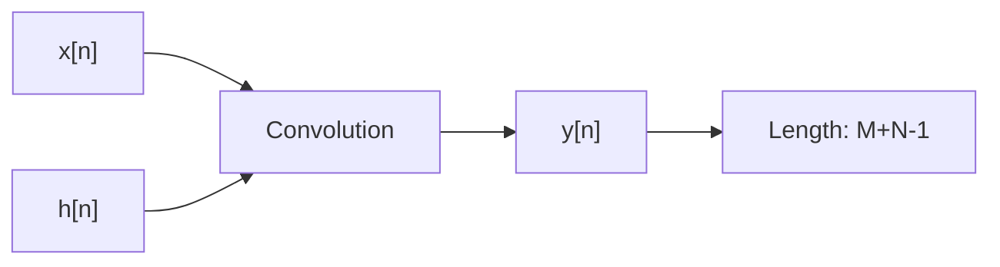

# 🔄 Linear Convolution

## 📖 What is Linear Convolution?

> **Linear convolution** is a mathematical operation that combines two sequences (signals) to produce a third sequence that represents the integral of the pointwise multiplication of the two input sequences as the second sequence is shifted. It's fundamental in Digital Signal Processing (DSP) for analyzing how systems respond to inputs and for filtering operations.

Linear convolution is defined for two discrete-time sequences \( x[n] \) and \( h[n] \) as:

$$ y[n] = \sum_{k=-\infty}^{\infty} x[k] h[n - k] $$

Where:
- \( x[n] \) is the input sequence
- \( h[n] \) is the impulse response (or kernel)
- \( y[n] \) is the output sequence
- The summation is over all possible shifts \( k \)

> [!note] Key Characteristics
> - **Linearity**: The operation is linear, meaning it satisfies superposition.
> - **Time-Invariance**: Shifting the input shifts the output by the same amount.
> - **Causality**: For causal systems, \( h[n] = 0 \) for \( n < 0 \).
> - **Finite Support**: For finite-length sequences, the result has length \( M + N - 1 \), where M and N are the lengths of x and h.

## 🧮 Mathematical Definition

For two finite sequences \( x[n] \) of length M and \( h[n] \) of length N, the linear convolution is:

$$ y[n] = \sum_{k=0}^{M-1} x[k] h[n - k] $$

Where the output \( y[n] \) is defined for \( n = 0 \) to \( M + N - 2 \).

### Example Calculation

Consider \( x = [1, 2, 3] \) and \( h = [0.5, 1] \):

- y[0] = x[0]h[0] = 1 × 0.5 = 0.5
- y[1] = x[0]h[1] + x[1]h[0] = 1 × 1 + 2 × 0.5 = 1 + 1 = 2
- y[2] = x[1]h[1] + x[2]h[0] = 2 × 1 + 3 × 0.5 = 2 + 1.5 = 3.5
- y[3] = x[2]h[1] = 3 × 1 = 3

So, y = [0.5, 2, 3.5, 3]

## 📊 Visual Representation



### Convolution Animation (Conceptual)

Imagine sliding h[n] over x[n]:
- At each position, multiply overlapping elements and sum.
- The result builds the output sequence.

## 🔗 Relation to Circular Convolution

Linear convolution differs from circular convolution:
- **Linear**: No wrap-around, treats sequences as infinite with zeros outside their support.
- **Circular**: Wraps around, assumes periodicity.

To compute linear convolution using circular convolution:
1. Zero-pad both sequences to length L ≥ M + N - 1
2. Perform circular convolution
3. The result is the linear convolution

## 💻 Python Implementation

> [!example] Direct Linear Convolution
```python
def linear_convolution(x, h):
    M = len(x)
    N = len(h)
    y = [0] * (M + N - 1)
    for n in range(M + N - 1):
        for k in range(max(0, n - N + 1), min(n + 1, M)):
            y[n] += x[k] * h[n - k]
    return y

# Example
x = [1, 2, 3]
h = [0.5, 1]
y = linear_convolution(x, h)
print(y)  # [0.5, 2.0, 3.5, 3.0]
```

> [!example] Using NumPy
```python
import numpy as np

x = np.array([1, 2, 3])
h = np.array([0.5, 1])
y = np.convolve(x, h, mode='full')
print(y)  # [0.5 2.  3.5 3. ]
```

## 🎯 Applications

- **System Analysis**: Determine output of LTI systems given input and impulse response.
- **Filtering**: Convolution with filter coefficients implements digital filters.
- **Signal Processing**: Image blurring, audio reverb, etc.
- **Correlation**: Cross-correlation is similar but with conjugation.

## 📚 Key Points for Exams

- Formula: \( y[n] = \sum_k x[k] h[n-k] \)
- Length: M + N - 1 for finite sequences
- Difference from circular: No periodicity assumption
- Computational complexity: O(MN) directly, but can be optimized with FFT

> [!tip] Remember
> Linear convolution is the "natural" convolution for non-periodic signals. Always specify if you mean linear or circular in DSP contexts.

> [!flashcard] What is the length of linear convolution of two sequences of lengths M and N?
> M + N - 1

> [!question] Compute linear convolution of x = [1, 2] and h = [1, 0.5, 0.25]
> y = [1, 2.5, 1.5, 0.5]

> [!resources] Further Reading
> - Proakis & Manolakis, Chapter 5
> - MIT OCW: Signals and Systems
> - NumPy documentation: np.convolve</content>

