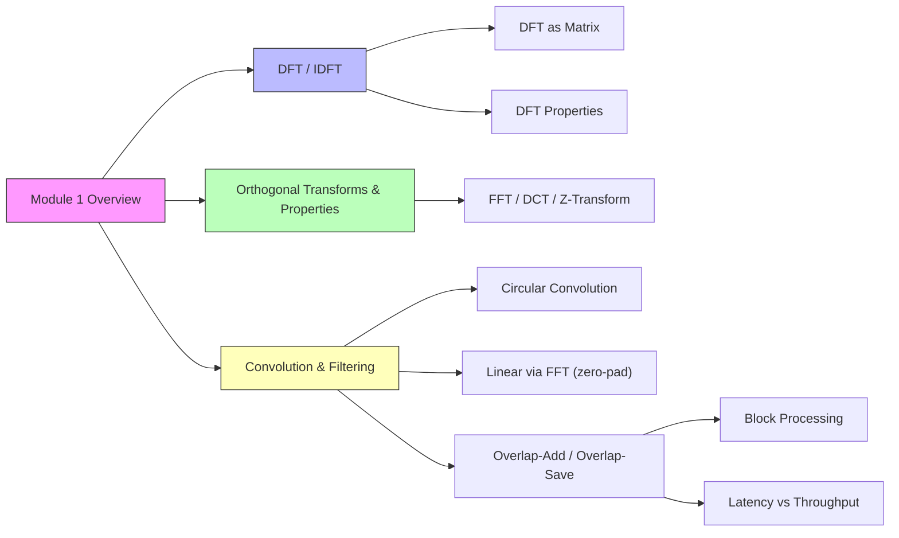
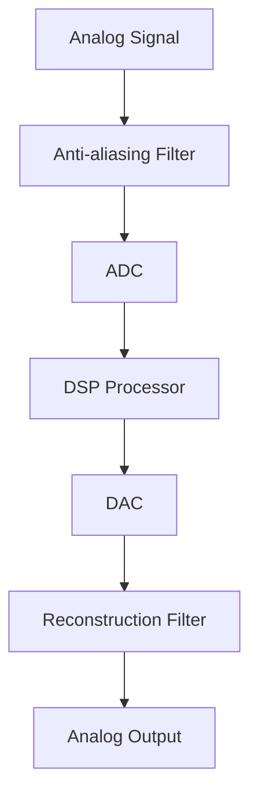
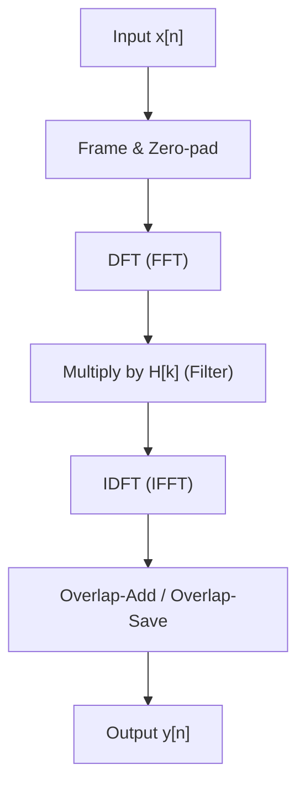

# DSP Module 1




- [ ] DFT , IDFT ✅ 2024-11-16
- [ ] Basic Elements of a DSP system, Typical DSP applications, Finite-length discrete transforms, ✅ 2024-11-17
- [ ] Orthogonal transforms
    - [ ] The Discrete Fourier Transform: DFT as a linear transformation (Matrix relations)
    - [ ] Relationship of the DFT to other transforms,
    - [ ] IDFT
    - [ ] Properties of DFT and examples.
- [ ] Circular convolution,
- [ ] Linear Filtering methods based on the DFT, ✅ 2025-11-12
- [ ] linear convolution using circular convolution, ✅ 2025-11-12
- [ ] Filtering of long data sequences, ✅ 2025-11-12
- [ ] overlap save and overlap add methods, ✅ 2025-11-12
- [ ] Frequency Analysis of Signals using the DFT (concept only required) ✅ 2025-11-12

## Introduction

<div class="highlight">
This module introduces the fundamentals of Digital Signal Processing (DSP), focusing on transforms, convolution, and filtering for discrete-time signals. By the end, you'll understand DFT/IDFT derivations, prove key properties, and apply techniques like overlap-add/save for efficient processing. Key concepts include orthogonality, periodicity, and frequency-domain analysis.
</div>

> [!objective] Learning Objectives
> - Derive DFT/IDFT formulas and matrix representations.
> - Prove properties like Parseval's theorem and symmetry.
> - Differentiate circular vs. linear convolution with padding.
> - Apply DFT for filtering long sequences using block methods.

## Table of Contents

- [[#Introduction]]
- [[#Basic Elements of a DSP System]]
- [[#Typical DSP Applications]]
- [[#Finite-Length Discrete Transforms]]
- [[#Orthogonal Transforms]]
- [[#DFT]]
- [[#IDFT]]
- [[#Important Relations]]
- [[#DFT as a Linear Transform]]
- [[#Relationship of the DFT to Other Transforms]]
- [[#Properties of DFT and Examples]]
- [[#Circular Convolution]]
- [[#Linear Filtering Methods Based on the DFT]]
- [[#Linear Convolution Using Circular Convolution]]
- [[#Filtering of Long Data Sequences]]
- [[#Overlap-Save and Overlap-Add Methods]]
- [[#Frequency Analysis of Signals Using the DFT]]


### Basic Elements of a DSP System


- **Analog-to-Digital Converter (ADC)**: Converts continuous analog signals to discrete digital samples.
- **Digital Signal Processor (DSP Processor)**: Performs mathematical operations on the digital samples.
- **Digital-to-Analog Converter (DAC)**: Converts processed digital signals back to analog form.
- **Anti-aliasing Filter**: Prevents high-frequency components from aliasing during sampling. In practical cases, such as audio recording, it ensures that frequencies above the Nyquist rate (half the sampling frequency) are attenuated to avoid distortion in the digital signal, like in CD recording where a low-pass filter cuts off above 22 kHz for a 44.1 kHz sample rate. The analog circuit equivalent is typically a low-pass filter, such as a passive RC filter (resistor-capacitor) or an active op-amp-based filter (e.g., Butterworth or Chebyshev design), placed before the ADC to smooth out high-frequency noise and prevent folding back into the baseband.
- **Reconstruction Filter**: Smooths the DAC output to recover the continuous signal.

#### Block Diagram of a DSP System


Where it's used:
- Audio processing (e.g., noise reduction in microphones).
- Communications (e.g., modem signal processing).
- Control systems (e.g., digital PID controllers).
- Biomedical (e.g., ECG signal filtering).

Exam tip: Draw the block diagram and explain the role of each element. Mention sampling theorem and Nyquist rate.

#### Sampling Theorem
To avoid aliasing, sample at fs ≥ 2f_max (Nyquist rate). For example, audio at 44.1 kHz samples up to 22.05 kHz.

#### ADC Example
For a sine wave x(t) = sin(2πf t), sampled at fs, discrete x[n] = sin(2πf n / fs). If f = fs/4, x[n] = sin(π n / 2).

### Typical DSP Applications

DSP is used in various fields due to its flexibility, precision, and ability to handle complex algorithms.

- **Audio Processing**: Equalization adjusts frequency response; compression reduces dynamic range for MP3s; echo cancellation removes delays in VoIP.
- **Image and Video Processing**: JPEG uses DCT for compression; filtering enhances edges or removes noise in medical imaging.
- **Communications**: OFDM modulates data onto subcarriers; equalization compensates for channel distortion in Wi-Fi.
- **Radar and Sonar**: Pulse compression detects echoes; matched filtering maximizes SNR for target detection.
- **Biomedical**: ECG filters noise to detect arrhythmias; MRI reconstructs images from k-space data.
- **Control Systems**: PID controllers stabilize motors; vibration analysis predicts failures.
- **Financial**: Algorithms filter market noise for trend detection; high-frequency trading uses spectral analysis.

Exam tip: Give 2-3 examples with brief explanations. Relate to real-world systems.

### Finite-Length Discrete Transforms

Finite-length discrete transforms are mathematical tools to represent discrete signals in different domains (e.g., frequency, time-frequency). They are essential for analysis and processing of finite sequences.

Key transforms include:
- DFT (Discrete Fourier Transform): Frequency domain representation.
- DCT (Discrete Cosine Transform): Used in image compression.
- DHT (Discrete Hartley Transform): Real-valued alternative to DFT.
- Wavelet Transform: Time-frequency analysis.

These transforms enable efficient computation of operations like convolution, filtering, and compression.

Where it's used:
- Spectral analysis.
- Data compression.
- Feature extraction.

Exam tip: Compare DFT with DTFT (infinite vs finite) and mention orthogonality.

### Orthogonal Transforms

Orthogonal transforms are linear transformations that map a signal to a domain where the basis functions are orthogonal. This property allows for energy preservation (Parseval's theorem) and efficient computation of operations like convolution and filtering.

Key characteristics:
- **Orthogonality**: The basis vectors satisfy \( \langle \phi_k, \phi_m \rangle = 0 \) for k ≠ m.
- **Unitary Matrix**: The transform matrix F satisfies F^H F = c I, where c is a constant (often N or 1).
- **Energy Preservation**: Total energy is conserved between time and transform domains.

Common orthogonal transforms:
- **DFT**: Uses complex exponentials as basis.
- **DCT (Discrete Cosine Transform)**: Uses cosines, real-valued, efficient for compression.
- **DHT (Discrete Hartley Transform)**: Real-valued, alternative to DFT.
- **Wavelet Transforms**: Provide time-frequency localization.

Where it's used:
- Data compression (JPEG uses DCT).
- Denoising and filtering.
- Feature extraction in pattern recognition.

Exam tip: Explain why orthogonality is important for invertibility and energy conservation. Compare with non-orthogonal transforms.

### DFT

What it is: The Discrete Fourier Transform (DFT) converts a finite discrete-time sequence into a finite set of complex frequency-domain samples. It decomposes a signal into orthogonal complex exponentials (frequency bins), giving amplitude and phase information at each bin.

Where it's used:
- Audio/speech analysis (spectrograms, pitch detection).
- Image and video compression (frequency-domain coding).
- Communications (modulation, channel analysis) and radar.
- Any spectral analysis task (e.g., biomedical signals: ECG/EEG).

Exam tip: State the DFT formula and mention complexity; if asked about computation, reference FFT (O(N log N)).

![[Discrete Fourier Tranform#^32d1f3]]

### IDFT

What it is: The Inverse Discrete Fourier Transform reconstructs a time-domain sequence from its DFT samples. It uses the same basis functions as the DFT but scaled (1/N) and with opposite complex sign in the exponent.

Where it's used:
- Reconstructing filtered signals after frequency-domain manipulation.
- Signal synthesis from spectral components (audio synthesis, inverse filtering).
- Numerical algorithms that operate in frequency domain then return to time domain.

Exam tip: Always include the 1/N factor in IDFT; forgetting it is a common mistake.

![[Discrete Fourier Tranform#^cf415f]]

> [!important] Important Relations
$$
\begin{align}
e^{-j 2 \pi} &= 1 \\
e^{\large\frac{-j 2 \pi}{N}} &= 1^\left( \frac{1}{N} \right)
\end{align}
$$

### DFT as a Linear Transform

What it is: The DFT is a linear operator that maps an N-length vector in time domain to an N-length vector in frequency domain via multiplication by the Fourier matrix F (a Vandermonde matrix). Linearity means superposition applies: DFT(ax + by) = a DFT(x) + b DFT(y).

Where it's used:
- Proofs of properties (orthogonality, Parseval).
- Matrix-based DSP derivations and teaching (helps connect to linear algebra).
- Implementations that exploit matrix structure or prove stability/orthogonality.

Exam tip: Mention that F is unitary up to scaling (F^-1 = (1/N) F^H) and use that to derive Parseval or inverse relations.

The DFT can be expressed as a linear transformation using a matrix. For a sequence \( x[n] \) of length N, the DFT is given by:

$$ \mathbf{X} = \mathbf{F} \mathbf{x} $$

where \( \mathbf{F} \) is the N x N Fourier matrix with elements:

$$ F_{k,n} = e^{-j 2\pi k n / N} $$

This matrix is unitary, meaning \( \mathbf{F}^{-1} = \frac{1}{N} \mathbf{F}^H \), where \( \mathbf{F}^H \) is the conjugate transpose.

**Exam Tip**: The DFT matrix is Vandermonde and has orthogonal columns. For N=4, compute F manually to understand symmetry. Inverse DFT uses the same matrix scaled by 1/N.

### Relationship of the DFT to Other Transforms

What it is: The DFT is a sampled/finite version of the DTFT and a special case of the Z-transform evaluated on the unit circle. The FFT is an algorithm for computing the DFT efficiently. The DCT is a related transform that uses cosines (real-valued) and is derived from DFT under specific symmetry/extension conditions.

Where it's used:
- Choose FFT for fast computation in real-time systems (audio effects, SDR).
- Use DCT in image and video compression (JPEG, MPEG).
- Use Z-transform and DTFT for analysis of infinite or LTI-system behavior; DFT for finite-window computations.
- In exams, show how DFT samples the DTFT at uniform frequencies.

The DFT is related to several other transforms:
- **FFT (Fast Fourier Transform)**: An efficient algorithm to compute DFT in O(N log N) time instead of O(N²).
- **DCT (Discrete Cosine Transform)**: A real-valued transform used in image compression (e.g., JPEG), derived from DFT for even functions.
- **Z-Transform**: A generalization of DFT for infinite sequences, where DFT is Z-transform evaluated on the unit circle.
- **DTFT (Discrete-Time Fourier Transform)**: The continuous frequency version of DFT for infinite sequences.

### Properties of DFT and Examples

What it is: A set of algebraic properties (linearity, periodicity, symmetry, shift/modulation, convolution theorems, Parseval) that make analysis and design possible in frequency domain. Examples give intuition: impulses ↔ constant spectrum, sinusoids ↔ spectral impulses, windows ↔ spectral leakage (sinc shapes).

Where it's used:
- Designing and analyzing filters (predict how an impulse response shapes the spectrum).
- Understanding spectral leakage and windowing in measurements (practical FFT usage).
- Exam questions: prove properties or apply them to small sequences (N=4).

Key properties of DFT:
- **Linearity**: DFT(ax + by) = a DFT(x) + b DFT(y)
- **Periodicity**: X[k] = X[k + N], and x[n] = x[n + N]
- **Symmetry**: For real x[n], X[N-k] = X*[k] (conjugate symmetry)
- **Shift**: DFT of x[n-m] = X[k] e^{-j2π k m / N} (circular shift)
- **Parseval's Theorem**: Energy conservation: \( \sum |x[n]|^2 = \frac{1}{N} \sum |X[k]|^2 \)
  *Derivation*: Since the DFT matrix F is unitary, \( \mathbf{F}^H \mathbf{F} = N \mathbf{I} \), so \( \mathbf{x}^H \mathbf{x} = \frac{1}{N} (\mathbf{F} \mathbf{x})^H (\mathbf{F} \mathbf{x}) \), proving energy preservation. Useful for power calculations in signals.
- **Circular Shift**: DFT of shifted sequence is phase-shifted DFT.

Examples:
- DFT of a constant sequence (all 1s) is a delta at k=0.
- DFT of e^{j 2π n k0 / N} is a delta at k=k0.
- DFT of δ[n] (unit impulse) is 1 for all k.
- DFT of a rectangular window (all 1s for n=0 to M-1) has a sinc shape.
- DFT of cos(2π n f / N) shows peaks at frequencies f and N-f.
- Shift example: DFT of x[n-1] = X[k] e^{-j2π k / N}.

### Numerical Example

Consider a sequence x[n] = [1, 2, 3, 4] for N=4.

The DFT X[k] is computed as:

For k=0: X[0] = 1 + 2 + 3 + 4 = 10

For k=1: X[1] = 1 + 2 e^{-j 2π 1 /4} + 3 e^{-j 2π 2 /4} + 4 e^{-j 2π 3 /4} = 1 + 2 (-j) + 3 (-1) + 4 (j) = 1 - 2j - 3 + 4j = -2 + 2j

For k=2: X[2] = 1 + 2 e^{-j 2π 2 /4} + 3 e^{-j 2π 4 /4} + 4 e^{-j 2π 6 /4} = 1 + 2 (-1) + 3 (1) + 4 (-1) = 1 - 2 + 3 - 4 = -2

For k=3: X[3] = 1 + 2 e^{-j 2π 3 /4} + 3 e^{-j 2π 6 /4} + 4 e^{-j 2π 9 /4} = 1 + 2 (j) + 3 (-1) + 4 (-j) = 1 + 2j - 3 - 4j = -2 - 2j

Note: Due to symmetry, X[3] = X*[1].

This demonstrates the computation and properties like periodicity and symmetry.

### Circular Convolution

What it is: Circular convolution computes convolution treating sequences as periodic (indices wrap modulo N). For finite-length sequences of the same length N, circular convolution corresponds to pointwise multiplication of DFTs.

Where it's used:
- Frequency-domain filtering using DFT (block-based methods).
- Efficient implementation of convolution via FFT engines (when sequences are zero-padded appropriately).
- Exam scenarios: demonstrate difference between circular and linear convolution and show padding to avoid aliasing.

Exam tip: For linear convolution via DFT, pad lengths to at least M+N-1 to prevent wrap-around.

Circular convolution of two sequences x[n] and h[n] of length N is:

$$ y[n] = \sum_{m=0}^{N-1} x[m] h[(n-m) \mod N] $$

It corresponds to multiplication in the frequency domain: DFT(y) = DFT(x) * DFT(h).

#### Diagram of Circular Convolution
Imagine x and h as periodic sequences wrapping around a circle. Convolution sums products along the circle.

### Example
For N=4, let x[n] = {1, 2, 3, 4} and h[n] = {1, 0, 1, 0}.

The circular convolution y[n] is calculated as:

- y[0] = x[0]h[0] + x[1]h[3] + x[2]h[2] + x[3]h[1] = 1×1 + 2×0 + 3×1 + 4×0 = 4
- y[1] = x[0]h[1] + x[1]h[0] + x[2]h[3] + x[3]h[2] = 1×0 + 2×1 + 3×0 + 4×1 = 6
- y[2] = x[0]h[2] + x[1]h[1] + x[2]h[0] + x[3]h[3] = 1×1 + 2×0 + 3×1 + 4×0 = 4
- y[3] = x[0]h[3] + x[1]h[2] + x[2]h[1] + x[3]h[0] = 1×0 + 2×1 + 3×0 + 4×1 = 6

Thus, y[n] = {4, 6, 4, 6}.

This can be verified by computing DFT(x) * DFT(h) and taking IDFT.

### Linear Filtering Methods Based on the DFT

What it is: Filtering in frequency domain: compute DFT of input and filter impulse response, multiply spectra (pointwise), then IDFT to obtain filtered time-domain output. Efficient for long FIR filters or large blocks.

Where it's used:
- Convolution reverb and long FIR filters in audio processing.
- Image filtering for large kernels (apply in frequency domain).
- Communications equalization using block-processing.

Exam tip: Mention zero-padding and overlap methods when applying to long signals; sketch block diagram (ADC → framing → DFT → multiply → IDFT → overlap-add/save → DAC).

To filter a signal x[n] with filter h[n]:
1. Compute DFT of x[n] and h[n].
2. Multiply the DFTs: Y[k] = X[k] H[k]
3. Take IDFT of Y[k] to get y[n].

This is efficient for FIR filters.

**Circular Convolution Theorem**: Convolution in time domain is multiplication in frequency domain. For linear convolution, use zero-padding to avoid aliasing. Common exam question: Difference between linear and circular convolution.

### Example
Suppose x[n] = {1, 2, 1} (N=3), and h[n] = {0.5, 0.5} (low-pass filter, padded to N=3 with zeros: {0.5, 0.5, 0}).

DFT(x) ≈ {4, -0.5 + j0.866, -0.5 - j0.866}

DFT(h) ≈ {1, -0.25 + j0.433, -0.25 - j0.433}

Multiply: Y[k] = X[k] H[k]

IDFT(y) ≈ {1.5, 2.5, 1.5} (filtered output).

### Linear Convolution Using Circular Convolution

What it is: A technique to compute linear (non-circular) convolution by performing circular convolution in a larger transform length L (L ≥ M+N-1) after zero-padding inputs. This avoids wrap-around aliasing.

Where it's used:
- Practical FFT-based convolution routines in software libraries.
- When exact linear convolution is required but FFT-based efficiency is desired.
- Exam tasks: show padding steps and prove equivalence.

Exam tip: Always state necessary L and demonstrate with a small numeric example.

To compute linear convolution (length M+N-1) using circular convolution:
1. Pad x[n] and h[n] with zeros to length L ≥ M+N-1.
2. Perform circular convolution.
3. The result is the linear convolution (no wrap-around).

### Filtering of Long Data Sequences

What it is: Processing long or streaming signals by dividing into manageable blocks and applying block-based FFT filtering (with overlap-save or overlap-add) to achieve efficient convolution without buffering the whole signal.

Where it's used:
- Real-time audio and streaming services where latency and memory matter.
- Large-data scientific processing (seismic, radar) that cannot fit into memory at once.
- Exam questions: contrast direct time-domain convolution cost O(NM) vs block FFT methods O(N log N).

Exam tip: State complexity benefits and trade-offs (latency vs compute).

For long sequences, process in blocks:
- Divide into segments.
- Filter each segment using DFT methods.
- Reassemble, handling overlaps to avoid artifacts.

### Overlap-Save and Overlap-Add Methods

What it is: Two block-based FFT convolution methods:
- Overlap-Add: partition input into non-overlapping blocks, pad, filter, then add overlapping outputs.
- Overlap-Save: partition with overlap, filter each block, discard invalid start samples, keep valid tail — preferred for streaming.

Where it's used:
- Real-time digital audio processing (effects, filters).
- Online signal processing where continuous streams are processed with fixed memory.
- Exam tasks: given filter length and block size, compute number of valid samples and show indices to add/save.

Exam tip: Draw the block diagrams and label lengths (block, filter length, overlap).

- **Overlap-Add**: Divide signal into overlapping blocks, filter each, add overlapping parts.
- **Overlap-Save**: Discard invalid parts from circular convolution, keep valid output.

Both enable efficient filtering of long sequences.

### Overlap-Add Example
For a long signal x[n], divide into blocks of length M, overlap by L (filter length-1).

Filter each block using DFT, add overlapping outputs.

Useful when signal length >> block size.

### Overlap-Save Example
Similar, but save the valid part after filtering, discard edges affected by circular artifacts.

Overlap-save is preferred for real-time applications.

### Frequency Analysis of Signals Using the DFT

What it is: Using the DFT to estimate the spectral content (magnitude and phase) of signals. Interpreting the DFT tells you dominant frequencies, harmonics, and noise components.

Where it's used:
- Spectrum analyzers in audio engineering and RF diagnostics.
- Feature extraction in machine learning (e.g., MFCCs in speech processing).
- Fault detection via vibration spectra (mechanical or electrical systems).

Exam tip: Remember frequency bin mapping: k ↔ frequency f = k * fs / N. State resolution Δf = fs / N and explain zero-padding (interpolation vs true resolution).

DFT decomposes a signal into frequency components, showing amplitude and phase at each frequency bin. Used for spectral analysis, e.g., identifying dominant frequencies in audio or detecting harmonics.

**Frequency Resolution**: The minimum frequency difference that can be distinguished is Δf = fs / N, where fs is the sampling frequency and N is the DFT length. Increasing N improves resolution but requires more computation. For exams, remember that zero-padding doesn't increase true resolution but interpolates the spectrum.

## Equations and Identities — full reference (exam-friendly)

Below is a compact but comprehensive collection of equations, properties and identities you should memorize and be able to use or derive in exams. All formulas assume an N-point DFT unless otherwise stated.

### Basic definitions
- DFT:
  $$ X[k] = \sum_{n=0}^{N-1} x[n] \; e^{-j \frac{2\pi}{N} k n}, \qquad k = 0,1,\dots,N-1 $$
- IDFT:
  $$ x[n] = \frac{1}{N} \sum_{k=0}^{N-1} X[k] \; e^{j \frac{2\pi}{N} k n}, \qquad n = 0,1,\dots,N-1 $$

- Matrix form:
  $$ \mathbf{X} = \mathbf{F} \mathbf{x}, \quad F_{k,n} = e^{-j \frac{2\pi}{N} k n} $$
  and the inverse: \( \mathbf{x} = \frac{1}{N}\mathbf{F}^H \mathbf{X} \).

- Unitary / orthogonality relation:
  $$ \mathbf{F} \mathbf{F}^H = N \mathbf{I} \quad\Rightarrow\quad \mathbf{F}^{-1} = \frac{1}{N}\mathbf{F}^H. $$

### Energy and Parseval / Plancherel
- Parseval's theorem (energy):
  $$ \sum_{n=0}^{N-1} |x[n]|^2 = \frac{1}{N} \sum_{k=0}^{N-1} |X[k]|^2. $$

### Periodicity and symmetry
- Periodicity (DFT bins):
  $$ X[k+N] = X[k], \quad x[n+N] = x[n]. $$
- Conjugate symmetry (real time signal):
  $$ x[n] \in \mathbb{R} \Rightarrow X[N-k] = X[k]^*. $$

### Time and frequency shift (duality)
- Time shift:
  $$ x[n-n_0] \xleftrightarrow{\text{DFT}} e^{-j \frac{2\pi}{N} k n_0} X[k]. $$
- Frequency shift (modulation):
  $$ e^{j \frac{2\pi}{N} n k_0} x[n] \xleftrightarrow{\text{DFT}} X[(k-k_0)\bmod N]. $$

### Convolution / multiplication theorems
- Circular convolution (length N):
  $$ y[n] = x[n] \circledast h[n] = \sum_{m=0}^{N-1} x[m]\, h[(n-m)\bmod N] $$
  corresponds to
  $$ Y[k] = X[k] \cdot H[k]. $$

- Linear convolution via zero-padding:
  If x has length M and h has length P, choose L ≥ M+P−1 and zero-pad to L:
  $$ \text{lin\_conv}(x,h) = \text{IDFT}_L\{ \text{DFT}_L\{x\}\cdot \text{DFT}_L\{h\} \}. $$

- Multiplication in time ↔ circular convolution in frequency:
  $$ x[n] \cdot h[n] \xleftrightarrow{\text{DFT}} \frac{1}{N} X[k] \circledast H[k]. $$

### Correlation
- Circular cross-correlation:
  $$ r_{xy}[l] = \sum_{n=0}^{N-1} x[n] y^*[(n-l)\bmod N] $$
  with DFT relation:
  $$ R_{xy}[k] = X[k] \cdot Y[k]^*. $$

### Linear phase condition
- For an FIR filter h[n] of length P, linear phase requires
  $$ h[n] = h[P-1-n] \quad\Rightarrow\quad H[k] = e^{-j \omega \frac{P-1}{2}} \tilde{H}[k] $$
  where \( \tilde{H}[k] \) is real (even) and \( \omega = \frac{2\pi k}{N} \).

### Windowing and spectral leakage (DTFT relations)
- Rectangular window DTFT (length M):
  $$ W_M(e^{j\omega}) = \sum_{n=0}^{M-1} e^{-j\omega n} = e^{-j\omega\frac{M-1}{2}} \cdot \frac{\sin(\omega M/2)}{\sin(\omega/2)}. $$
  - Interpretation: mainlobe width ≈ 4π/M (in radians) and sidelobes determined by sinc envelope — explains leakage.
- Windowing in time → convolution in frequency:
  $$ x_w[n] = x[n] w[n] \quad\Rightarrow\quad X_w[k] = X[k] \circledast W[k] $$ 
  where \( W[k] \) is DFT of the window; in practice this smears/averages the spectrum.

### Frequency resolution and zero-padding
- Frequency bin to physical frequency:
  $$ f_k = \frac{k}{N} f_s, \quad \Delta f = \frac{f_s}{N}. $$
- Zero-padding: increases number of DFT samples (interpolates the DTFT) but does NOT increase true resolution — it gives a finer grid of samples of the underlying DTFT.

### Relationship with DTFT and Z-transform
- DTFT of infinite-length sequence x[n] (if exists):
  $$ X_{\text{DTFT}}(e^{j\omega}) = \sum_{n=-\infty}^{\infty} x[n] e^{-j\omega n}. $$
  The N-point DFT samples DTFT at \( \omega_k = 2\pi k / N \):
  $$ X[k] = X_{\text{DTFT}}(e^{j \omega_k}) \quad\text{(for finite-length x or windowed analysis)}. $$
- Z-transform relation:
  $$ X(z) = \sum_{n=-\infty}^{\infty} x[n] z^{-n}, \quad \text{DFT: } z = e^{j\omega_k}. $$

### Useful derived identities (handy in proofs)
- Duality (time/frequency swap) for finite-length:
  If \( x[n] \xrightarrow{\text{DFT}} X[k] \) then, up to scaling and indexing, a DFT of \( X[n] \) gives a time-reversed/scaled version of x (use carefully with indices and N).
- Shift-modulation identity (combining properties) — useful for proving aliases.

### Quick checklist of operator complexities
- Direct (naive) DFT / IDFT: \( O(N^2) \).
- FFT (Cooley–Tukey and variants): \( O(N\log N) \).
- FFT-based linear convolution of lengths M and P using L-point FFT: cost ≈ \( O(L\log L) \) per block (plus overlap management).

---

> [!tip] How to use these in exams
> - Start answers with the DFT / IDFT formulas and clearly state N and whether sequences are real/complex.
> - When proving properties, reference the matrix form (unitarity) whenever Parseval or orthogonality is needed.
> - For convolution problems, explicitly state whether you want circular or linear convolution and include padding steps if linear convolution is required.
> - For windowing/leakage questions, write the rectangular window DTFT and discuss mainlobe / sidelobe trade-offs.


## Exam-Oriented Tips

- **Common Questions**: Expect derivations of DFT/IDFT, properties proofs (e.g., linearity, periodicity), and applications like filtering long sequences. Numerical examples with small N (e.g., N=4) are frequent.
- **Remember Properties**: Use mnemonics like "LAPS" for Linearity, Periodicity, Symmetry, Parseval's. Practice shifting sequences and checking phase changes.
- **Circular vs Linear Convolution**: Know when to use padding for linear convolution. Overlap methods are key for long signals—draw diagrams to visualize overlap-add/save.
- **Matrix Relations**: For DFT as linear transform, recall unitary property for IDFT. Useful for proving orthogonality.
- **Frequency Analysis**: Focus on interpreting DFT magnitude for harmonics. Practice with sinusoids: pure tone at frequency f gives peak at k = f * N / fs.
- **Time-Saving Tricks**: FFT is DFT's fast version—mention it if asked for efficiency. Relate to other transforms (FFT, DCT) for bonus points.
- **Problem-Solving**: Start with small N, compute manually. For filtering, sketch block diagram. Always check units (e.g., normalized frequency).
- **Key Mistakes to Avoid**: Confusing circular/linear convolution without padding. Forgetting 1/N in IDFT. Not handling periodicity in proofs.

> [!warning] Common Mistakes in Exams
> - **Forgetting the 1/N in IDFT**: Always include it; it's crucial for energy conservation.
> - **Circular vs Linear Convolution**: Use padding for linear; otherwise, results differ due to wrap-around.
> - **Periodicity Confusion**: DFT assumes periodicity; don't treat as aperiodic without justification.
> - **Matrix Scaling**: For unitary DFT matrix, inverse is (1/N) F^H, not just F^H.
> - **Frequency Bin Interpretation**: k corresponds to f = k * fs / N; mix-up leads to wrong frequency analysis.
> - **Overlap Methods**: In overlap-save, discard the first P-1 samples, not the last.

> [!flashcard] What is the DFT of a delta function δ[n]?
> Constant 1 for all k.

> [!flashcard] How does DFT relate to Z-transform?
> DFT is Z-transform evaluated on unit circle at z = e^{j2πk/N}.

> [!question] Compute DFT of x = [1, -1, 1, -1] for N=4.
> Manual calculation: X[0]=0, X[1]=2j, X[2]=0, X[3]=-2j.

> [!callout] Additional practical content — callouts, diagrams, and code examples
> Use the examples and diagrams below for quick revision and to demonstrate steps in exams or lab assignments. Copy the code blocks into a .py or .go file to run locally.

> [!tip] Quick practical tips
> - For FFT-based filtering use power-of-two block sizes when possible (lower constant factors).
> - Window before taking DFT to reduce spectral leakage (Hann/Hamming).
> - Zero-pad to (at least) M+N-1 for linear convolution via DFT to avoid aliasing.
> - For overlap-add/save choose block size B such that B >> filter length L for efficiency but small enough to meet latency constraints.

> [!note] How to use these examples
> - Python: install numpy (`pip install numpy`) and run `python example.py`.
> - Go: save the Go snippet as `main.go` and run `go run main.go`.

---

> [!mindmap] Block diagram (mermaid)
> The following visual shows a typical block-processing pipeline (framing, FFT, multiply, IFFT, overlap-add/save).


---

> [!example] Python — manual DFT, IDFT and comparison with numpy FFT
```python
import numpy as np

def dft(x):
    N = len(x)
    n = np.arange(N)
    k = n.reshape((N,1))
    W = np.exp(-2j * np.pi * k * n / N)
    return np.dot(W, x)

def idft(X):
    N = len(X)
    n = np.arange(N)
    k = n.reshape((N,1))
    W = np.exp(2j * np.pi * k * n / N)
    return np.dot(W, X) / N

# Example
x = np.array([1,2,3,4], dtype=float)
print('Manual DFT:', dft(x))
print('NumPy FFT:', np.fft.fft(x))
print('Reconstructed (IDFT):', idft(np.fft.fft(x)))
```
</details>

> [!tip] Study note: manually computing small DFTs (N=4 or N=8) helps you internalize symmetry and conjugate relationships used in proofs.

---

> [!example]- Python — linear convolution using FFT (with zero-padding)
>```python
>import numpy as np
>
>def linear_conv_fft(x, h):
>    L = len(x) + len(h) - 1
>    x_pad = np.pad(x, (0, L - len(x)))
>    h_pad = np.pad(h, (0, L - len(h)))
>    X = np.fft.fft(x_pad)
>    H = np.fft.fft(h_pad)
>    Y = X * H
>    y = np.fft.ifft(Y).real
>    return y[:L]  # Trim to linear length
>
># Example
>x = np.array([1, 2, 1])
>h = np.array([0.5, 0.5])
>y = linear_conv_fft(x, h)
>print('Linear convolution:', y)  # [0.5, 1.5, 1.5, 0.5]
>```

>[!example] Go — linear convolution direct implementation
>```go
>package main
>
>import (
>    "fmt"
>)
>
>func circularConv(x, h []float64) []float64 {
>    N := len(x)
>    y := make([]float64, N)
>    for n := 0; n < N; n++ {
>        var sum float64
>        for m := 0; m < N; m++ {
>            idx := (n - m + N) % N
>            sum += x[m] * h[idx]
>        }
>        y[n] = sum
>    }
>    return y
>}
>
>func main() {
>    x := []float64{1,2,3,4}
>    h := []float64{1,0,1,0}
>    y := circularConv(x,h)
>    fmt.Println("Circular convolution:", y)
>}
>```

---

> [!note] Overlap-Add / Overlap-Save pseudo-implementation notes
> - Overlap-Add (OLA): split input x into non-overlapping blocks of length B, zero-pad each block to L = B + (P-1) where P is filter length, compute FFTs, multiply with H[k], IFFT, then add overlapping sections.
> - Overlap-Save (OLS): use blocks of length L = B + P - 1 by sliding input with hop size B, compute circular convolution via FFT, discard first P-1 samples (corrupted), keep last B samples. OLS is often preferred for streaming.

> [!hint] Choose B (block length) to balance:
> - Computation: FFT complexity O(L log L)
> - Latency: smaller B reduces latency
> - Overhead: larger L gives better throughput

---

> [!example] Practical checklist for exam answers
> - State assumptions: finite length N, real vs complex, whether signals are zero-padded.
> - Write DFT/IDFT formulas and mention the 1/N factor explicitly.
> - For convolution problems: clearly state whether result should be linear or circular; if linear, show padding step (L ≥ M+N-1).
> - When asked to implement filtering for long signals, mention OLA/OLS and show a small numeric example or a mermaid diagram pipeline.

---

> [!resources] Further reading & commands
> - NumPy FFT: https://numpy.org/doc/stable/reference/routines.fft.html
> - Go tools: install Go from golang.org and run `go run main.go`
> - Obsidian: paste mermaid blocks directly into notes to render diagrams
> - Textbook: "Digital Signal Processing" by Proakis (Chapter 5-7)
> - Online: MIT OCW DSP course for FFT animations
