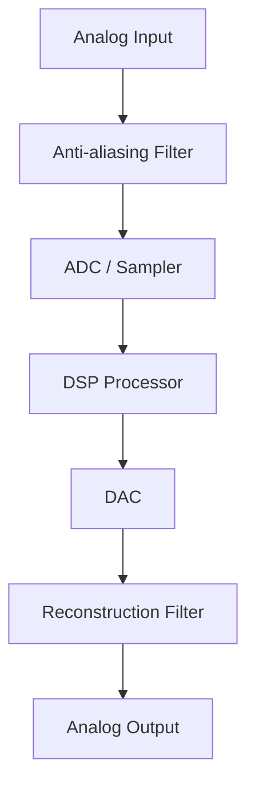

# Part A

---
id: Dec 2022 PQ
tags:
    - academics
    - btech
    - s5
    - digital_signal_processing
    - pyq
updated: 2025-11-15
---

> [!toc]
> - [[#Compute DFT of|Compute DFT of]]
> - [[#Explain Digital signal processing system with a block diagram. (use mermaid)|DSP Block Diagram]]
> - [[#Discuss the need for FFT. Justify your answer in terms of computational complexity, memory requirement etc.|Need for FFT]]
> - [[#FIR vs IIR – Comparison Table|FIR vs IIR]]
> - [[#Analog transfer function of a digital filter is given|Impulse Invariance Example]]

## Compute DFT of
> [!question] Compute DFT (Practice) 📅 2025-11-15
> Find the 4-point DFT of the sequence below:
> $$x[n] = \left( \frac{1}{2} \right)^n \sum_{k=0}^{3} \delta(n-k)$$

The summation $\sum_{k=0}^{3}\delta(n-k)$ gates the factor $(\tfrac12)^n$ so that the sequence exists only at $n=0,1,2,3$.

$$x[n]=\Big(\tfrac12\Big)^n\sum_{k=0}^{3}\delta(n-k)  
=\begin{cases}  
\big(\tfrac12\big)^n, & n=0,1,2,3,\\[4pt]  
0, & \text{otherwise.}  
\end{cases}$$

That is why, when you compute the $N$-point DFT with $N\ge4$, the DFT sum reduces to $n=0$ to $3$ — the other terms are zero.

* * *

### Steps (short)

1. Write $N$-point DFT (here take $N=4$):
    
    $$X[k]=\sum_{n=0}^{3} x[n] e^{-j\frac{2\pi}{4}kn}.$$
2. Substitute $x[n]=(\tfrac12)^n$ for $n=0..3$.
    
3. Recognize a finite geometric series in $r=(\tfrac12)W_4^{k}$ where $W_4=e^{-j\pi/2}$.
    
4. Use the closed form and evaluate for $k=0,1,2,3$.
    

* * *

> [!answer] Key formula

$$\boxed{\,X[k]=\sum_{n=0}^{3}\Big(\tfrac12\Big)^n W_4^{kn}  
=\frac{1-\big(\tfrac{1}{2}W_4^{k}\big)^{4}}{1-\tfrac{1}{2}W_4^{k}},\qquad W_4=e^{-j\pi/2}\,}$$

(For $k=0$ the formula reduces to the arithmetic sum $1+\tfrac12+\tfrac14+\tfrac18$.)

* * *

### Evaluate (explicitly)

Sequence values: $x[0]=1,\;x[1]=\tfrac12,\;x[2]=\tfrac14,\;x[3]=\tfrac18$.

* $k=0$:
    
    $$X[0]=1+\tfrac12+\tfrac14+\tfrac18=\frac{15}{8}.$$
* $k=1$ ($W_4=-j$, so $r=-\tfrac{j}{2}$):
    
    $$X[1]=\frac{1-( -\tfrac{j}{2})^{4}}{1+ \tfrac{j}{2}}  
    =\frac{15/16}{1+\tfrac{j}{2}}  
    =\frac{3}{4}-j\frac{3}{8}.$$
* $k=2$ ($W_4^2=-1$, so $r=-\tfrac12$):
    
    $$X[2]=1-\tfrac12+\tfrac14-\tfrac18=\frac{5}{8}.$$
* $k=3$ ($W_4^3=+j$, conjugate of $k=1$):
    
    $$X[3]=\overline{X[1]}=\frac{3}{4}+j\frac{3}{8}.$$

* * *

> [!important] Final result

$$\boxed{\,X[0]=\tfrac{15}{8},\quad X[1]=\tfrac{3}{4}-j\tfrac{3}{8},\quad X[2]=\tfrac{5}{8},\quad X[3]=\tfrac{3}{4}+j\tfrac{3}{8}\,}$$

* * *

> [!tip] Exam tip — DFT of short sequences
> - If x[n] is gated by delta functions, shorten the summation limits to non-zero sample indices.  
> - Use the geometric series form when x[n] = r^n.  

## Explain Digital signal processing system with a block diagram. (use mermaid)

* * *

The flow is simple:
1. **Analog Input Signal**  
    Real-world signals from sensors (mic, ECG, radar, etc.).
2. **Anti-Aliasing Filter (Analog LPF)**  
    Removes high-frequency components so sampling doesn't cause aliasing.
3. **Sampler / ADC (Analog-to-Digital Converter)**  
    Samples the signal at a fixed rate and quantizes it into digital values.
4. **Digital Signal Processor**  
    Performs operations like filtering, FFT, modulation, compression, etc.
5. **DAC (Digital-to-Analog Converter)**  
    Converts processed digital values back to an analog waveform.
6. **Reconstruction Filter (Analog LPF)**  
    Smooths the DAC output and removes sampling images.
    

* * *

### **Block Diagram**

![[Digital Signal Processing System (1).png]]

## Discuss the need for FFT
> [!objective] Why FFT?
> FFT reduces the cost of computing the DFT enormously — essential for real-time/embedded DSP.

* * *
### **Need for FFT (Fast Fourier Transform)**

The FFT is required because a direct DFT calculation is **too slow and too expensive** for practical digital signal processing. The FFT provides the same result as the DFT but with **drastically lower computational complexity and memory usage**.

* * *

### **1. Computational Complexity**

#### **Direct DFT**

For an $N$-point sequence:

$$X[k]=\sum_{n=0}^{N-1} x[n]e^{-j2\pi kn/N},\quad k=0,\dots,N-1$$

Each output uses $N$ complex multiplications → total:

$$\boxed{\text{Direct DFT complexity} = O(N^2)}$$

Example:  
For $N=1024$:  
DFT requires ≈ **1 million** complex operations.

* * *

#### **FFT**

FFT uses **divide-and-conquer** to reuse computations by breaking the DFT into smaller DFTs (butterflies).

$$\boxed{\text{FFT complexity} = O(N\log_2 N)}$$

For $N=1024$:  
FFT requires ≈ **10,240** operations  
→ almost **100× faster**.

* * *

### **2. Memory Requirements**

FFT stores **intermediate results** and **twiddle factors** efficiently.

* DFT needs large matrix multiplications → requires storing an $N\times N$ matrix of complex exponentials.
    
    $$\boxed{\text{DFT memory} = O(N^2)}$$
* FFT stores only:  
    • input sequence $N$  
    • twiddle factors, usually $N$  
    • intermediate FFT stage values
    
    $$\boxed{\text{FFT memory} = O(N)}$$

This massive reduction makes FFT feasible on DSP processors, microcontrollers, SDRs, mobile devices, etc.

* * *

### **3. Real-Time Processing**

Real-world applications (radar, SDR, speech, OFDM, biomedical sensing) require **fast** frequency-domain analysis.  
A direct DFT is too slow for real-time systems.

FFT enables:

* real-time spectral analysis
* fast filtering (FFT convolution)
* OFDM modulation/demodulation
* channel estimation
* image processing
    

* * *

### **4. Energy / Power Efficiency**

Lower computations → lower power consumption.  
Critical for battery-operated devices (phones, wearables, IoT, SDR-based systems).

* * *

## **FIR vs IIR – Comparison Table**

| **Feature** | **FIR Filter** | **IIR Filter** |
| --- | --- | --- |
| **Impulse response** | Finite duration | Infinite duration |
| **Structure** | Non-recursive (no feedback) | Recursive (uses feedback) |
| **Stability** | Always stable | May be unstable (depends on poles) |
| **Phase response** | Can be exactly linear phase | Cannot achieve exact linear phase |
| **Order required** | High order for given specs | Lower order for same specs |
| **Computational cost** | More multipliers → higher cost | Fewer multipliers → efficient |
| **Design methods** | Windowing, frequency sampling, Parks-McClellan | Analog prototype (Butterworth, Chebyshev, Elliptic) |
| **Quantization sensitivity** | Low; numerically robust | High; pole quantization affects stability |
| **Memory requirement** | Higher | Lower |
| **Typical applications** | Audio, image processing, communication filters | Control, real-time DSP, biomedical filtering |

## Impulse invariance example — analog to digital

> [!question] Convert the analog filter and comment on stability
> Given: $H_a(s)=\dfrac{1}{s+3}$. Show analog stability and map to digital with impulse-invariance (sampling time $T$).

$$H_a(s)=\frac{1}{s+3},$$

which is the standard single-pole lowpass form. 
* * *

## Steps (short)

1. Identify poles/zeros of $H_a(s)$ and check region of convergence → comment on analog stability.
2. Find continuous impulse response $h_a(t)=\mathcal{L}^{-1}\{H_a(s)\}$.
3. Sample $h_a(t)$ at $t=nT$ to get the discrete impulse response $h[n]$ (impulse-invariance mapping).
4. Take the z-transform to obtain $H(z)=\sum_{n=0}^\infty h[n] z^{-n}$.
5. Inspect the digital poles for stability and note aliasing caveat of impulse-invariance.
    

* * *

### (A) Stability of the analog filter

The pole of $H_a(s)$ is at $s=-3$ (real, left half plane).

$$\boxed{\text{Analog pole: } s=-3\quad\Rightarrow\quad \text{Analog filter is stable (LHP pole).}}$$

* * *

### (B) Impulse-invariance conversion

**1. Continuous impulse response**

$$h_a(t)=\mathcal{L}^{-1}\left\{\frac{1}{s+3}\right\}=e^{-3t}u(t).$$

### **2. Sample impulse response (impulse-invariance)**

Sample at $t=nT$ (causal, $n\ge0$):

$$\boxed{h[n]=h_a(nT)=e^{-3nT},\qquad n=0,1,2,\dots}$$

### **3. z-transform (DTFT / DFT convention: one-sided z)**

$$\begin{aligned}  
H(z)&=\sum_{n=0}^{\infty} h[n]\,z^{-n}  
=\sum_{n=0}^{\infty} \big(e^{-3T}\big)^n z^{-n}\\[4pt]  
&=\sum_{n=0}^{\infty}\big(e^{-3T} z^{-1}\big)^n  
=\frac{1}{1-e^{-3T}z^{-1}},\qquad |e^{-3T}z^{-1}|<1.  
\end{aligned}$$

So the digital transfer function is

> [!answer] Digital transfer function (impulse invariance)

$$\boxed{\,H(z)=\dfrac{1}{1 - e^{-3T}z^{-1}}\,}$$

### **4. Digital pole & stability**

Digital pole at

$$z = e^{-3T}.$$

Since $T>0$, $e^{-3T}$ satisfies $0<e^{-3T}<1$, so the pole lies inside the unit circle.

$$\boxed{\text{Digital pole: } z=e^{-3T}\in(0,1)\quad\Rightarrow\quad\text{Digital system is BIBO stable.}}$$

* * *

### (C) Remarks / Caveats

* **Aliasing:** Impulse-invariance samples the continuous impulse response, which corresponds to **periodic replication (aliasing)** of the analog frequency response in the digital frequency axis. That can distort the desired frequency response if the analog response is not bandlimited well below half the sampling rate.  
    In practice, impulse-invariance is best when the analog system is lowpass with negligible energy above $ \omega_s/2$ (where $\omega_s=2\pi/T$).
    
* **Gain scaling:** We used the direct sampling $h[n]=h_a(nT)$. (Some derivations insert a factor $T$ depending on how the continuous/discrete impulse trains are normalized — here we used the standard mapping where $h[n]=h_a(nT)$ and obtained the transfer function above.)
    

* * *

### Final boxed answers

$$\boxed{H_a(s)=\dfrac{1}{s+3}\quad\text{(analog pole at }s=-3\text{; stable)}}  
\qquad  
$$

$$
\boxed{H(z)=\dfrac{1}{1-e^{-3T}z^{-1}}\quad\text{(digital pole at }z=e^{-3T}\text{; stable)}}
$$

> [!cheatsheet] Quick summary
>
> - DFT of gated geometric sequences → use finite geometric sum identity.  
> - Use mermaid for block diagrams in Obsidian.  
> - For analog→digital mapping: impulse invariance samples h_a(t), bilinear uses prewarp then substitution.
