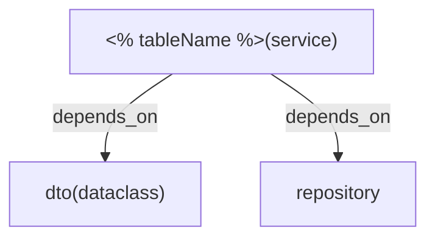

<%*
// Get table name from user
let tableName = await tp.system.prompt("Enter the table name (e.g., staff_project_guided):");

// Convert snake_case to PascalCase for struct names
let structName = tableName
    .split('_')
    .map(word => word.charAt(0).toUpperCase() + word.slice(1))
    .join('');

// Convert PascalCase to camelCase
let camelCaseName = structName.charAt(0).toLowerCase() + structName.slice(1);

// Generate service-specific names
let serviceInterfaceName = structName + "Service";
let readerInterfaceName = structName + "Reader";
let writerInterfaceName = structName + "Writer";
let serviceStructName = camelCaseName + "Service";

// Generate DTO names
let presentationDTOName = structName + "PresentationDTO";
let createDTOName = structName + "CreateDTO";
let updateDTOName = structName + "UpdateDTO";

// Generate method verbs based on struct name
let getAllMethod = "GetAll" + structName;
let getCountMethod = "Count" + structName;
let getSingleMethod = "Get" + structName;
let createMethod = "Create" + structName;
let updateMethod = "Update" + structName;
let deleteMethod = "Delete" + structName;

%>

# Service: <% serviceInterfaceName %>

**File Path:** `/domain/interfaces/service/<% tableName %>_service.go`



**Imports:**
```go
import (
    "context"
    "<% tableName %>/application/dto"
    "<% tableName %>/domain/model"
    "<% tableName %>/domain/repository"
)
```

## Type Contracts 

```go
type <% serviceInterfaceName %> interface {
	<% readerInterfaceName %>
	<% writerInterfaceName %>
}
```

### Reader Type Contract

```go
type <% readerInterfaceName %> interface {
	<% getAllMethod %>(ctx context.Context, staffID uint, limit int, offset int) (*[]dto.<% presentationDTOName %>, error)
	<% getCountMethod %>(ctx context.Context, staffID uint) (int64, error)
	<% getSingleMethod %>(ctx context.Context, id uint) (*dto.<% presentationDTOName %>, error)
}
```

### Writer Type Contract

```go
type <% writerInterfaceName %> interface {
	<% createMethod %>(ctx context.Context, staffID uint, req *dto.<% createDTOName %>) (*model.<% structName %>, error)
	<% updateMethod %>(ctx context.Context, id uint, req *dto.<% updateDTOName %>) (*model.<% structName %>, error)
	<% deleteMethod %>(ctx context.Context, id uint) error
}
```

## Implementation

### Constructor

```go
type <% serviceStructName %> struct {
	repo repository.<% serviceInterfaceName %>
}

func New<% serviceInterfaceName %>(repo repository.<% serviceInterfaceName %>) <% serviceInterfaceName %> {
	return &<% serviceStructName %>{
		repo: repo,
	}
}
```

### Reader Methods

```go
func (s *<% serviceStructName %>) <% getAllMethod %>(ctx context.Context, staffID uint, limit int, offset int) (*[]dto.<% presentationDTOName %>, error) {
	// Business logic here
	return nil, nil
}

func (s *<% serviceStructName %>) <% getCountMethod %>(ctx context.Context, staffID uint) (int64, error) {
	// Business logic here
	return 0, nil
}

func (s *<% serviceStructName %>) <% getSingleMethod %>(ctx context.Context, id uint) (*dto.<% presentationDTOName %>, error) {
	// Business logic here
	return nil, nil
}
```

### Writer Methods

```go
func (s *<% serviceStructName %>) <% createMethod %>(ctx context.Context, staffID uint, req *dto.<% createDTOName %>) (*model.<% structName %>, error) {
	// Validate input
	if req == nil {
		return nil, errors.New("invalid request")
	}
	
	// Create model from DTO
	m := &model.<% structName %>{
		// Map fields from req
	}
	
	// Call repository to create
	return s.repo.Create(ctx, m)
}

func (s *<% serviceStructName %>) <% updateMethod %>(ctx context.Context, id uint, req *dto.<% updateDTOName %>) (*model.<% structName %>, error) {
	// Validate input
	if req == nil {
		return nil, errors.New("invalid request")
	}
	
	// Get existing record
	existing, err := s.repo.FindByID(ctx, id)
	if err != nil {
		return nil, err
	}
	
	// Update fields
	// Map req to existing
	
	// Call repository to update
	return s.repo.Update(ctx, existing)
}

func (s *<% serviceStructName %>) <% deleteMethod %>(ctx context.Context, id uint) error {
	// Validation and business logic
	return s.repo.Delete(ctx, id)
}
```

## DTOs

### Presentation DTO
```go
type <% presentationDTOName %> struct {
	ID        uint      `json:"id"`
	// Add other fields
	CreatedAt time.Time `json:"created_at"`
	UpdatedAt time.Time `json:"updated_at"`
}
```

### Create DTO
```go
type <% createDTOName %> struct {
	// Add fields needed for creation (exclude ID, timestamps)
}
```

### Update DTO
```go
type <% updateDTOName %> struct {
	// Add fields that can be updated
}
```

## Notes

- **Service Name:** `<% serviceInterfaceName %>`
- **Struct Name:** `<% structName %>`
- **Table Name:** `<% tableName %>`
- **Presentation DTO:** `<% presentationDTOName %>`
- **Create DTO:** `<% createDTOName %>`
- **Update DTO:** `<% updateDTOName %>`
- All methods include `context.Context` for cancellation and timeout support
- Reader methods always return Presentation DTOs
- Writer methods return Model objects
